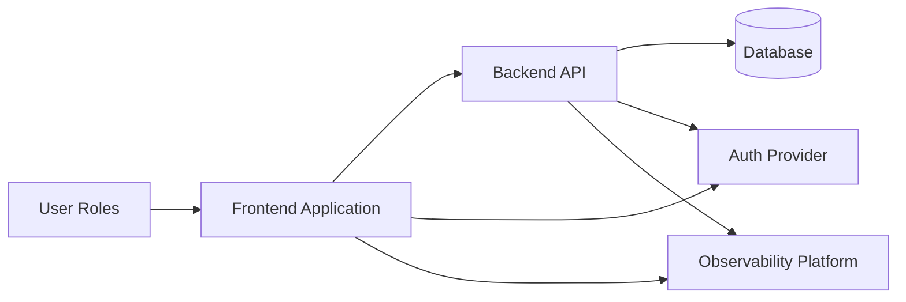
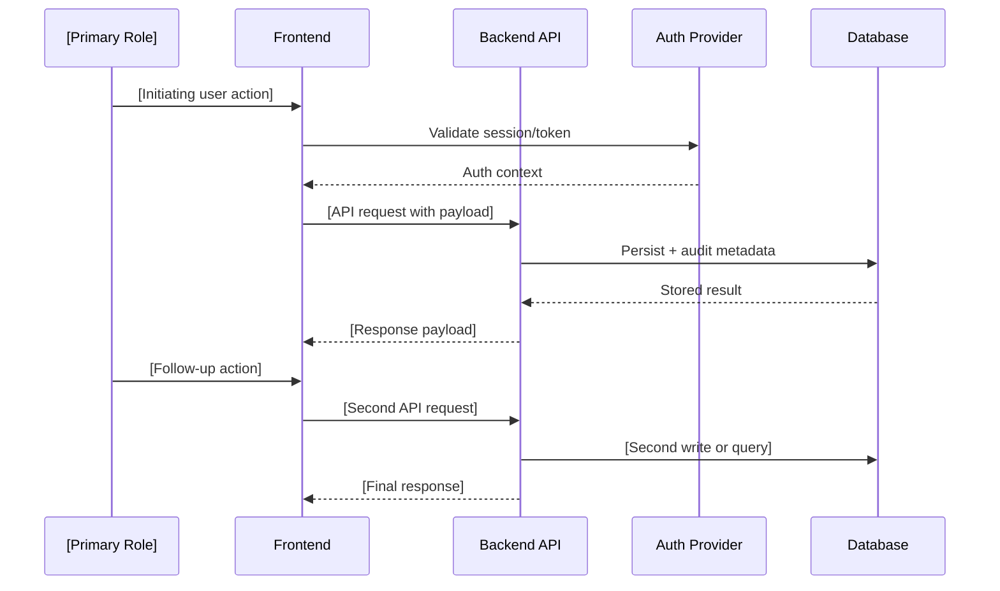

# Architecture Solution Design Template (AI-Ready)

| Attribute        | Value                            |
| ---------------- | -------------------------------- |
| **Project**      | [Project Name]                   |
| **Version**      | [vX.Y]                           |
| **Status**       | [Draft \| In Review \| Approved] |
| **Last Updated** | [YYYY-MM-DD]                     |

## How to Use (AI Agent Instructions)

- Fill in System Context first — it anchors all component and data flow decisions.
- Every pattern selection in this document must link to an ADR.
- Keep the Component Diagram synchronized with Technology Stack choices.
- Update the Data Flow section whenever a new user-facing workflow is added.

---

# [Project Name] — Architecture Solution Design

## System Context

[Describe the business and technical context: what must the system support, what constraints does it operate under?]

Based on functional and non-functional requirements, the architecture must prioritize:

- [e.g., rapid MVP delivery for a small team]
- [e.g., strong maintainability through clear domain boundaries]
- [e.g., secure-by-design access control and data handling]
- [e.g., explicit evolution path for future scale]

The system is designed as [describe decomposition, e.g., separate frontend and backend deployables with shared domain contracts].

## Architectural Approach

### Selected Pattern

**[Selected Pattern Name, e.g., Modular Monolith + Clean Architecture + DDD with a separately deployed frontend]**

### Candidate Pattern Comparison

| Pattern                | Strengths                                         | Weaknesses                                  | Fit for Current Requirements  |
| ---------------------- | ------------------------------------------------- | ------------------------------------------- | ----------------------------- |
| Layered Monolith       | Fast setup, simple deployment                     | Boundary erosion risk, harder decomposition | [Evaluation]                  |
| Hexagonal Architecture | Strong ports/adapters isolation, high testability | Upfront abstraction discipline              | [Evaluation]                  |
| Microservices          | Independent scaling, strong isolation             | High operational complexity for small teams | [Evaluation]                  |
| **[Selected Pattern]** | [Key strengths]                                   | [Key weaknesses]                            | **Best fit because [reason]** |

### High-Level Design Principles

1. **Separation of concerns**: [e.g., frontend and backend remain independent deployable units]
2. **Domain-centric design**: [e.g., bounded contexts define module boundaries]
3. **Dependency inversion**: [e.g., domain and application rules are framework-independent]
4. **Security by design**: [e.g., authorization enforced at API, domain, and data policy layers]
5. **Evolutionary architecture**: [e.g., module seams support future extraction to services]

## Component Design

- **Frontend Application**: [UI layer responsibilities, e.g., user workflows, read-only access, hosting platform]
- **Backend API**: [Backend structure, e.g., modular monolith organized by bounded contexts]
- **Data Layer**: [Database type and data protection strategy, e.g., managed PostgreSQL with RLS]
- **Auth Layer**: [Identity and session lifecycle approach, e.g., managed auth with JWT]

## Data Flow

## Integration Points

- **Frontend → Backend:** [e.g., HTTPS REST APIs with token-based authentication]
- **Backend → Database:** [e.g., persistence through backend-owned access patterns and policy enforcement]
- **Authentication flow:** [e.g., managed auth provider issues identity tokens consumed by frontend and validated by backend]
- **External integrations:** [e.g., observability platform for centralized error and performance monitoring]

## Observability

- Capture frontend runtime errors, failed API interactions, and degraded user journeys.
- Capture backend exceptions, request failures, and high-latency critical paths.
- Track release versions from CI/CD for regression correlation.
- Monitor key signals: [API error rate, p95 latency, auth failure trends, critical workflow failure rate]
- Configure alerting for: [sustained error rate spike, critical path latency degradation, auth failures]

## Deployment

- **Pipeline stages:** quality gates, environment-based deployments, post-deploy verification.
- **Deployment strategy:** [e.g., preview environments for frontend, rolling deploys for backend]
- **Rollback:** revert deployment artifact/commit and redeploy prior stable version.
- **Migration strategy:** versioned, backward-compatible schema changes applied before backend rollout.
- **Zero-downtime approach:** stateless backend processes with health checks and rolling replacement.

## Security Considerations

- Enforce role-based authorization at API and data policy layers.
- Apply least-privilege access across frontend, backend, and database.
- HTTPS-only communication across all service boundaries.
- Protect sensitive data with managed encryption at rest and in transit.
- Request validation, rate limiting, and secure session/token lifecycle controls.

## Scalability Considerations

- Stateless backend components to support horizontal scaling.
- Isolated modules so hotspots can be independently optimized or extracted.
- Database indexing and query discipline for high-read paths.
- Asynchronous/background processing path when workload grows.
- Frontend independently scalable via global edge distribution.

## Trade-offs and Alternatives

- **Chosen now:** [Selected pattern and key reason]
- **Deferred:** [What was explicitly not chosen and why]
- **Risk:** [Main architecture risk]
  **Mitigation:** [Mitigation approach]

## ADR References

- [ADR-001: High-Level Architecture](./adrs/adr-template.md) — replace with actual ADR link

---

## Change Log

| Date         | Version | Change Summary | Author |
| ------------ | ------- | -------------- | ------ |
| [YYYY-MM-DD] | [vX.Y]  | [What changed] | [Name] |
