<!-- AI AGENT INSTRUCTIONS
Purpose: Document the CI/CD pipeline architecture for [Project Name].
Replace all [placeholder] blocks with project-specific tool choices and pipeline decisions.
Cross-reference: technology-stack.md, deployment-architecture.md, adrs/.
-->

# CI/CD Pipeline Architecture

| Attribute        | Value          |
| ---------------- | -------------- |
| **Project**      | [Project Name] |
| **Version**      | [0.1]          |
| **Status**       | [Draft]        |
| **Last Updated** | [YYYY-MM-DD]   |

## Sources

- [Architecture Solution Design](../architecture-solution-design.md)
- [Technology Stack](../technology-stack.md)
- [Deployment Architecture](deployment-architecture.md)
- [Requirements Template](../../../product-owner-playbook/assets/requirements/prd-template-by-feature.md)

## 1. CI/CD Tool Selection

**Selected:** [CI/CD Tool, e.g., GitHub Actions / GitLab CI / CircleCI]

Rationale: [Explain why this tool was selected — native repository integration, cost, secrets management, environment protection rules, workflow flexibility.]

## 2. Pipeline Stages

```mermaid
flowchart LR
    A[PR Opened/Updated] --> B[Static Checks & Validation]
    B --> C[Unit/Integration Test Gates]
    C --> D[Build Artifacts]
    D --> E[Deploy Preview Environment]
    E --> F[Manual Review & Approval]
    F --> G[Merge to Develop]
    G --> H[Deploy Staging + Smoke Tests]
    H --> I[Merge to Main]
    I --> J[Production Deploy]
    J --> K[Post-Deploy Verification + Release Check]
```

## 3. Build and Verification Responsibilities

- **PR pipeline:**
  - [e.g., Markdown/document linting, contract checks, quality gates.]
  - [Preview deployment for frontend changes.]
- **Staging pipeline:**
  - [Environment-specific build and smoke test suite.]
  - [Integration smoke tests for critical flows: auth, core CRUD, key workflows.]
- **Production pipeline:**
  - [Promotion of validated staging artifacts.]
  - [Post-deploy health checks and observability validation.]

## 4. Deployment Stages

| Stage      | Trigger           | Approval Required | Target Environment |
| ---------- | ----------------- | ----------------- | ------------------ |
| Preview    | PR opened/updated | No                | [Preview env]      |
| Staging    | Merge to develop  | [Yes/No]          | [Staging env]      |
| Production | Merge to main     | Yes               | [Production env]   |

## 5. Database Migration Strategy

- [Describe migration tooling, e.g., Alembic, Flyway, or managed provider migrations.]
- Migrations must be backward compatible — additive changes deployed before API changes.
- Order of operations:
  1. Apply additive migration.
  2. Deploy application using new schema.
  3. Remove deprecated columns/paths in a follow-up release.
- Migration status surfaces as a deployment gate.

## 6. Rollback Strategy

- **Application rollback:** redeploy last successful artifact/commit.
- **Database rollback:** prefer forward-fix migrations; if severe, use [Database PITR / point-in-time recovery] under incident protocol.
- **Rollback triggers:** elevated error rate, failed smoke tests, auth path unavailability.

## 7. Release Strategies

- **[Frontend Platform]:** [e.g., progressive rollout via preview deployments, instant promotion.]
- **[Backend Platform]:** [e.g., rolling deployments with health check gates.]
- **Canary/blue-green:** [Optional — describe if used or planned for future high-risk releases.]

## 8. Environment Variables and Secrets Management

- Secrets stored in [CI/CD Tool] encrypted secrets and platform-managed environment stores.
- No plaintext secrets in source control or CI artifacts.
- Separate secret scopes per environment (dev / staging / production).
- Rotation policy aligned with secrets management ADR.

## 9. Zero-Downtime Deployment Approach

- Stateless services with readiness and health checks.
- [Describe rolling replacement strategy for backend instances.]
- Backward-compatible API and schema changes during transition windows.
- Frontend and backend deployed independently to minimize cross-service blast radius.

## Change Log

| Date         | Version | Change Summary | Author |
| ------------ | ------- | -------------- | ------ |
| [YYYY-MM-DD] | [vX.Y]  | [What changed] | [Name] |
