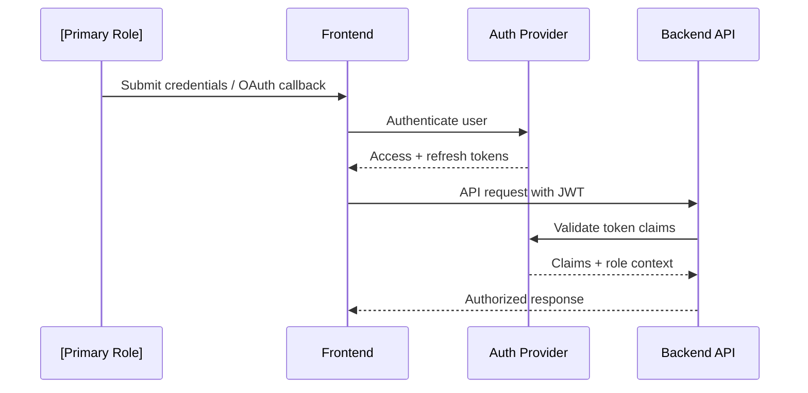

# Sequence Diagrams Template (AI-Ready)

| Attribute        | Value                            |
| ---------------- | -------------------------------- |
| **Project**      | [Project Name]                   |
| **Version**      | [vX.Y]                           |
| **Status**       | [Draft \| In Review \| Approved] |
| **Last Updated** | [YYYY-MM-DD]                     |

## How to Use (AI Agent Instructions)

- Add one diagram per key user or system interaction flow.
- Label participants using role names and system/service layer names, not specific platform names.
- Keep diagrams focused on a single flow; split complex flows into multiple diagrams.
- Reference Mermaid `.mmd` files in `diagrams/` for large or reused diagrams.

---

## 1. Authentication and Session Validation



---

## 2. [Core Workflow Name, e.g., Data Submission and Processing]

```mermaid
sequenceDiagram
    participant Actor as [Role]
    participant FE as Frontend
    participant BE as Backend API
    participant DB as Database
    participant SVC as [External Service / Worker]

    Actor->>FE: [Initiate action]
    FE->>BE: [POST /resource]
    BE->>DB: [Persist input + metadata]
    BE->>SVC: [Request processing / enrichment]
    SVC-->>BE: [Processed result]
    BE->>DB: [Save result]
    BE-->>FE: [Return draft/result]
    FE-->>Actor: [Display output]
```

---

## 3. [Approval / State Transition Workflow]

```mermaid
sequenceDiagram
    participant Actor as [Admin Role]
    participant FE as Frontend
    participant BE as Backend API
    participant DB as Database
    participant Viewer as [Viewer Role]

    Actor->>FE: [Approve or submit action]
    FE->>BE: [POST /resource/action]
    BE->>DB: [Validate ownership + update state]
    DB-->>BE: [State persisted]
    BE-->>FE: [Success response]
    Viewer->>FE: [Access resource page]
    FE->>BE: [GET /resource]
    BE->>DB: [Fetch approved/visible records only]
    DB-->>BE: [Filtered result set]
    BE-->>FE: [Response]
    FE-->>Viewer: [Display approved view]
```

---

## 4. [Async / Background Processing Flow]

```mermaid
sequenceDiagram
    participant Actor as [Role]
    participant FE as Frontend
    participant BE as Backend API
    participant Q as Message Queue / Broker
    participant Worker as Background Worker
    participant DB as Database

    Actor->>FE: [Trigger async action]
    FE->>BE: [POST /resource/trigger]
    BE->>Q: [Publish event]
    BE-->>FE: [Accepted / queued response]
    Q->>Worker: [Deliver event]
    Worker->>DB: [Execute background task]
    Worker->>DB: [Store result]
    FE->>BE: [Poll or webhook callback]
    BE->>DB: [Fetch completed result]
    BE-->>FE: [Result payload]
```

---

## Diagram Naming Conventions

Follow these rules when adding new sequence diagrams to keep the catalog consistent and cross-referenceable.

### Naming Format

```
[NNN]-[flow-category]-[short-description]
```

| Segment               | Rule                                                            | Example                     |
| --------------------- | --------------------------------------------------------------- | --------------------------- |
| `[NNN]`               | Three-digit sequence number, scoped to this file.               | `001`, `002`                |
| `[flow-category]`     | One of: `auth`, `crud`, `approval`, `async`, `export`, `error`. | `approval`                  |
| `[short-description]` | Kebab-case, 2-4 words describing the actor and action.          | `admin-approves-submission` |

### Linkage Rules

Every diagram section header must reference the feature and story it covers:

```markdown
## [NNN]. [Diagram Title]

- **Feature:** [F-NNN]
- **Stories:** [US-BE-MVP-001, US-FE-MVP-001]
- **FR(s):** [FR-NNN-01]
```

### File Reference (Large Diagrams)

For diagrams exceeding ~30 lines of Mermaid code, extract to a `.mmd` file in `diagrams/` and link to it using a relative path in prose, e.g.:

> See [`diagrams/001-auth-admin-login.mmd`](diagrams/) for the full diagram source.

---

## Change Log

| Date         | Version | Change Summary | Author |
| ------------ | ------- | -------------- | ------ |
| [YYYY-MM-DD] | [vX.Y]  | [What changed] | [Name] |
