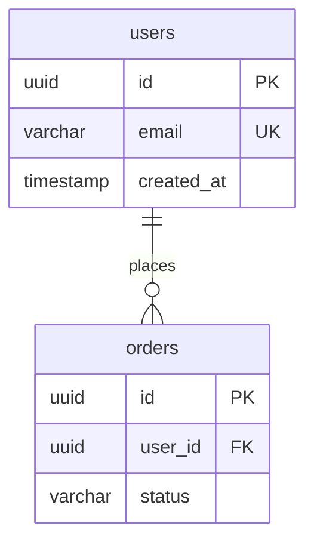

# Database Administration & Design Skill

This skill equips the agent with specialized knowledge for designing, optimizing, and documenting **PostgreSQL** databases, with a specific focus on our **Supabase** infrastructure.

When you are utilizing this skill, you must enforce the following guidelines:

## 1. Schema Design Standards (PostgreSQL)

- **Normalization:** Design schemas in 3NF.
- **Data Types:** Use native PostgreSQL types. Prefer `UUID` (over INT) for primary keys, `TIMESTAMPTZ` for dates, and `JSONB` for flexible payloads.
- **Data Integrity:** Push validation down to the database using `CHECK`, `UNIQUE`, and `FOREIGN KEY` constraints.
- **Supabase Integration:** Always assume the existence of the Supabase `auth.users` schema. Link custom user tables or entities to `auth.users.id` via foreign keys.

## 2. Row-Level Security (RLS)

Because we use Supabase, security must be handled at the database level.

- Every new table must have RLS enabled: `ALTER TABLE table_name ENABLE ROW LEVEL SECURITY;`
- You must define explicit policies for `SELECT`, `INSERT`, `UPDATE`, and `DELETE` (e.g., `USING (auth.uid() = user_id)`).

## 3. Query Optimization & Indexing

When evaluating query performance or designing schemas, explicitly define indexes:

- **B-tree:** For standard foreign keys and high-cardinality equality checks.
- **Composite Indexes:** For queries frequently filtering by multiple columns (e.g., `user_id` + `status`).
- **Partial Indexes:** For heavily skewed data or specific state lookups (e.g., `CREATE INDEX ON orders (created_at) WHERE status = 'pending'`).

---

## 📝 Schema Output Template

When asked to design or document a database schema, you MUST output a Markdown file using this exact template.

### A. Entity-Relationship Diagram

Use Mermaid.js to visualize the tables and cardinality.



### B. Table Definitions

For each table, provide a detailed schema breakdown.

**Table: `[schema].[table_name]`**

| Column    | PostgreSQL Type | Constraints  | Default             | Description                 |
| --------- | --------------- | ------------ | ------------------- | --------------------------- |
| `id`      | `UUID`          | PK           | `gen_random_uuid()` | Primary identifier          |
| `user_id` | `UUID`          | FK, NOT NULL |                     | References `auth.users(id)` |
| `status`  | `VARCHAR`       | CHECK        | `'pending'`         | Current state               |

### C. Indexes & Optimization

```sql
-- List required indexes for anticipated query patterns
CREATE INDEX CONCURRENTLY idx_[table]_[column] ON [schema].[table] (column);
```

### D. Supabase RLS Policies

```sql
ALTER TABLE [schema].[table] ENABLE ROW LEVEL SECURITY;

-- Select Policy
CREATE POLICY "Users can view their own data"
ON [schema].[table] FOR SELECT
USING (auth.uid() = user_id);
```
