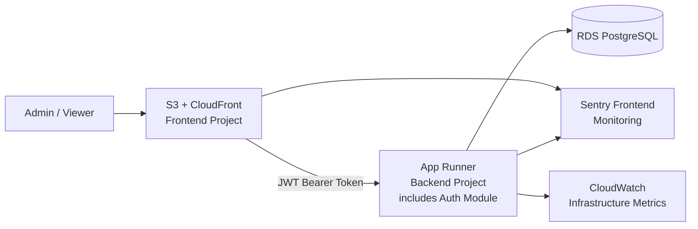
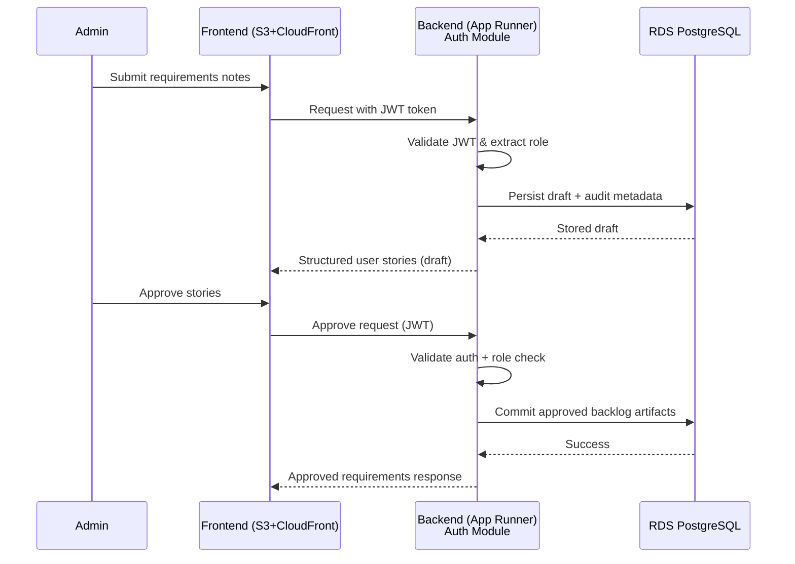

# Open Projects Hub — Architecture Solution Design

| Attribute        | Value                       |
| ---------------- | --------------------------- |
| **Project**      | Open Projects Hub |
| **Version**      | 1.0                         |
| **Status**       | Accepted                    |

## Table of Contents

- [Source References](#source-references)
- [System Context](#system-context)
- [Architectural Approach](#architectural-approach)
- [Component Design](#component-design)
- [Data Flow](#data-flow)
- [Integration Points](#integration-points)
- [Observability (Hybrid: Sentry + CloudWatch)](#observability-hybrid-sentry--cloudwatch)
- [Deployment Impact (GitHub Actions + AWS)](#deployment-impact-github-actions--aws)
- [Security Considerations](#security-considerations)
- [Scalability Considerations](#scalability-considerations)
- [Trade-offs and Alternatives](#trade-offs-and-alternatives)
- [ADR Reference](#adr-reference)

## System Context

The Open Projects Hub must support AI-assisted requirement refinement, role-based collaboration (Admin/Viewer), and secure project management for freelancers within MVP limits. Based on functional and non-functional requirements, the architecture must prioritize:

- rapid MVP delivery for a small team,
- strong maintainability through clear boundaries,
- secure-by-design access control and data handling,
- an explicit evolution path for future scale.

To satisfy these needs, the system is designed as separate frontend and backend projects with shared domain language and contracts.

## Architectural Approach

**Modular Monolith backend using Clean Architecture + DDD, with a separately deployed frontend application.**

The architecture prioritizes:

- **Rapid MVP delivery** with lower operational overhead than microservices
- **Strong domain boundaries** through explicit bounded contexts and dependency rules
- **Clean Architecture principles** keeping domain/application layers framework-agnostic
- **Evolutionary design** enabling future service extraction when scale demands it

For detailed rationale and alternatives considered, see [ADR-001: High-Level Architecture Pattern](../adrs/adr-001-high-level-architecture.md).

### Key Design Principles

1. **Separation of concerns**: frontend and backend remain independent projects.
2. **Domain-centric design**: bounded contexts define module boundaries.
3. **Dependency inversion**: domain and application rules stay independent from frameworks.
4. **Security by design**: authorization and data-access rules are enforced at domain/application and data policy layers.
5. **Evolutionary architecture**: module seams support future extraction to services if growth demands it.

## Component Design

- **Frontend Project (S3 + CloudFront):** UI workflows for project management, AI refinement interaction, and read-only viewer access; global edge delivery via CDN.
- **Backend Project (App Runner):** modular monolith organized by bounded contexts (clients, projects, requirements, auth, access control, exports); containerized FastAPI application with integrated auth module.
- **Data Layer (RDS PostgreSQL):** transactional persistence with policy-based protection via PostgreSQL RLS.

## Data Flow

## Integration Points

- **S3 + CloudFront frontend → App Runner backend:** HTTPS REST APIs with JWT bearer token authentication.
- **Backend → RDS PostgreSQL database:** persistence through backend-owned access patterns and PostgreSQL RLS policy enforcement.
- **Authentication flow:** Backend auth module (internal bounded context) issues JWT tokens via `/auth/login` endpoint; tokens are consumed by frontend and validated by backend middleware on all protected routes.
- **External service integrations:**
  - Sentry for centralized frontend/backend error tracking and application performance monitoring.
  - CloudWatch for AWS infrastructure metrics (App Runner, RDS, S3, CloudFront).

## Observability (Hybrid: Sentry + CloudWatch)

**Zero-cost monitoring strategy maintaining $0/month:**

### Sentry (Free Developer Plan)

- Capture frontend runtime errors, failed API interactions, and degraded user journeys.
- Capture backend exceptions, request failures, and high-latency endpoints.
- Performance monitoring: page loads, API latency, transaction traces.
- Track release versions from CI/CD for regression correlation.
- Custom dashboards (up to 10) for key application metrics.
- Email alerts for critical errors.

### CloudWatch (Free Tier)

- Monitor AWS infrastructure metrics (always free):
  - App Runner: CPU, memory, request count, latency
  - RDS: connections, CPU, storage, read/write IOPS
  - S3: storage size, request count
  - CloudFront: data transfer, request count, cache hit rate
- Application logs with structured JSON (≤5 GB/month ingestion).
- Critical infrastructure alarms (≤10 alarms within free tier).
- **No custom metrics** (avoid $0.30/metric/month charge).

### Key Signals to Monitor

- API error rate (Sentry)
- p95 latency for core requirement workflows (Sentry + CloudWatch)
- Authentication failure trends (Sentry)
- Export failure rate (Sentry)
- RDS connection pool health (CloudWatch)
- App Runner memory/CPU utilization (CloudWatch)

### Alerting Configuration

- Sustained elevated error rate → Sentry email alert
- Repeated auth failures → Sentry email alert
- Critical path latency degradation → Sentry performance alert
- RDS connection saturation → CloudWatch alarm
- App Runner health check failures → CloudWatch alarm

## Deployment Impact (GitHub Actions + AWS)

- **Pipeline stages:** documentation checks (if configured), quality gates for app repos, and environment-based deployments to AWS.
- **Deployment strategy:**
  - Frontend: Build with Vite → Deploy to S3 → Invalidate CloudFront cache.
  - Backend: Build Docker image → Push to ECR → Deploy to App Runner (zero-downtime rolling update).
- **Rollback:** revert deployment artifact/commit and redeploy prior stable version via GitHub Actions.
- **Migration strategy:** versioned, backward-compatible database migrations; apply before backend rollout requiring new schema.
- **Environment management:** separate dev/staging/prod secrets stored in GitHub Secrets and AWS environment variables.
- **Zero-downtime approach:** stateless backend processes with App Runner health checks and rolling replacement.
- **Pre-deploy verification:** validate auth flow, core CRUD flows, and requirements export workflow in non-production environment.

## Security Considerations

- Enforce role-based authorization for Admin and Viewer capabilities.
- Apply least-privilege access across frontend, backend, and database policies.
- Use HTTPS-only communication across all service boundaries.
- Protect sensitive data with managed encryption at rest and in transit.
- Prevent abuse with request validation, rate limiting, and secure session/token lifecycle controls.

## Scalability Considerations

- Maintain stateless backend components to allow horizontal scaling.
- Keep modules isolated so hotspots can be independently optimized or extracted later.
- Use database indexing and query discipline for requirements and project listing paths.
- Keep workflows synchronous and optimize critical paths before introducing additional infrastructure.
- Keep frontend independently scalable via global edge distribution.

## Trade-offs and Alternatives

- **Chosen now:** modular monolith with strict module boundaries for speed and manageable complexity.
- **Deferred:** microservices, since current scope/team size does not justify distributed-system overhead.
- **Risk:** module boundary erosion over time.  
  **Mitigation:** explicit architecture governance, ADR-driven decisions, and periodic boundary reviews.
- **Risk:** growth in AI-related workload could pressure synchronous APIs.  
  **Mitigation:** apply targeted query optimization, payload shaping, and selective module extraction.

## ADR Reference

- [ADR-001: High-Level Architecture](../adrs/adr-001-high-level-architecture.md)
- [ADR-004: Database (Amazon RDS PostgreSQL)](../adrs/adr-004-database.md)
- [ADR-005: Authentication (Custom FastAPI Auth + JWT)](../adrs/adr-005-authentication.md)
- [ADR-006: Deployment Platform (AWS)](../adrs/adr-006-deployment-platform.md)
- [ADR-009: Monitoring and Observability (Sentry + CloudWatch)](../adrs/adr-009-monitoring-observability.md)

## Source References

- [Architecture Styles](./architecture-styles.md)
- [Technology Stack](./technology-stack.md)
- [Requirements](../../01-requirements/README.md)

---

**Last Updated**: 2026-08-04
