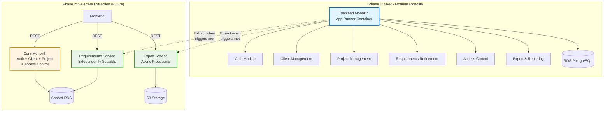

# Architecture Styles Decision

| Attribute        | Value                       |
| ---------------- | --------------------------- |
| **Project**      | Open Freelancer Project Hub |
| **Version**      | 1.0                         |
| **Status**       | Accepted                    |
| **Last Updated** | 2026-08-04                  |

## Decision Summary

The project will use a **Modular Monolith** (backend) with a separately deployed frontend for MVP and near-term scaling.

This decision aligns with:

- MVP timeline (1 to 1.5 months),
- small team coordination constraints,
- requirement scope (up to 3 active projects per account in MVP),
- need for clear domain boundaries and future extraction path.

## Architecture Style Evaluation

The architecture style selection balances MVP velocity, maintainability, and future scalability needs.

| Style                           | Benefits                                                                    | Drawbacks                                                                   | Fit for Current Context                                    |
| ------------------------------- | --------------------------------------------------------------------------- | --------------------------------------------------------------------------- | ---------------------------------------------------------- |
| Monolithic (layered)            | Fast setup, simple deploy pipeline                                          | Boundary erosion risk, harder long-term decomposition                       | Acceptable for very short-lived MVPs, but weaker long-term |
| Microservices                   | Independent scaling/deployments, isolation                                  | High operational complexity, distributed transactions, higher DevOps burden | Premature for current team size and MVP scope              |
| **Modular Monolith (Selected)** | Strong module boundaries, single deployable, easier refactor and extraction | Requires discipline to protect module boundaries                            | **Best fit for MVP + planned evolution**                   |

**Why Modular Monolith wins:**
- **Delivery speed:** Single deployment artifact accelerates MVP timeline (1-1.5 months)
- **Operational simplicity:** One Docker container, one database, one CI/CD pipeline for small team
- **Clean Architecture fit:** Module boundaries enforce domain isolation without distributed system overhead
- **Evolution path:** Bounded contexts can be extracted to services when growth triggers justify it

For detailed alternatives analysis, see [ADR-001: High-Level Architecture Pattern](../adrs/adr-001-high-level-architecture.md).

## Bounded Context Alignment

The modular monolith maps bounded contexts to internal modules:

- **Auth**: User identity lifecycle, JWT token issuance, authentication middleware
- **Client Management**: client records and lifecycle
- **Project Management**: project creation, status (discovery/planning), constraints
- **Requirements Refinement**: AI-assisted drafting, approvals, story artifact lifecycle
- **Access Control**: Admin/Viewer authorization and visibility rules
- **Export & Reporting**: Markdown export and delivery artifacts

Each module owns:

- domain entities and use cases,
- repository interfaces (domain/application side),
- infrastructure adapters behind module contracts.

**Cross-module dependencies:**
- **Auth** → provides JWT validation middleware consumed by all protected endpoints
- **Access Control** → uses Auth user context to enforce Admin/Viewer rules
- **All modules** → use Access Control to check permissions before operations

## Rationale and Trade-offs

### Why this is the right decision now

1. Supports fast MVP delivery with low operational overhead.
2. Preserves Clean Architecture and DDD boundaries needed for maintainability.
3. Reduces distributed-system complexity (network partitions and cross-service coordination overhead) until scale requires it.

### Key trade-offs

- We accept a single backend deployable now to accelerate delivery.
- We mitigate long-term growth risk with strict module boundaries and ADR-governed changes.

## Evolution Strategy (Modular Monolith → Selective Microservices)

### Evolution Path Visualization

**Evolution Principles:**
1. **Start simple:** All modules coexist in monolith during MVP
2. **Extract selectively:** Only when extraction triggers are sustained (see below)
3. **Keep stable core:** Auth, Client, Project, Access Control likely remain in monolith
4. **Extract candidates:** Requirements (AI workload) and Export (async processing) are prime candidates

### Trigger-based extraction criteria

Extract a module into a service only when at least one trigger is sustained:

- throughput hotspot (latency/SLA pressure),
- independent release cadence needed,
- fault-isolation requirement,
- team ownership split requiring independent delivery velocity.

### Migration path

1. Keep domain contracts stable inside module boundaries.
2. Extract one bounded context at a time behind existing API contracts.
3. Keep cross-module interactions synchronous until scaling constraints are proven.

## Scalability Alignment

- MVP and Phase 1 targets (NFR-005/NFR-006) are achievable with stateless backend scaling on AWS App Runner.
- Modular boundaries reduce refactor risk while enabling selective horizontal scaling later.
- Additional distributed patterns are deferred to future scope reviews.

## Related Documents

- [Architecture Solution Design](./architecture-solution-design.md)
- [ADR-001: High-Level Architecture](../adrs/adr-001-high-level-architecture.md)
