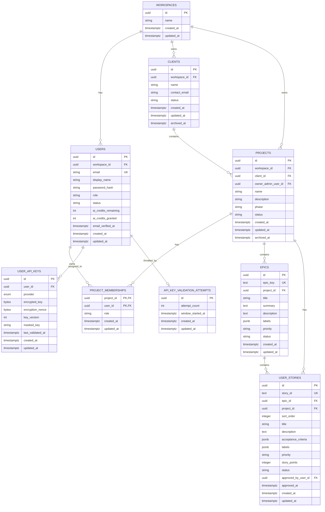

# Database Design

| Attribute        | Value                       |
| ---------------- | --------------------------- |
| **Project**      | Open Projects Hub |
| **Version**      | 1.8                         |
| **Status**       | Accepted                    |

## Table of Contents

- [Source References](#source-references)
- [Design Scope and Assumptions](#design-scope-and-assumptions)
- [Data Domains](#data-domains)
- [Core Entities](#core-entities)
- [Relationships](#relationships)
- [Entity-Relationship Diagram (ERD)](#entity-relationship-diagram-erd)
- [Schema Documentation](#schema-documentation)
- [Constraints and Integrity Rules](#constraints-and-integrity-rules)
- [Access Patterns and Indexing Notes](#access-patterns-and-indexing-notes)
- [Migration and Evolution Considerations](#migration-and-evolution-considerations)
- [Security and Data Governance](#security-and-data-governance)
- [Risks and Open Questions](#risks-and-open-questions)
- [Traceability to Requirements](#traceability-to-requirements)

## Design Scope and Assumptions

- Covers the MVP core: user identity, client basics, project lifecycle, role-based access, and AI-refined user stories.
- Internal notes are out of scope for this simplified MVP schema and are not persisted in database entities.
- Removed in this version: ambiguity tracking, requirements promotion workflow, and Markdown export tracking. These can be reintroduced post-MVP. Acceptance criteria stored as JSONB on `user_stories` rather than a child table.
- The custom auth bounded context (per ADR-005) owns credential storage, JWT tokens, and user identity lifecycle. The application schema stores user profile, password hash, and authorization projection data.
- Database engine: Amazon RDS PostgreSQL (per ADR-004). Migrations managed via Alembic (per ADR-017). Physical deployment is out of scope here.

## Data Domains

- **Identity and Access:** User profile projection with workspace-scoped `admin` and `member` roles. Clients have no accounts; a project's `access_code` is the credential for the public Client Review route (ADR-020).
- **Client and Project Lifecycle:** Basic client info, project metadata, phase/status, epic grouping, and archive behavior.
- **Refinement and User Stories:** AI-generated user stories produced from refinement input, linked directly to projects with per-story approval tracking.

## Core Entities

| Entity                | Purpose                                                  | Bounded Context     | Lifecycle States     |
| --------------------- | -------------------------------------------------------- | ------------------- | -------------------- |
| `workspaces`          | Tenant boundary owning `clients` and `projects`; created per sign-up | Identity and Access | active by record |
| `users`               | Application-visible user profile keyed to auth identity, scoped to one workspace | Identity and Access | `active`, `disabled` |
| `clients`             | Basic client info managed by the freelancer Admin        | Client Lifecycle    | `active`, `archived` |
| `projects`            | Project metadata, phase, and status                      | Project Lifecycle   | `active`, `archived` |
| `epics`               | Grouping container for related user stories per project  | Project Lifecycle   | `open`, `in_progress`, `done` |
| `user_stories`        | Approved user stories (AI-refined stories are not stored before approval, ADR-019) | Refinement Workflow | `approved` |
| `user_api_keys`       | Per-user AI provider credentials, encrypted at rest      | AI Monetization     | active by record     |
| `api_key_validation_attempts` | Per-user counter behind the key-validation rate limit | AI Monetization | active by record  |
| `email_verification_codes` | Hashed, short-lived codes that confirm a registered email | Identity and Access | active, used, expired |

## Relationships

- `workspaces` owns `clients` and `projects`; every `user` belongs to exactly one `workspace`, and a self-registration creates a new workspace with its Admin. An Admin adds `member` users to their own workspace only.
- `projects` belongs to a `client` and has `epics` and `user_stories`.
- `epics` group user stories within a project; each epic contains one or more `user_stories`.
- `user_stories` are approved individually and linked to both their parent epic and project.
- `workspaces.ai_credits_granted_total` counts every free credit the workspace has ever handed out (ceiling 25) and never decreases, so deleting and re-adding members cannot mint more.
- `users` holds its own AI credit balance and owns at most one `user_api_keys` row per provider.

## Entity-Relationship Diagram (ERD)

## Schema Documentation

### 1. `workspaces`

- **Purpose:** The tenant boundary that lets many freelancers share one instance safely. Every self-registration creates one; its Admin and, later, any members it adds all belong to it.
- **Primary key:** `id` (UUID).
- **Columns:** `name` (defaults to `"{displayName}'s workspace"` at sign-up, editable), audit timestamps.
- **Design note:** `clients` and `projects` are scoped by `workspace_id` directly (denormalized rather than joined through `users`), so every list and count query filters on one column. `users.workspace_id` is `ON DELETE RESTRICT`: a workspace with any user cannot be deleted outright.

### 2. `users`

- **Purpose:** Represents authenticated platform users visible to the application as Admin or Member profiles.
- **Primary key:** `id` (UUID), generated by the application or database.
- **Foreign keys:** `workspace_id -> workspaces.id` (`ON DELETE RESTRICT`).
- **Constraints:** `email` unique instance-wide (an address can only ever belong to one workspace), `status` check (`active`, `disabled`), `password_hash` NOT NULL, `role` check (`admin`, `member`).
- **Indexes:** unique index on `email`.
- **Design note:** Password hashing via bcrypt/passlib per ADR-005. JWT tokens, session state, and password-reset flows are managed by the custom auth bounded context.
- **Email verification (F-008):** `email_verified_at` is `NULL` until a self-registered account confirms its email, and login is refused while it is `NULL`. Accounts created by an Admin or the seed script are verified on creation, and the migration that added the column backfilled `created_at` so existing accounts kept signing in.
- **AI credits (F-010):** `ai_credits_remaining` and `ai_credits_granted` both default to 5. Accounts created by an Admin or the seed script get them when the row is created; every account starts at 0 and Admins and Members are granted 5 when their email is verified, reserved atomically from the workspace's `ai_credits_granted_total` (ceiling 25). `granted` is kept alongside `remaining` so the UI can render "3 of 5" without hardcoding the grant, and so changing the grant later does not rewrite what existing accounts received. A credit is spent with a single conditional `UPDATE ... WHERE ai_credits_remaining > 0`; a read-modify-write would let two concurrent refinements share one credit and would roll back any password change made while the provider was working.

### 3. `clients`

- **Purpose:** Basic client records owned by an Admin.
- **Primary key:** `id` (UUID).
- **Foreign keys:** `workspace_id -> workspaces.id`.
- **Constraints:** `status` check (`active`, `archived`), nullable `archived_at` for soft archive. CHECK constraint: `status != 'archived' OR archived_at IS NOT NULL`.
- **Indexes:** `(workspace_id, status)`. Partial unique index on `(workspace_id, email)` where `email IS NOT NULL` — an email can repeat across workspaces but not within one.

### 4. `projects`

- **Purpose:** Project metadata, lifecycle phase, and status.
- **Primary key:** `id` (UUID).
- **Foreign keys:** `workspace_id -> workspaces.id`, `client_id -> clients.id`, `owner_admin_user_id -> users.id`.
- **Constraints:**
  - `phase` check (`discovery`, `planning`).
  - `status` check (`active`, `archived`), nullable `archived_at` for soft archive. CHECK constraint: `status != 'archived' OR archived_at IS NOT NULL`.
- **Indexes:** `(workspace_id, status, created_at DESC)`, `(client_id, status)`. Unique on `(workspace_id, code)` — a project code is unique within a workspace, not instance-wide, so two freelancers can both use `WEB`.
- **Client Review key:** `access_code` (VARCHAR(20), NOT NULL), unique instance-wide (`uq_projects_access_code`). Server-generated as `PRJ-` plus 8 characters from `A-Z`/`2-9` without `O`/`I` (about 10^12 values); regenerated on demand to revoke. It is the only column the public Client Review route looks a project up by, which is why it is globally unique while `code` is not (ADR-020).
- **Business rule:** max 3 active projects per workspace, enforced at the service layer within a single transaction.

### 5. `epics`

- **Purpose:** Grouping container for related user stories within a project. Maps to Jira epics for future integration.
- **Primary key:** `id` (UUID).
- **Human-readable key:** `epic_key` (TEXT, unique per project) following the convention `EPIC-{n}` (e.g., `EPIC-0`).
- **Foreign keys:** `project_id -> projects.id`.
- **Constraints:**
  - `epic_key` unique per project (unique constraint on `(project_id, epic_key)`).
  - `priority` check (`must_have`, `should_have`, `could_have`, `wont_have`).
  - `status` check (`open`, `in_progress`, `done`).
- **Indexes:** unique on `(project_id, epic_key)`, `(project_id, status)`, GIN on `(labels)`.

### 6. `project_memberships` (removed)

Per-project Admin and Viewer assignment was never needed once clients stopped having accounts (ADR-020). A project belongs to one workspace, and every Admin and Member of that workspace can work on it. The section number is kept so references to later sections stay valid.

### 7. `user_stories`

- **Purpose:** AI-generated user stories linked to an epic within a project; individually approvable with acceptance criteria, priority, and estimation.
- **Primary key:** `id` (UUID).
- **Human-readable key:** `story_id` (TEXT, unique) following the convention `US-EP{epic}-{team}-{seq}` (e.g., `US-EP0-BE-001`).
- **Foreign keys:** `epic_id -> epics.id` (NOT NULL), `project_id -> projects.id`, `approved_by_user_id -> users.id`.
- **Constraints:**
  - `story_id` unique across all projects.
  - `priority` check (`must_have`, `should_have`, `could_have`, `wont_have`).
  - `story_points` nullable integer, check (`>= 1`) when present.
  - `status` check (`approved`); unapproved refinement output is never persisted (ADR-019).
  - `sort_order >= 1`.
  - unique `(project_id, sort_order)` for deterministic ordering within a project.
  - `approved_by_user_id` and `approved_at` are `NULL` until explicit approval; a `CHECK` constraint requires both when `status = 'approved'`.
- **Indexes:** unique on `(story_id)`, `(epic_id, sort_order)`, `(project_id, status, created_at DESC)`, `(approved_by_user_id)`, GIN on `(acceptance_criteria)`, GIN on `(labels)`.

### 8. `user_api_keys`

- **Purpose:** Stores a user's own AI provider credentials so refinement can run on their quota instead of platform credits (F-010 FR-010-04).
- **Primary key:** `id` (UUID).
- **Foreign keys:** `user_id -> users.id` with `ON DELETE CASCADE`.
- **Constraints:** `UNIQUE (user_id, provider)` — one active key per provider per user. `provider` is the Postgres enum `aiprovider` (`gemini`, `openai`, `deepseek`).
- **Indexes:** `user_id`, plus the audit-column indexes used across this schema.
- **Design note:** The table holds ciphertext only — there is no plaintext column and no read path that returns one (NFR-010-01, NFR-010-02). `encrypted_key` and `encryption_nonce` are AES-256-GCM output with the owning `user_id` bound as associated data, so a row copied onto another user fails authentication rather than decrypting. `key_version` records which master key produced the ciphertext, which is what makes rotation tractable (see ADR-018). `masked_key` is the only display form. Rotation overwrites the row rather than inserting a second one, so no superseded secret remains recoverable; deletion is a hard `DELETE`, never a soft flag (NFR-010-04).

### 9. `api_key_validation_attempts`

- **Purpose:** Backs the per-user limit of 5 key-validation attempts per hour (NFR-010-03).
- **Primary key:** `id` (UUID) — the user, since the budget is per account and exactly one window is open at a time.
- **Foreign keys:** `id -> users.id` with `ON DELETE CASCADE`.
- **Design note:** Validation calls reach third-party providers on the platform's quota, so an unmetered endpoint would let one account probe provider APIs through us. The limit is per user rather than per IP: an IP limit would neither stop a single account from probing nor spare users behind a shared address, which is why `slowapi` is not used here. The window is fixed — it opens on the first attempt and rolls after an hour — and a charge is a single `INSERT ... ON CONFLICT DO UPDATE ... RETURNING`, so concurrent requests cannot all read the same count and collapse into one charge. Storage is SQL-backed rather than in-process so the budget survives a restart and cannot be reset by landing on another instance.

### 10. `email_verification_codes`

- **Purpose:** Backs sign-up email verification (F-008 FR-008-03 to FR-008-05, NFR-008-02/03).
- **Primary key:** `id` (UUID).
- **Foreign keys:** `user_id -> users.id` with `ON DELETE CASCADE`.
- **Columns:** `code_hash` (bcrypt; the plaintext code is never stored), `expires_at` (5 minutes after issue for sign-up, 24 hours for Admin-added accounts; 30 minutes for password reset codes), `used_at` (set on success or when superseded by a newer code), `attempt_count` (5 wrong guesses lock the code), `created_at`.
- **Indexes:** `user_id`, `created_at` (the resend limit counts codes issued per user in the last 15 minutes).
- **Design note:** Mirrors `password_reset_codes` but is a separate table because the two lifecycles differ: a verification code activates an account and grants credits, a reset code changes a credential and revokes sessions.

## Constraints and Integrity Rules

- **Primary keys:** UUIDs on all root entities; root entities have no composite keys.
- **Foreign keys:** all child records reference their parent entities to prevent orphaned stories and epics. `users.workspace_id` is `ON DELETE RESTRICT` so a workspace with users cannot be dropped.
- **Uniqueness:** `users.email` (instance-wide — an address belongs to one workspace), `projects.code` per workspace, `clients.email` per workspace, `user_stories.story_id`, `epics.epic_key` per project, `projects.access_code` instance-wide, ordered stories within each project.
- **Check constraints:** lifecycle enums on all status fields, `epics.priority`, `user_stories.priority`, `projects.phase`, approval metadata pairing on `user_stories`.
- **Soft archive:** `clients` and `projects` use `status + archived_at` with CHECK constraints ensuring archival consistency.

## Access Patterns and Indexing Notes

- **Dashboard list:** active projects by owner -> `(owner_admin_user_id, status, created_at DESC)` on `projects`.
- **Epic board:** epics by project and status -> `(project_id, status)` on `epics`.
- **Project detail:** stories by project and status -> `(project_id, status, created_at DESC)` on `user_stories`.
- **Backlog view:** stories by epic, filtered by priority and status -> `(epic_id, sort_order)` + `story_id` for ordering.
- **Story rendering:** ordered stories within a project -> `(project_id, sort_order)` on `user_stories`.

## Migration and Evolution Considerations

- **Migration tooling:** Alembic for version-controlled, additive-first migrations per ADR-017. Manual review required on all auto-generated migrations.
- **Additive-first policy:** new columns and tables before destructive changes for MVP iterations.
- **Post-MVP additions:** requirements promotion, Markdown export tracking, and ambiguity logging can all be appended without changing this core schema.
- **Auth evolution:** extend the `users` projection and membership model for invites or onboarding without duplicating credential storage.

## Security and Data Governance

- **Sensitive fields:** user email and client contact email.
- **Access controls:** backend authorization and native PostgreSQL Row-Level Security (RLS) enforce Admin and Member boundaries with least-privilege defaults. The public Client Review route resolves a single project from its access code and reads that project's approved stories only.
- **Auditability:** `created_at`, `updated_at`, `approved_at`, and `archived_at` provide lifecycle traceability.
- **Auth boundary:** credentials, password hashes, and JWT tokens are managed by the custom auth bounded context per ADR-005.

## Risks and Open Questions

- **Risk:** Max-3-active-project rule lives in the service layer; concurrent requests could bypass it. **Mitigation:** single-transaction check with `SELECT FOR UPDATE` or equivalent.
- **Note:** unapproved stories are never stored (ADR-019), so the Client Review route cannot expose them; tests still cover the approved-only read path.
- **Open question:** Should `user_stories` support individual archival or only project-level lifecycle transitions?

## Traceability to Requirements

| Requirement | Database Coverage                                                                                       |
| ----------- | ------------------------------------------------------------------------------------------------------- |
| FR-001-01   | `clients` and `projects` with `client_id` FK model the Admin-managed client and project relationship.   |
| FR-001-02   | `projects.status` and owner index support the max-3-active-project validation path.                     |
| FR-001-03   | `projects.phase` constrained to `discovery` and `planning`.                                             |
| FR-002-01   | Raw input acceptance handled at application layer; refined output stored in `user_stories`.             |
| FR-002-02   | `user_stories` stores generated stories with `story_id`, `title`, `description`, `acceptance_criteria`, `priority`, `story_points`, `labels`, ordering, `epic_id`, and approval audit fields. |
| FR-002-03   | `user_stories.status` plus `approved_by_user_id` and `approved_at` preserve the explicit approval gate.                                                                                        |
| FR-003-01   | `users.role` (`admin`, `member`) and `users.status` support Admin and Member authorization.                                                                                                    |
| FR-003-02   | `users.workspace_id` confines every account to one workspace; a workspace has one Admin.                                                                                                       |
| FR-003-03   | Approved `user_stories`, `projects.phase`, and the unique `projects.access_code` provide the client-safe story and phase visibility model.                                                     |
| FR-004-01   | `epics` and `user_stories` with `acceptance_criteria`, `priority`, `status`, and `epic_id` FK support structured backlog views grouped by epic, priority, and status.                          |
| FR-007-01   | `users` stores identity projection and `password_hash`; custom auth bounded context owns credential lifecycle. |
| FR-009-01   | Password-reset flow managed by custom auth module per ADR-005; not stored in this schema.                     |
| FR-010-01   | Admins and Members are granted 5 credits when `email_verified_at` is set, reserved from `workspaces.ai_credits_granted_total` (ceiling 25). |
| FR-010-02   | Conditional `UPDATE ... WHERE ai_credits_remaining > 0` spends exactly one credit, only after a successful refinement. |
| FR-010-04   | `user_api_keys` with `UNIQUE (user_id, provider)` gives one replaceable key per provider per user.       |
| FR-010-07   | `masked_key` is the only display form; no column or read path exposes plaintext.                        |
| NFR-010-01  | `encrypted_key`/`encryption_nonce` hold AES-256-GCM ciphertext; `key_version` supports rotation (ADR-018). |
| NFR-010-03  | `api_key_validation_attempts` enforces 5 validations per user per hour via an atomic upsert.             |
| NFR-010-04  | Key removal is a hard `DELETE`; `ON DELETE CASCADE` clears keys with the owning account.                 |
| NFR-001-01  | Soft archive fields on `clients` and `projects` support privacy-aligned archival.                       |
| NFR-003-01  | Membership-driven RBAC and RLS-compatible ownership fields support least-privilege access.              |
| NFR-X01     | Auth-provider boundary and sensitive-field handling support secure credential design.                   |
| NFR-X06     | UUID keys and targeted indexes support MVP growth without logical schema changes.                       |

## Source References

- [Project Overview](../../00-context/overview.md)
- [F-001 Client and Project Lifecycle Management](../../01-requirements/f-001-client-and-project-lifecycle-management.md)
- [F-002 AI Refinement and Approval Workflow](../../01-requirements/f-002-ai-refinement-and-approval-workflow.md)
- [F-003 Access Control and Visibility Boundaries](../../01-requirements/f-003-access-control-and-visibility-boundaries.md)
- [ADR-004: Database (Amazon RDS PostgreSQL)](../../04-decisions/adr-004-database.md)
- [ADR-005: Authentication and Authorization Strategy](../../04-decisions/adr-005-authentication.md)

---

**Last Updated**: 2026-08-11
