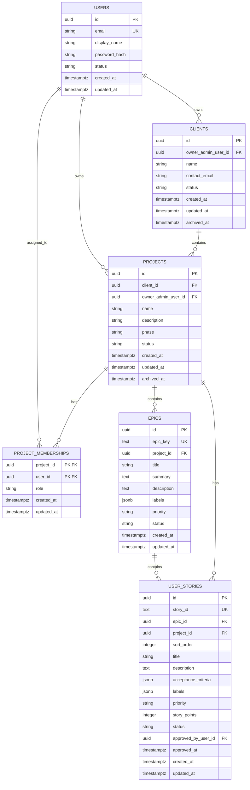

# Database Design

| Attribute        | Value                       |
| ---------------- | --------------------------- |
| **Project**      | Open Projects Hub |
| **Version**      | 1.8                         |
| **Status**       | Draft                       |
| **Last Updated** | 2026-08-11                  |

## Table of Contents

- [Source References](#source-references)
- [Design Scope and Assumptions](#design-scope-and-assumptions)
- [Data Domains](#data-domains)
- [Core Entities](#core-entities)
- [Relationships](#relationships)
- [Entity-Relationship Diagram (ERD)](#entity-relationship-diagram-erd)
- [Schema Documentation](#schema-documentation)
- [Constraints and Integrity Rules](#constraints-and-integrity-rules)
- [Access Patterns and Indexing Notes](#access-patterns-and-indexing-notes)
- [Migration and Evolution Considerations](#migration-and-evolution-considerations)
- [Security and Data Governance](#security-and-data-governance)
- [Risks and Open Questions](#risks-and-open-questions)
- [Traceability to Requirements](#traceability-to-requirements)

## Design Scope and Assumptions

- Covers the MVP core: user identity, client basics, project lifecycle, role-based access, and AI-refined user stories.
- Internal notes are out of scope for this simplified MVP schema and are not persisted in database entities.
- Removed in this version: ambiguity tracking, requirements promotion workflow, and Markdown export tracking. These can be reintroduced post-MVP. Acceptance criteria stored as JSONB on `user_stories` rather than a child table.
- The custom auth bounded context (per ADR-005) owns credential storage, JWT tokens, and user identity lifecycle. The application schema stores user profile, password hash, and authorization projection data.
- Database engine: Amazon RDS PostgreSQL (per ADR-004). Migrations managed via Alembic (per ADR-017). Physical deployment is out of scope here.

## Data Domains

- **Identity and Access:** User profile projection plus per-project role assignment for `admin` and `viewer` boundaries.
- **Client and Project Lifecycle:** Basic client info, project metadata, phase/status, epic grouping, and archive behavior.
- **Refinement and User Stories:** AI-generated user stories produced from refinement input, linked directly to projects with per-story approval tracking.

## Core Entities

| Entity                | Purpose                                                  | Bounded Context     | Lifecycle States     |
| --------------------- | -------------------------------------------------------- | ------------------- | -------------------- |
| `users`               | Application-visible user profile keyed to auth identity  | Identity and Access | `active`, `disabled` |
| `clients`             | Basic client info managed by the freelancer Admin        | Client Lifecycle    | `active`, `archived` |
| `projects`            | Project metadata, phase, and status                      | Project Lifecycle   | `active`, `archived` |
| `epics`               | Grouping container for related user stories per project  | Project Lifecycle   | `open`, `in_progress`, `done` |
| `project_memberships` | Per-project role assignment (admin or viewer)            | Identity and Access | active by record     |
| `user_stories`        | AI-generated user stories produced from refinement input | Refinement Workflow | `draft`, `approved`  |

## Relationships

- `users` owns `clients` and `projects` as the freelancer Admin boundary.
- `projects` belongs to a `client` and has `epics`, `project_memberships`, and `user_stories`.
- `epics` group user stories within a project; each epic contains one or more `user_stories`.
- `user_stories` are approved individually and linked to both their parent epic and project.

## Entity-Relationship Diagram (ERD)

## Schema Documentation

### 1. `users`

- **Purpose:** Represents authenticated platform users visible to the application as Admin or Viewer profiles.
- **Primary key:** `id` (UUID), generated by the application or database.
- **Constraints:** `email` unique, `status` check (`active`, `disabled`), `password_hash` NOT NULL.
- **Indexes:** unique index on `email`.
- **Design note:** Password hashing via bcrypt/passlib per ADR-005. JWT tokens, session state, and password-reset flows are managed by the custom auth bounded context.

### 2. `clients`

- **Purpose:** Basic client records owned by an Admin.
- **Primary key:** `id` (UUID).
- **Foreign keys:** `owner_admin_user_id -> users.id`.
- **Constraints:** `status` check (`active`, `archived`), nullable `archived_at` for soft archive. CHECK constraint: `status != 'archived' OR archived_at IS NOT NULL`.
- **Indexes:** `(owner_admin_user_id, status)`.

### 3. `projects`

- **Purpose:** Project metadata, lifecycle phase, and status.
- **Primary key:** `id` (UUID).
- **Foreign keys:** `client_id -> clients.id`, `owner_admin_user_id -> users.id`.
- **Constraints:**
  - `phase` check (`discovery`, `planning`).
  - `status` check (`active`, `archived`), nullable `archived_at` for soft archive. CHECK constraint: `status != 'archived' OR archived_at IS NOT NULL`.
- **Indexes:** `(owner_admin_user_id, status, created_at DESC)`, `(client_id, status)`.
- **Business rule:** max 3 active projects per Admin, enforced at the service layer within a single transaction.

### 4. `epics`

- **Purpose:** Grouping container for related user stories within a project. Maps to Jira epics for future integration.
- **Primary key:** `id` (UUID).
- **Human-readable key:** `epic_key` (TEXT, unique per project) following the convention `EPIC-{n}` (e.g., `EPIC-0`).
- **Foreign keys:** `project_id -> projects.id`.
- **Constraints:**
  - `epic_key` unique per project (unique constraint on `(project_id, epic_key)`).
  - `priority` check (`must_have`, `should_have`, `could_have`, `wont_have`).
  - `status` check (`open`, `in_progress`, `done`).
- **Indexes:** unique on `(project_id, epic_key)`, `(project_id, status)`, GIN on `(labels)`.

### 5. `project_memberships`

- **Purpose:** Per-project role assignment used for authorization and RLS decisions.
- **Primary key:** `(project_id, user_id)`.
- **Foreign keys:** `project_id -> projects.id`, `user_id -> users.id`.
- **Constraints:** `role` check (`admin`, `viewer`).
- **Uniqueness:** partial unique index on `(project_id)` where `role = 'admin'`; partial unique index on `(project_id)` where `role = 'viewer'`.
- **Indexes:** `(user_id)` for "my projects" authorization queries.

### 6. `user_stories`

- **Purpose:** AI-generated user stories linked to an epic within a project; individually approvable with acceptance criteria, priority, and estimation.
- **Primary key:** `id` (UUID).
- **Human-readable key:** `story_id` (TEXT, unique) following the convention `US-EP{epic}-{team}-{seq}` (e.g., `US-EP0-BE-001`).
- **Foreign keys:** `epic_id -> epics.id` (NOT NULL), `project_id -> projects.id`, `approved_by_user_id -> users.id`.
- **Constraints:**
  - `story_id` unique across all projects.
  - `priority` check (`must_have`, `should_have`, `could_have`, `wont_have`).
  - `story_points` nullable integer, check (`>= 1`) when present.
  - `status` check (`draft`, `approved`).
  - `sort_order >= 1`.
  - unique `(project_id, sort_order)` for deterministic ordering within a project.
  - `approved_by_user_id` and `approved_at` are `NULL` until explicit approval; a `CHECK` constraint requires both when `status = 'approved'`.
- **Indexes:** unique on `(story_id)`, `(epic_id, sort_order)`, `(project_id, status, created_at DESC)`, `(approved_by_user_id)`, GIN on `(acceptance_criteria)`, GIN on `(labels)`.

## Constraints and Integrity Rules

- **Primary keys:** UUIDs on all root entities; composite key on `project_memberships`.
- **Foreign keys:** all child records reference their parent entities to prevent orphaned stories and epics.
- **Uniqueness:** `users.email`, `user_stories.story_id`, `epics.epic_key` per project, one admin and one viewer membership per project, ordered stories within each project.
- **Check constraints:** lifecycle enums on all status fields, `epics.priority`, `user_stories.priority`, `projects.phase`, approval metadata pairing on `user_stories`.
- **Soft archive:** `clients` and `projects` use `status + archived_at` with CHECK constraints ensuring archival consistency.

## Access Patterns and Indexing Notes

- **Dashboard list:** active projects by owner -> `(owner_admin_user_id, status, created_at DESC)` on `projects`.
- **Epic board:** epics by project and status -> `(project_id, status)` on `epics`.
- **Project detail:** stories by project and status -> `(project_id, status, created_at DESC)` on `user_stories`.
- **Backlog view:** stories by epic, filtered by priority and status -> `(epic_id, sort_order)` + `story_id` for ordering.
- **Story rendering:** ordered stories within a project -> `(project_id, sort_order)` on `user_stories`.

## Migration and Evolution Considerations

- **Migration tooling:** Alembic for version-controlled, additive-first migrations per ADR-017. Manual review required on all auto-generated migrations.
- **Additive-first policy:** new columns and tables before destructive changes for MVP iterations.
- **Post-MVP additions:** requirements promotion, Markdown export tracking, and ambiguity logging can all be appended without changing this core schema.
- **Auth evolution:** extend the `users` projection and membership model for invites or onboarding without duplicating credential storage.

## Security and Data Governance

- **Sensitive fields:** user email and client contact email.
- **Access controls:** backend authorization and native PostgreSQL Row-Level Security (RLS) enforce Admin and Viewer boundaries with least-privilege defaults.
- **Auditability:** `created_at`, `updated_at`, `approved_at`, and `archived_at` provide lifecycle traceability.
- **Auth boundary:** credentials, password hashes, and JWT tokens are managed by the custom auth bounded context per ADR-005.

## Risks and Open Questions

- **Risk:** Max-3-active-project rule lives in the service layer; concurrent requests could bypass it. **Mitigation:** single-transaction check with `SELECT FOR UPDATE` or equivalent.
- **Risk:** draft stories could be exposed to Viewer users if approval filtering is inconsistent across API responses and RLS policies. **Mitigation:** enforce `status = 'approved'` visibility for Viewer paths and add role-based test coverage.
- **Open question:** Should `user_stories` support individual archival or only project-level lifecycle transitions?

## Traceability to Requirements

| Requirement | Database Coverage                                                                                       |
| ----------- | ------------------------------------------------------------------------------------------------------- |
| FR-001-01   | `clients` and `projects` with `client_id` FK model the Admin-managed client and project relationship.   |
| FR-001-02   | `projects.status` and owner index support the max-3-active-project validation path.                     |
| FR-001-03   | `projects.phase` constrained to `discovery` and `planning`.                                             |
| FR-002-01   | Raw input acceptance handled at application layer; refined output stored in `user_stories`.             |
| FR-002-02   | `user_stories` stores generated stories with `story_id`, `title`, `description`, `acceptance_criteria`, `priority`, `story_points`, `labels`, ordering, `epic_id`, and approval audit fields. |
| FR-002-03   | `user_stories.status` plus `approved_by_user_id` and `approved_at` preserve the explicit approval gate.                                                                                        |
| FR-003-01   | `project_memberships.role` and `users.status` support Admin and Viewer authorization.                                                                                                          |
| FR-003-02   | Partial unique membership indexes limit to one Admin and one Viewer per project.                                                                                                               |
| FR-003-03   | Approved `user_stories` and `projects.phase` provide the Viewer-safe story and phase visibility model.                                                                                         |
| FR-004-01   | `epics` and `user_stories` with `acceptance_criteria`, `priority`, `status`, and `epic_id` FK support structured backlog views grouped by epic, priority, and status.                          |
| FR-007-01   | `users` stores identity projection and `password_hash`; custom auth bounded context owns credential lifecycle. |
| FR-009-01   | Password-reset flow managed by custom auth module per ADR-005; not stored in this schema.                     |
| NFR-001-01  | Soft archive fields on `clients` and `projects` support privacy-aligned archival.                       |
| NFR-003-01  | Membership-driven RBAC and RLS-compatible ownership fields support least-privilege access.              |
| NFR-X01     | Auth-provider boundary and sensitive-field handling support secure credential design.                   |
| NFR-X06     | UUID keys and targeted indexes support MVP growth without logical schema changes.                       |

## Source References

- [Project Overview](../../overview.md)
- [F-001 Client and Project Lifecycle Management](../../01-requirements/f-001-client-and-project-lifecycle-management.md)
- [F-002 AI Refinement and Approval Workflow](../../01-requirements/f-002-ai-refinement-and-approval-workflow.md)
- [F-003 Access Control and Visibility Boundaries](../../01-requirements/f-003-access-control-and-visibility-boundaries.md)
- [ADR-004: Database (Amazon RDS PostgreSQL)](../adrs/adr-004-database.md)
- [ADR-005: Authentication and Authorization Strategy](../adrs/adr-005-authentication.md)

---

**Last Updated**: 2026-08-11
