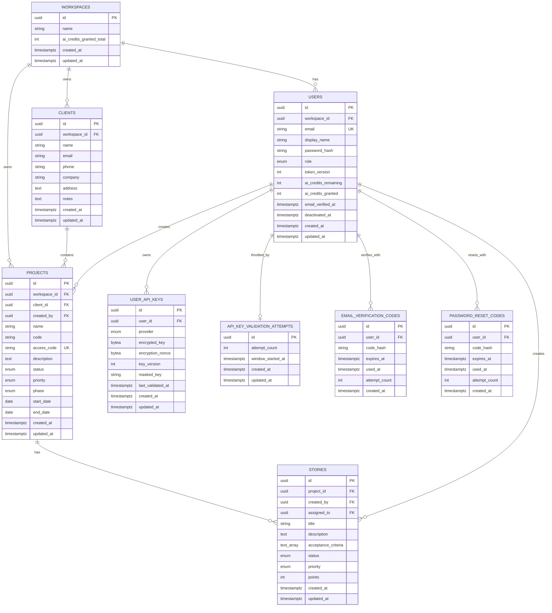

# Database Design

| Attribute        | Value                       |
| ---------------- | --------------------------- |
| **Project**      | Open Projects Hub |
| **Version**      | 2.0                         |
| **Status**       | Accepted                    |

This page describes the schema as implemented by the SQLAlchemy models and Alembic migrations in
`open-projects-hub-api` (`src/app/features/*/infrastructure/models/`, `alembic/versions/`).

## Table of Contents

- [Source References](#source-references)
- [Design Scope and Assumptions](#design-scope-and-assumptions)
- [Data Domains](#data-domains)
- [Core Entities](#core-entities)
- [Relationships](#relationships)
- [Entity-Relationship Diagram (ERD)](#entity-relationship-diagram-erd)
- [Schema Documentation](#schema-documentation)
- [Constraints and Integrity Rules](#constraints-and-integrity-rules)
- [Access Patterns and Indexing Notes](#access-patterns-and-indexing-notes)
- [Migration and Evolution Considerations](#migration-and-evolution-considerations)
- [Security and Data Governance](#security-and-data-governance)
- [Risks and Open Questions](#risks-and-open-questions)
- [Traceability to Requirements](#traceability-to-requirements)

## Design Scope and Assumptions

- Covers the MVP: workspaces and user identity, clients, the project lifecycle, approved user stories, AI credits and provider keys, and the auth state tables (verification codes, reset codes, lockouts, revoked refresh tokens).
- AI refinement output is not stored until the Admin or Member approves it (ADR-019). Every row in `stories` is an approved story; its `status` tracks delivery work, not approval.
- Acceptance criteria are stored as a PostgreSQL `TEXT[]` column on `stories`, not a child table or JSONB.
- Not built: epics, story ordering (`sort_order`), ambiguity tracking, export history, and database Row-Level Security. Authorization is enforced in the application layer (see [Security and Data Governance](#security-and-data-governance)).
- Database engine: PostgreSQL (ADR-004). Migrations are managed with Alembic (ADR-017).

## Data Domains

- **Identity and Access:** workspaces, users with workspace-scoped `admin` and `member` roles, and auth state (verification codes, reset codes, lockouts, revoked refresh tokens). Clients have no accounts; a project's `access_code` is the credential for the public Client Review route (ADR-020).
- **Client and Project Lifecycle:** client records and projects with status, priority, phase, and optional dates.
- **Stories:** approved user stories linked to a project.
- **AI Monetization:** per-user credit balances, encrypted provider keys, and the key-validation rate limit.

## Core Entities

| Entity | Purpose | Bounded Context | Lifecycle |
| --- | --- | --- | --- |
| `workspaces` | Tenant boundary owning users, `clients`, and `projects`; one per sign-up | Identity and Access | active by record |
| `users` | Admin or Member profile in one workspace | Identity and Access | unverified, active, deactivated (`deactivated_at`) |
| `clients` | Client records managed inside a workspace | Client Lifecycle | active by record; hard delete |
| `projects` | Project metadata, status, priority, phase, dates, and Client Review access code | Project Lifecycle | `active`, `completed`, `archived` |
| `stories` | Approved user stories (unapproved AI output is never stored, ADR-019) | Stories | `todo`, `in_progress`, `blocked`, `done` |
| `user_api_keys` | Per-user AI provider credentials, encrypted at rest | AI Monetization | active by record |
| `api_key_validation_attempts` | Per-user counter behind the key-validation rate limit | AI Monetization | rolling window |
| `email_verification_codes` | Hashed, short-lived codes that confirm an email or accept an invite | Identity and Access | active, used, expired |
| `password_reset_codes` | Hashed, short-lived password reset codes | Identity and Access | active, used, expired |
| `account_lockouts` | Failed-login counters and lockout windows, keyed by email | Identity and Access | cleared on success or expiry |
| `revoked_refresh_tokens` | Hashes of used or logged-out refresh tokens | Identity and Access | removed after expiry |

## Relationships

- Every `user`, `client`, and `project` belongs to exactly one `workspace`. Self-registration creates a new workspace with its Admin; an Admin adds `member` users to their own workspace only.
- A `project` belongs to one `client` and is created by one `user` (`created_by`).
- A `story` belongs to one `project` (`ON DELETE CASCADE`), records its creator, and can optionally be assigned to a user.
- `workspaces.ai_credits_granted_total` counts every free credit the workspace has ever handed out (ceiling 25) and never decreases, so deleting and re-adding members cannot mint more.
- A `user` holds its own AI credit balance and owns at most one `user_api_keys` row per provider.

## Entity-Relationship Diagram (ERD)

`account_lockouts` and `revoked_refresh_tokens` are keyed by email and token hash rather than by
foreign key, so they are left out of the diagram.

## Schema Documentation

### 1. `workspaces`

- **Purpose:** The tenant boundary that lets many freelancers share one instance safely. Every self-registration creates one; its Admin and any members it adds belong to it.
- **Primary key:** `id` (UUID).
- **Columns:** `name` (defaults to `"{displayName}'s workspace"` at sign-up, editable), `ai_credits_granted_total` (free credits ever granted in this workspace), audit timestamps.
- **Design note:** `clients` and `projects` carry `workspace_id` directly rather than joining through `users`, so every list and count query filters on one column. Every `workspace_id` foreign key is `ON DELETE RESTRICT`: a workspace that still owns rows cannot be deleted.

### 2. `users`

- **Purpose:** Admin and Member accounts.
- **Primary key:** `id` (UUID).
- **Foreign keys:** `workspace_id -> workspaces.id` (`ON DELETE RESTRICT`).
- **Constraints:** `email` unique instance-wide (an address belongs to one workspace), `password_hash` NOT NULL, `role` is the Postgres enum `userrole` (`admin`, `member`).
- **Indexes:** unique on `email`; `workspace_id`; `created_at`.
- **Sessions:** `token_version` is embedded in refresh tokens. Bumping it (password reset, deactivation, forced logout) invalidates every outstanding refresh token for the user.
- **Deactivation:** `deactivated_at` blocks sign-in without deleting the row.
- **Email verification (F-008):** `email_verified_at` is `NULL` until the account confirms its email, and login is refused while it is `NULL`. Self-registered accounts verify with a 5-minute code. Accounts an Admin adds verify through a 24-hour invite code and set their own password at the same time. Accounts created by the seed script are verified on creation.
- **AI credits (F-010):** `ai_credits_remaining` and `ai_credits_granted` start at 0 for self-registered and invited accounts. When the email is verified the account is granted 5 credits, reserved atomically from the workspace's `ai_credits_granted_total` (ceiling 25). `granted` is kept alongside `remaining` so the UI can render "3 of 5" without hardcoding the grant. A credit is spent with a single conditional `UPDATE ... WHERE ai_credits_remaining > 0`, so two concurrent refinements cannot share one credit.

### 3. `clients`

- **Purpose:** Client records managed inside a workspace.
- **Primary key:** `id` (UUID).
- **Foreign keys:** `workspace_id -> workspaces.id` (`ON DELETE RESTRICT`).
- **Columns:** `name` (required), optional `email`, `phone`, `company`, `address`, `notes`, audit timestamps.
- **Indexes:** `(workspace_id, name)`; `name`, `email`, `company`, `created_at`; partial unique index `uq_clients_workspace_id_email` on `(workspace_id, email)` where `email IS NOT NULL`. An email can repeat across workspaces but not within one.
- **Lifecycle:** clients have no archive state. A client with active projects cannot be deleted; deleting a client first deletes its archived projects (the application does this, since `projects.client_id` has no cascade).

### 4. `projects`

- **Purpose:** Project metadata, lifecycle status, priority, phase, and optional dates.
- **Primary key:** `id` (UUID).
- **Foreign keys:** `workspace_id -> workspaces.id` (`ON DELETE RESTRICT`), `client_id -> clients.id`, `created_by -> users.id`.
- **Enums:** `status` (`active`, `completed`, `archived`), `priority` (`low`, `medium`, `high`), `phase` (`discovery`, `planning`).
- **Dates:** `start_date` and `end_date` are optional `DATE` columns.
- **Indexes:** `(workspace_id, status, created_at)`, `(status, created_at)`, `created_by`, `priority`, `code`, `client_id`, `created_at`.
- **Uniqueness:** `(workspace_id, code)` (`uq_projects_workspace_id_code`): a project code is unique within a workspace, so two freelancers can both use `WEB`.
- **Client Review key:** `access_code` (`VARCHAR(20)`, NOT NULL), unique instance-wide (`uq_projects_access_code`). Server-generated as `PRJ-` plus 8 characters from `A-Z`/`2-9` without `O`/`I` (about 10^12 values) and regenerated on demand to revoke access. It is the only column the public Client Review route looks a project up by, which is why it is globally unique while `code` is not (ADR-020).
- **Business rule:** at most 3 active projects per workspace (`project_limits.max_active_per_admin`), checked when a project is created or reactivated.

### 5. `stories`

- **Purpose:** Approved user stories for a project. AI refinement output is held in the browser until approved and is never stored before that (ADR-019).
- **Primary key:** `id` (UUID).
- **Foreign keys:** `project_id -> projects.id` (`ON DELETE CASCADE`), `created_by -> users.id`, `assigned_to -> users.id` (nullable).
- **Columns:** `title` (`VARCHAR(255)`), `description`, `acceptance_criteria` (`TEXT[]`, default empty), `points` (nullable integer), audit timestamps.
- **Enums:** `status` (`todo`, `in_progress`, `blocked`, `done`), `priority` (`low`, `medium`, `high`).
- **Indexes:** `(project_id, created_at)`, `(assigned_to, status)`, `(status, priority)`, `created_by`, `created_at`.
- **Ordering:** stories are listed by `created_at`. There is no manual ordering column.

### 6. `user_api_keys`

- **Purpose:** Stores a user's own AI provider credentials so refinement can run on their quota instead of platform credits (F-010 FR-010-04).
- **Primary key:** `id` (UUID).
- **Foreign keys:** `user_id -> users.id` with `ON DELETE CASCADE`.
- **Constraints:** `UNIQUE (user_id, provider)`: one key per provider per user. `provider` is the Postgres enum `aiprovider` (`gemini`, `openai`, `deepseek`).
- **Indexes:** `user_id`, `created_at`.
- **Design note:** The table holds ciphertext only. There is no plaintext column and no read path that returns one (NFR-010-01, NFR-010-02). `encrypted_key` and `encryption_nonce` are AES-256-GCM output with the owning `user_id` bound as associated data, so a row copied onto another user fails authentication rather than decrypting. `key_version` records which master key produced the ciphertext, which makes rotation possible (ADR-018). `masked_key` is the only display form. Rotation overwrites the row, and deletion is a hard `DELETE` (NFR-010-04).

### 7. `api_key_validation_attempts`

- **Purpose:** Backs the per-user limit of 5 key-validation attempts per hour (NFR-010-03).
- **Primary key:** `id` (UUID), which is the user's id: the budget is per account and one window is open at a time.
- **Foreign keys:** `id -> users.id` with `ON DELETE CASCADE`.
- **Design note:** Validation calls reach third-party providers, so an unmetered endpoint would let one account probe provider APIs through the platform. The limit is per user rather than per IP. The window opens on the first attempt and rolls after an hour, and a charge is a single `INSERT ... ON CONFLICT DO UPDATE ... RETURNING`, so concurrent requests cannot collapse into one charge. Storage is in the database so the budget survives a restart.

### 8. `email_verification_codes`

- **Purpose:** Backs sign-up email verification and invite acceptance (F-008 FR-008-03 to FR-008-05, NFR-008-02/03).
- **Primary key:** `id` (UUID).
- **Foreign keys:** `user_id -> users.id` with `ON DELETE CASCADE`.
- **Columns:** `code_hash` (bcrypt; the plaintext code is never stored), `expires_at` (5 minutes for sign-up, 24 hours for invited accounts), `used_at` (set on success or when superseded by a newer code), `attempt_count` (5 wrong guesses lock the code), `created_at`.
- **Indexes:** `user_id`, `created_at` (the resend limit counts codes issued per user in the last 15 minutes).

### 9. `password_reset_codes`

- **Purpose:** Backs password reset (F-009).
- **Columns and keys:** same shape as `email_verification_codes`; codes expire after 30 minutes.
- **Design note:** kept separate from verification codes because the lifecycles differ: a verification code activates an account and grants credits, a reset code changes a credential and revokes sessions (`users.token_version`).

### 10. `account_lockouts`

- **Purpose:** Progressive login lockout after repeated failures (F-007).
- **Primary key:** `email`.
- **Columns:** `failed_attempts`, `locked_until` (nullable), `last_attempt_at`.
- **Design note:** keyed by email rather than user id so attempts against unknown addresses are throttled the same way. Stored in the database so lockouts survive restarts and apply across instances.

### 11. `revoked_refresh_tokens`

- **Purpose:** Makes refresh tokens single-use and lets logout revoke a session.
- **Primary key:** `token_hash` (SHA-256 of the token; raw tokens are never stored).
- **Columns:** `expires_at`; rows past it can be removed.
- **Design note:** the primary key also settles concurrent refreshes with the same token: only the request whose insert succeeds receives new tokens.

## Constraints and Integrity Rules

- **Primary keys:** UUIDs on all entity tables; `account_lockouts` and `revoked_refresh_tokens` use natural keys (email, token hash).
- **Foreign keys:** `workspace_id` references are `ON DELETE RESTRICT`. Stories, API keys, codes, and validation attempts cascade with their parent.
- **Uniqueness:** `users.email` (instance-wide), `projects.code` per workspace, `projects.access_code` instance-wide, `clients.email` per workspace (when present), `user_api_keys (user_id, provider)`.
- **Enums:** `userrole`, `aiprovider`, project `status`/`priority`/`phase`, story `status`/`priority`.

## Access Patterns and Indexing Notes

- **Dashboard and project list:** projects by workspace and status, newest first: `(workspace_id, status, created_at)`.
- **Active-project limit:** count of a workspace's active projects: `(workspace_id, status, created_at)`.
- **Project backlog and export:** stories by project in creation order: `(project_id, created_at)`.
- **Client Review:** one project by access code: unique `access_code`, then the project's stories.
- **Client list and duplicate check:** `(workspace_id, name)` and the partial unique `(workspace_id, email)`.

## Migration and Evolution Considerations

- **Tooling:** Alembic, with auto-generated migrations reviewed by hand (ADR-017). The migration chain is linear with a single head.
- **Additive first:** new columns and tables come before destructive changes. Data migrations backfill new non-null columns (for example `email_verified_at` for accounts that existed before verification, and `access_code` for existing projects).
- **Possible additions:** epics, manual story ordering, export history, and story archival can be added without changing the existing tables.

## Security and Data Governance

- **Sensitive fields:** user email, client contact details, password hashes, encrypted provider keys.
- **Access control:** enforced in the application layer. Every repository method takes the caller's `workspace_id` and filters by it, so a record from another workspace is reported as not found. Row-Level Security is not used. The public Client Review route resolves a single project from its access code and reads that project's stories only.
- **Secrets at rest:** passwords and one-time codes are bcrypt hashes, refresh tokens are stored as SHA-256 hashes, provider keys are AES-256-GCM ciphertext.
- **Auditability:** `created_at` and `updated_at` on every entity table, plus `email_verified_at`, `deactivated_at`, and `used_at` on the codes.

## Risks and Open Questions

- **Risk:** the active-project limit is checked in the application layer; two concurrent creates could both pass the count. The window is small for a single-freelancer workspace.
- **Open question:** should individual stories be archivable, or only follow their project's lifecycle?

## Traceability to Requirements

| Requirement | Database Coverage |
| ----------- | ----------------- |
| FR-001-01 | `clients` and `projects` with the `client_id` FK model the client and project relationship. |
| FR-001-02 | `projects.status` and `(workspace_id, status, created_at)` support the max-3-active-projects check. |
| FR-001-03 | `projects.phase` limited to `discovery` and `planning`. |
| FR-002-01 | Refinement input is handled in the application layer; approved output is stored in `stories`. |
| FR-002-02 | `stories` stores `title`, `description`, `acceptance_criteria`, `priority`, and `points`. |
| FR-002-03 | Only approved stories are written (ADR-019), which preserves the approval gate. |
| FR-003-01 | `users.role` (`admin`, `member`) supports Admin and Member authorization. |
| FR-003-02 | `workspace_id` on users, clients, and projects confines every record to one workspace. |
| FR-003-03 | `stories`, `projects.phase`, and the unique `projects.access_code` give clients read-only visibility of one project. |
| FR-004-01 | `stories` with `acceptance_criteria`, `priority`, and `status` support the backlog view and Markdown export. |
| FR-007-01 | `users.password_hash`, `account_lockouts`, and `revoked_refresh_tokens` back login, lockout, and session rotation. |
| FR-009-01 | `password_reset_codes` backs the reset flow; `users.token_version` revokes sessions after a reset. |
| FR-010-01 | Accounts are granted 5 credits when `email_verified_at` is set, reserved from `workspaces.ai_credits_granted_total` (ceiling 25). |
| FR-010-02 | Conditional `UPDATE ... WHERE ai_credits_remaining > 0` spends exactly one credit, only after a successful refinement. |
| FR-010-04 | `user_api_keys` with `UNIQUE (user_id, provider)` gives one replaceable key per provider per user. |
| FR-010-07 | `masked_key` is the only display form; no column or read path exposes plaintext. |
| NFR-010-01 | `encrypted_key`/`encryption_nonce` hold AES-256-GCM ciphertext; `key_version` supports rotation (ADR-018). |
| NFR-010-03 | `api_key_validation_attempts` enforces 5 validations per user per hour via an atomic upsert. |
| NFR-010-04 | Key removal is a hard `DELETE`; `ON DELETE CASCADE` clears keys with the owning account. |
| NFR-003-01 | Workspace-scoped foreign keys and repository filters support least-privilege access. |
| NFR-X01 | Hashed passwords, codes, and refresh tokens, plus encrypted provider keys, support secure credential handling. |
| NFR-X06 | UUID keys and targeted indexes support MVP growth without logical schema changes. |

## Source References

- [Project Overview](../../00-context/overview.md)
- [F-001 Client and Project Lifecycle Management](../../01-requirements/f-001-client-and-project-lifecycle-management.md)
- [F-002 AI Refinement and Approval Workflow](../../01-requirements/f-002-ai-refinement-and-approval-workflow.md)
- [F-003 Access Control and Visibility Boundaries](../../01-requirements/f-003-access-control-and-visibility-boundaries.md)
- [ADR-004: Database (Amazon RDS PostgreSQL)](../../04-decisions/adr-004-database.md)
- [ADR-005: Authentication and Authorization Strategy](../../04-decisions/adr-005-authentication.md)

---

**Last Updated**: 2026-10-07
