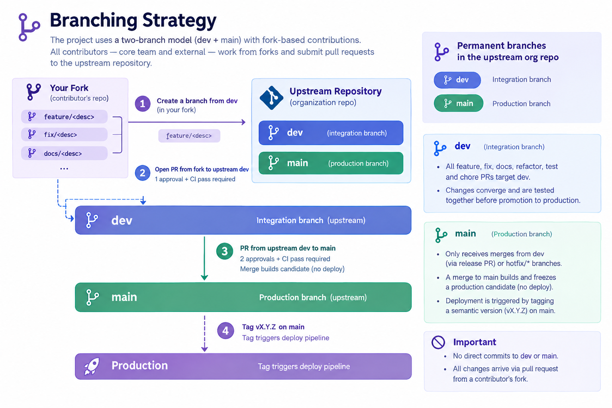
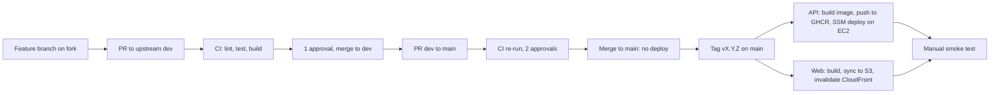

# CI/CD Pipeline Architecture

| Attribute   | Value             |
| ----------- | ----------------- |
| **Project** | Open Projects Hub |
| **Version** | 3.0               |
| **Status**  | Accepted          |

## Table of Contents

- CI/CD Pipeline Architecture
  - [Table of Contents](#table-of-contents)
  - [1. Branching Strategy](#1-branching-strategy)
    - [Branch Protection Rules](#branch-protection-rules)
  - [2. Fork Setup \& Sync](#2-fork-setup--sync)
    - [One-time Fork Setup](#one-time-fork-setup)
    - [Keeping Your Fork in Sync](#keeping-your-fork-in-sync)
  - [3. Branch Naming Conventions](#3-branch-naming-conventions)
  - [4. PR Conventions](#4-pr-conventions)
    - [Feature PR Flow (target: `dev`)](#feature-pr-flow-target-dev)
    - [Release PR Flow (dev → main)](#release-pr-flow-dev--main)
    - [Releasing to Production](#releasing-to-production)
    - [Release Versioning](#release-versioning)
    - [Commit Conventions](#commit-conventions)
  - [5. CI/CD Tool Selection](#5-cicd-tool-selection)
  - [6. Pipeline Stages](#6-pipeline-stages)
  - [7. Build and Verification Responsibilities](#7-build-and-verification-responsibilities)
  - [8. Hotfix Process](#8-hotfix-process)
  - [9. Deployment Environment Strategy](#9-deployment-environment-strategy)
  - [10. Database Migration Strategy](#10-database-migration-strategy)
  - [11. Rollback Strategy](#11-rollback-strategy)
  - [12. Environment Variables and Secrets Management](#12-environment-variables-and-secrets-management)
  - [13. Zero-Downtime Deployment Approach](#13-zero-downtime-deployment-approach)
  - [14. Deployment Impact Summary](#14-deployment-impact-summary)
  - [Source References](#source-references)

## 1. Branching Strategy

The project uses a **two-branch model** (`dev` + `main`) with fork-based contributions. All contributors — core team and external — work from forks and submit pull requests to the upstream repository.

```text
feature/<desc>  fix/<desc>  docs/<desc>    ← created from dev in your fork
         │
         ▼
        dev  ───────────────────────────── integration branch (upstream)
         │                                 PR from fork to upstream dev
         │                                 1 approval + CI pass required
         │
         ▼  (PR dev → main)
        main ───────────────────────────── production branch (upstream)
         │                                 PR from upstream dev to main
         │                                 2 approvals + CI pass required
         │                                 merge builds candidate (no deploy)
         │
         ▼  (tag vX.Y.Z on main)
    Production ─────────────────────────── tag triggers deploy pipeline
```



**Permanent branches in the upstream org repo:** `dev`, `main`

- **`dev`**: Integration branch. All feature, fix, docs, refactor, test, and chore PRs target `dev`. This is where changes converge and are tested together before promotion to production.
- **`main`**: Production branch. Only receives merges from `dev` (via release PR) or `hotfix/*` branches. A merge to `main` builds and freezes a production candidate but does **not** deploy. Deployment is triggered by tagging a semantic version (`vX.Y.Z`) on `main`.

No direct commits to `dev` or `main`. All changes arrive via pull request from a contributor's fork.

**Relationship to ADR-016:** The branching model, commit conventions, and merge strategy are defined in [ADR-016](../../04-decisions/adr-016-git-workflow-strategy.md). This document defines the CI/CD pipeline that enforces these conventions.

### Branch Protection Rules

| Rule                    | `dev`                                       | `main`                                                      |
| ----------------------- | ------------------------------------------- | ----------------------------------------------------------- |
| Direct pushes           | ❌ Blocked                                  | ❌ Blocked                                                  |
| PR required             | ✅ All changes via PR                       | ✅ All changes via PR from `dev` or hotfix                  |
| Required approvals      | 1 (when team > 1)                           | 2                                                           |
| Status checks           | ✅ Must pass (lint, test, type-check, docs) | ✅ Must pass (lint, test, type-check, docs) |
| Up-to-date before merge | ✅ Required                                 | ✅ Required                                                 |
| Conversation resolution | ✅ Required                                 | ✅ Required                                                 |
| Stale reviews           | ✅ Dismissed on new commits                 | ✅ Dismissed on new commits                                 |
| Force pushes            | ❌ Blocked                                  | ❌ Blocked                                                  |

---

## 2. Fork Setup & Sync

### One-time Fork Setup

Fork the upstream repository on GitHub, then:

```bash
git clone git@github.com:<your-handle>/open-projects-hub.git
cd open-projects-hub
git remote add upstream git@github.com:<org>/open-projects-hub.git
git remote -v
# origin    git@github.com:<your-handle>/open-projects-hub.git (fetch/push)
# upstream  git@github.com:<org>/open-projects-hub.git (fetch/push)
```

`origin` is your fork. `upstream` is the org repo. You push to `origin` and open PRs targeting `upstream`.

### Keeping Your Fork in Sync

Sync your fork's `dev` with upstream before starting any new branch:

```bash
git fetch upstream
git checkout dev
git rebase upstream/dev
git push origin dev
```

If your feature branch diverges from `dev` while in progress:

```bash
git checkout feature/add-pipeline-audit
git rebase upstream/dev
git push origin feature/add-pipeline-audit --force-with-lease
```

---

## 3. Branch Naming Conventions

All work branches are created from `dev` (except hotfixes, which branch from `main`):

| Branch type   | Pattern                       | Example                       | Targets |
| ------------- | ----------------------------- | ----------------------------- | ------- |
| Feature       | `feature/<short-description>` | `feature/ai-refinement-ui`    | `dev`   |
| Bug fix       | `fix/<issue-description>`     | `fix/login-redirect-loop`     | `dev`   |
| Documentation | `docs/<topic>`                | `docs/update-readme`          | `dev`   |
| Refactoring   | `refactor/<component>`        | `refactor/auth-service`       | `dev`   |
| Tests         | `test/<scope>`                | `test/auth-endpoints`         | `dev`   |
| Chores        | `chore/<task>`                | `chore/update-dependencies`   | `dev`   |
| Hotfix        | `hotfix/<description>`        | `hotfix/fix-login-regression` | `main`  |

---

## 4. PR Conventions

All pull requests follow these conventions:

| Field              | Rule                                                                           |
| ------------------ | ------------------------------------------------------------------------------ |
| Title              | Short description in imperative mood (e.g., `add pipeline audit endpoint`)     |
| Target branch      | `dev` for features, fixes, docs, refactors, tests, chores; `main` for hotfixes |
| Merge strategy     | Standard merge commit — preserves full feature branch history (see ADR-016)    |
| Required approvals | 1 for PRs targeting `dev`; 2 for PRs targeting `main`                          |
| Self-approval      | Not allowed                                                                    |
| CI gate            | All status checks must pass (lint, test, type-check, docs)                     |
| Unresolved threads | Must be resolved before merge                                                  |
| Up-to-date         | Branch must be current with target before merge                                |

### Feature PR Flow (target: `dev`)

```bash
# 1. Sync your fork
git fetch upstream
git checkout dev
git rebase upstream/dev
git push origin dev

# 2. Create feature branch
git checkout -b feature/add-pipeline-audit

# 3. Develop and commit using Conventional Commits
git commit -m "feat(api): add pipeline_audit POST endpoint"

# 4. Push to your fork
git push -u origin feature/add-pipeline-audit

# 5. Open PR on GitHub:
#    From: <your-handle>/open-projects-hub:feature/add-pipeline-audit
#    Into: <org>/open-projects-hub:dev
```

CI runs checks on the PR. After 1 approval and all checks passing, merge via standard merge commit. Delete the fork branch after merge.

### Release PR Flow (dev → main)

```bash
# Open a PR from upstream dev into upstream main
# Requires 2 approvals and all CI checks passing
# Merge builds and freezes a production candidate — does NOT deploy
```

### Releasing to Production

Once the candidate is signed off, tag the release from upstream `main`:

```bash
git fetch upstream
git checkout main
git rebase upstream/main
git tag v1.0.0
git push upstream v1.0.0
```

The tag (`vX.Y.Z`) triggers the production deployment pipeline.

### Release Versioning

The project uses semantic versioning (`vMAJOR.MINOR.PATCH`):

| Segment | Increment when                                   |
| ------- | ------------------------------------------------ |
| `MAJOR` | Breaking change to a public API or data contract |
| `MINOR` | New feature, backwards-compatible                |
| `PATCH` | Bug fix, backwards-compatible                    |

Hotfixes increment `PATCH` (e.g., `v1.0.0` → `v1.0.1`). New features shipped via the normal `dev` → `main` cycle increment `MINOR` (e.g., `v1.0.1` → `v1.1.0`).

### Commit Conventions

All commits follow **Conventional Commits** (`<type>(<scope>): <description>`):

| Type       | When to use                                   |
| ---------- | --------------------------------------------- |
| `feat`     | New feature for users                         |
| `fix`      | Bug fix                                       |
| `docs`     | Documentation only                            |
| `style`    | Code formatting, whitespace (no logic change) |
| `refactor` | Code change with no functional change         |
| `test`     | Adding or updating tests                      |
| `chore`    | Build process, tooling, dependencies          |
| `perf`     | Performance improvements                      |
| `ci`       | CI/CD configuration changes                   |

Examples:

- `feat(auth): add JWT refresh token rotation`
- `fix(ui): resolve modal close button alignment`
- `docs(adr): add code quality tooling strategy`
- `refactor(api): extract validation logic to shared module`

**Enforcement:** PR titles are validated via CI (GitHub Actions checks Conventional Commits format). Commit *messages* are not validated by a local hook, so message format stays friction-free during rapid iteration. Local pre-commit hooks are still used for code quality — Ruff, ESLint, Prettier, mypy, and gitleaks secret detection per [ADR-015](../../04-decisions/adr-015-code-quality-tooling.md) — and CI re-runs those checks as the authoritative gate, so a bypassed hook cannot land non-conforming code. CONTRIBUTING.md documents the format with examples for new contributors.

---

## 5. CI/CD Tool Selection

**Selected:** GitHub Actions
**Rationale:** Native repository integration, environment protection rules for `main` and `dev` branches, flexible workflow orchestration, Terraform automation, and release tracking with Sentry.

---

## 6. Pipeline Stages

The CI/CD pipeline is designed around the two-branch strategy to ensure code quality and a safe path to production.



---

## 7. Build and Verification Responsibilities

- **Feature PR Pipeline (target: `dev`):** Triggered on every PR from a fork targeting upstream `dev`.
  - Runs all documentation checks, code quality scans, and unit/integration tests.
  - Runs the repository's lint, format, security and unit-test checks, and builds the frontend artifacts to ensure validity.
  - In the infrastructure repository it runs `terraform fmt -check` and `terraform validate`.
  - **No deployment occurs from this pipeline.**

- **Release PR Pipeline (target: `main`):** Triggered on a PR from upstream `dev` to upstream `main`.
  - This is a governance step. It re-runs the same checks as the feature PR pipeline.
  - Requires 2 approvals before merging.
  - **Merge freezes a candidate — does NOT deploy.**

- **Production Deployment Pipeline (trigger: tag `vX.Y.Z` on `main`):**
  - **Backend repository:** builds the Docker image from the tagged commit, pushes `ghcr.io/alonsovndev/open-projects-hub-api:vX.Y.Z`, then runs the `ophub-prod-deploy` SSM document on the EC2 host. The host pulls the image and restarts the Docker Compose stack. Alembic migrations run when the API container starts. The workflow fails if the stack does not start healthy: Docker Compose waits for the API health check (about two minutes at most), then the deploy script waits up to 90 more seconds for `/health/ready`.
  - **Frontend repository:** builds the React app from the tagged commit, syncs it to S3 and invalidates the CloudFront cache.
  - Both workflows authenticate to AWS with short-lived OIDC credentials. They can also be run manually from a tag ref to redeploy it.
  - **Infrastructure** is not applied by the pipeline: Terraform changes are applied locally by the owner after reviewing the plan (see [Deployment Architecture](./deployment-architecture.md)).
  - Smoke tests are run manually after a deploy: log in as the seeded admin and create a project. Self-registration cannot be smoke-tested until an email provider with a verified sending domain is configured, because new users must verify by email.

---

## 8. Hotfix Process

Use hotfixes only for critical production bugs that cannot wait for the normal `dev` → `main` cycle. The 2-approval requirement still applies.

1. Sync your fork's `main` with upstream, then branch from it:

   ```bash
   git fetch upstream
   git checkout main
   git rebase upstream/main
   git checkout -b hotfix/fix-login-regression
   ```

2. Fix, test, push to your fork, and open a PR into upstream `main` (2 approvals).

3. After merge and approval, tag the hotfix release from upstream `main`:

   ```bash
   git tag v1.0.1
   git push upstream v1.0.1
   ```

   The tag triggers the production deployment pipeline.

4. Back-merge into upstream `dev` to keep branches in sync:

   ```bash
   git fetch upstream
   git checkout dev
   git rebase upstream/dev
   git merge upstream/main
   git push upstream dev
   ```

**Recovery:** The default is fix-forward — land another hotfix. Redeploying a prior good version is possible by running the deploy workflow on the earlier tag, but fix-forward is the norm.

---

## 9. Deployment Environment Strategy

Development happens in the local environments (`local`, `test` and `container`, see ADR-014). AWS hosts a single environment:

- **Production:** the release shown at the master's review, a single low-cost EC2 host behind CloudFront (see ADR-021). It is deployed **only** from a `vX.Y.Z` tag cut from `main`.

There is no persistent `staging` or `dev` environment on AWS. The `dev` branch provides code-level integration; the `container` environment, which runs the same Docker image that is deployed, serves as the pre-release smoke test.

---

## 10. Database Migration Strategy

- Migrations are managed via **Alembic** (see ADR-017) and are versioned and backward-compatible.
- In the production pipeline (triggered by tag `vX.Y.Z` on `main`), migrations run when the API container starts (`alembic upgrade head` in `scripts/start-api.sh`). With a single instance there is no migration race.
- A failed migration keeps the API from becoming ready, so the deploy script times out and the workflow fails instead of reporting success against an incorrect schema version.

---

## 11. Rollback Strategy

- **Application Rollback:** Re-run the deploy workflow on the previous tag. For the frontend, re-run its deploy workflow on the previous tag.
- **Database Rollback:** Prefer forward-fix migrations. There are no database backups (ADR-021), so a destructive migration cannot be undone by restoring data.
- **Infrastructure Rollback:** Revert the change in the Terraform code and apply it locally.

---

## 12. Environment Variables and Secrets Management

- Runtime secrets for production are generated by Terraform (or set by hand) in **AWS Systems Manager Parameter Store** under `/ophub/prod/`.
- The deploy script on the host reads them with the instance role and writes a root-only `.env` for Docker Compose. Parameters still set to the placeholder `N/A` are skipped, so the variable stays unset.
- GitHub holds no AWS keys: workflows assume IAM roles through OIDC. Repository variables hold only non-secret identifiers (role ARN, region, instance ID, bucket, distribution ID).
- No plaintext secrets are ever stored in the repository.

---

## 13. Zero-Downtime Deployment Approach

- Zero-downtime deployment is **not** provided: the single EC2 host restarts the API container on each deploy, so expect a short interruption (ADR-021).
- Database migrations are written to be backward-compatible. A failed deploy is not rolled back automatically: the old API container has already been replaced, so the site is down until the previous tag is redeployed.
- The frontend is deployed independently to S3 and CloudFront; uploading hashed assets before `index.html` and keeping old hashed files avoids broken pages during a deploy.

---

## 14. Deployment Impact Summary

- The architecture supports a controlled release promotion: `dev` → `main` (candidate) → tag `vX.Y.Z` (deploy).
- Fork-based contributions ensure consistent workflow for all contributors and clean upstream history.
- Sentry can be enabled by setting its DSN; there is no CloudWatch alarm setup. Cost is watched through AWS Budgets alerts.
- The pipeline design separates development integration (`dev`) from production releases (`main`), ensuring stability.
- Hotfixes bypass `dev` and go directly to `main`, then back-merge to keep branches synchronized.

## Source References

- [Deployment Architecture](./deployment-architecture.md)
- [Requirements Home](../../01-requirements/README.md)
- [ADR-006: Deployment Platform (AWS)](../../04-decisions/adr-006-deployment-platform.md) (superseded in part)
- [ADR-021: Low-Cost Single-Host Deployment](../../04-decisions/adr-021-low-cost-single-host-deployment.md)
- [ADR-011: Secrets Management Strategy](../../04-decisions/adr-011-secrets-management.md)
- [ADR-013: Infrastructure as Code Strategy](../../04-decisions/adr-013-infrastructure-as-code.md)
- [ADR-016: Git Workflow and Branch Strategy](../../04-decisions/adr-016-git-workflow-strategy.md)
- [ADR-017: Database Migration Strategy](../../04-decisions/adr-017-database-migration-strategy.md)

---

**Last Updated**: 2026-10-10
