# CI/CD Pipeline Architecture

| Attribute        | Value                       |
| ---------------- | --------------------------- |
| **Project**      | Open Freelancer Project Hub |
| **Version**      | 1.0                         |
| **Status**       | Draft                       |
| **Last Updated** | 2026-02-28                  |

## 1. CI/CD Tool Selection

## Sources

- [Architecture Solution Design](../architecture-solution-design.md)
- [Technology Stack](../technology-stack.md)
- [Deployment Architecture](deployment-architecture.md)
- [Non-Functional Requirements](../../01-requirements/non-functional-requirements.md)

---

**Selected:** GitHub Actions  
Rationale: native repository integration, environment protection rules, flexible workflow orchestration, and release automation support with Sentry.

## 2. Pipeline Stages

```mermaid
flowchart LR
    A[PR Opened/Updated] --> B[Static Checks & Docs Validation]
    B --> C[Unit/Integration Test Gates in App Repos]
    C --> D[Build Artifacts]
    D --> E[Deploy Preview Environment]
    E --> F[Manual Review & Approval]
    F --> G[Merge to Develop]
    G --> H[Deploy Staging + Smoke Tests]
    H --> I[Merge to Main]
    I --> J[Production Deploy]
    J --> K[Post-Deploy Verification + Sentry Release Check]
```

## 3. Build and Verification Responsibilities

- **PR pipeline:**
  - Markdown/document checks for docs repository changes.
  - Contract and quality gates in application repositories.
  - Preview deployment for frontend changes.
- **Staging pipeline:**
  - Environment-specific build.
  - Smoke tests for auth, core CRUD, and requirements flows.
- **Production pipeline:**
  - Promotion of validated artifacts.
  - Post-deploy health and observability checks.

## 4. Deployment Stages (dev, staging, production)

- **Dev:** fast feedback, frequent deployments from active branches.
- **Staging:** candidate validation in production-like configuration.
- **Production:** protected branch, required approvals, controlled rollout.

## 5. Database Migration Strategy

- Migrations are versioned and backward compatible.
- Order of operations:
  1. Apply additive/non-breaking migration.
  2. Deploy backend using new schema path.
  3. Remove deprecated schema paths in later release window.
- Migration status is surfaced as a deployment gate in GitHub Actions.

## 6. Rollback Strategy

- **Application rollback:** redeploy last successful artifact/commit.
- **Database rollback:** prefer forward-fix migrations; if severe, use Supabase PITR restore under incident protocol.
- **Operational rollback trigger:** elevated error rate, unavailable auth path, or failed smoke checks.

## 7. Release Strategies

- **Frontend:** progressive rollout via Vercel deployment controls.
- **Backend:** rolling deployments on Render with health checks.
- **Canary/blue-green:** optional future enhancement for high-risk backend changes.

## 8. Environment Variables and Secrets Management

- Secrets stored in GitHub Actions encrypted secrets and platform environment stores.
- No plaintext secrets in repository.
- Separate secret scopes per environment.
- Rotation policy aligned with ADR-012 secrets strategy.

## 9. Zero-Downtime Deployment Approach

- Stateless backend services with readiness/health checks.
- Rolling replacement of instances in Render.
- Backward-compatible APIs and schema changes during transition windows.
- Frontend deployed independently to minimize cross-service blast radius.

## 10. Deployment Impact Summary

- Architecture supports controlled release promotion and fast rollback.
- Sentry release tracking provides immediate user-impact visibility.
- Pipeline design aligns with MVP delivery speed while preserving production safety.

---

## Change Log

| Date       | Version | Change Summary                                          | Author |
| ---------- | ------- | ------------------------------------------------------- | ------ |
| 2026-02-28 | 1.0     | Initial draft — CI/CD pipeline architecture             | —      |
| 2026-03-24 | 1.1     | Moved to ops/ subfolder; Sources section added          | —      |
