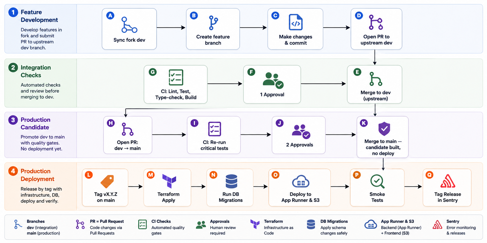

# CI/CD Pipeline Architecture

| Attribute        | Value                       |
| ---------------- | --------------------------- |
| **Project**      | Open Projects Hub |
| **Version**      | 3.0                         |
| **Status**       | Draft                       |
| **Last Updated** | 2026-08-07                  |

## Sources

- [Deployment Architecture](./deployment-architecture.md)
- [Requirements Home](../../01-requirements/README.md)
- [ADR-006: Deployment Platform (AWS)](../adrs/adr-006-deployment-platform.md)
- [ADR-011: Secrets Management Strategy](../adrs/adr-011-secrets-management.md)
- [ADR-013: Infrastructure as Code Strategy](../adrs/adr-013-infrastructure-as-code.md)
- [ADR-016: Git Workflow and Branch Strategy](../adrs/adr-016-git-workflow-strategy.md)
- [ADR-017: Database Migration Strategy](../adrs/adr-017-database-migration-strategy.md)

---

## 1. Branching Strategy

The project uses a **two-branch model** (`dev` + `main`) with fork-based contributions. All contributors — core team and external — work from forks and submit pull requests to the upstream repository.

```
feature/<desc>  fix/<desc>  docs/<desc>    ← created from dev in your fork
         │
         ▼
        dev  ───────────────────────────── integration branch (upstream)
         │                                 PR from fork to upstream dev
         │                                 1 approval + CI pass required
         │
         ▼  (PR dev → main)
        main ───────────────────────────── production branch (upstream)
         │                                 PR from upstream dev to main
         │                                 2 approvals + CI pass required
         │                                 merge builds candidate (no deploy)
         │
         ▼  (tag vX.Y.Z on main)
    Production ─────────────────────────── tag triggers deploy pipeline
```

**Permanent branches in the upstream org repo:** `dev`, `main`

- **`dev`**: Integration branch. All feature, fix, docs, refactor, test, and chore PRs target `dev`. This is where changes converge and are tested together before promotion to production.
- **`main`**: Production branch. Only receives merges from `dev` (via release PR) or `hotfix/*` branches. A merge to `main` builds and freezes a production candidate but does **not** deploy. Deployment is triggered by tagging a semantic version (`vX.Y.Z`) on `main`.

No direct commits to `dev` or `main`. All changes arrive via pull request from a contributor's fork.

**Relationship to ADR-016:** The branching model, commit conventions, and merge strategy are defined in [ADR-016](../adrs/adr-016-git-workflow-strategy.md). This document defines the CI/CD pipeline that enforces these conventions.

### Branch Protection Rules

| Rule                    | `dev`                                       | `main`                                                      |
| ----------------------- | ------------------------------------------- | ----------------------------------------------------------- |
| Direct pushes           | ❌ Blocked                                  | ❌ Blocked                                                  |
| PR required             | ✅ All changes via PR                       | ✅ All changes via PR from `dev` or hotfix                  |
| Required approvals      | 1 (when team > 1)                           | 2                                                           |
| Status checks           | ✅ Must pass (lint, test, type-check, docs) | ✅ Must pass (lint, test, type-check, docs, terraform plan) |
| Up-to-date before merge | ✅ Required                                 | ✅ Required                                                 |
| Conversation resolution | ✅ Required                                 | ✅ Required                                                 |
| Stale reviews           | ✅ Dismissed on new commits                 | ✅ Dismissed on new commits                                 |
| Force pushes            | ❌ Blocked                                  | ❌ Blocked                                                  |

---

## 2. Fork Setup & Sync

### One-time Fork Setup

Fork the upstream repository on GitHub, then:

```bash
git clone git@github.com:<your-handle>/open-projects-hub.git
cd open-projects-hub
git remote add upstream git@github.com:<org>/open-projects-hub.git
git remote -v
# origin    git@github.com:<your-handle>/open-projects-hub.git (fetch/push)
# upstream  git@github.com:<org>/open-projects-hub.git (fetch/push)
```

`origin` is your fork. `upstream` is the org repo. You push to `origin` and open PRs targeting `upstream`.

### Keeping Your Fork in Sync

Sync your fork's `dev` with upstream before starting any new branch:

```bash
git fetch upstream
git checkout dev
git rebase upstream/dev
git push origin dev
```

If your feature branch diverges from `dev` while in progress:

```bash
git checkout feature/add-pipeline-audit
git rebase upstream/dev
git push origin feature/add-pipeline-audit --force-with-lease
```

### Optional Git Aliases

These user-level aliases simplify fork workflow. Add them to `~/.gitconfig`:

```bash
git config --global --edit
```

```ini
[alias]
   sync = !git fetch upstream && git merge upstream/$(git branch --show-current) && git push origin HEAD
   resync = !git fetch upstream && git reset --hard upstream/$(git branch --show-current) && git push origin HEAD --force-with-lease
   feat = "!f() { test -n \"$1\" || { echo \"usage: git feature <branch-name>\"; return 1; }; git checkout dev && git resync && git checkout -b \"$1\"; }; f"
```

| Alias             | What it does                                                                                                                                                                                                     |
| ----------------- | ---------------------------------------------------------------------------------------------------------------------------------------------------------------------------------------------------------------- |
| `git sync`        | Fetches `upstream`, merges `upstream/<current-branch>` into your current branch, then pushes the result to the same branch on your fork (`origin`). Use to bring a local branch up to date without rewriting it. |
| `git resync`      | Fetches `upstream`, resets your current branch to exactly match `upstream/<current-branch>`, then force-pushes with `--force-with-lease`. Use to make your fork's `dev` or `main` match upstream exactly.        |
| `git feat <name>` | Checks out `dev`, runs `git resync` so local and fork `dev` match `upstream/dev`, then creates the named feature branch from the refreshed `dev`. Example: `git feat feature/ai-refinement-ui`.                  |

**Important:** Use `git resync` only on disposable local copies of shared branches (`dev` or `main`). Do not run it on a feature branch that contains unmerged work.

---

## 3. Branch Naming Conventions

All work branches are created from `dev` (except hotfixes, which branch from `main`):

| Branch type   | Pattern                       | Example                       | Targets |
| ------------- | ----------------------------- | ----------------------------- | ------- |
| Feature       | `feature/<short-description>` | `feature/ai-refinement-ui`    | `dev`   |
| Bug fix       | `fix/<issue-description>`     | `fix/login-redirect-loop`     | `dev`   |
| Documentation | `docs/<topic>`                | `docs/update-readme`          | `dev`   |
| Refactoring   | `refactor/<component>`        | `refactor/auth-service`       | `dev`   |
| Tests         | `test/<scope>`                | `test/auth-endpoints`         | `dev`   |
| Chores        | `chore/<task>`                | `chore/update-dependencies`   | `dev`   |
| Hotfix        | `hotfix/<description>`        | `hotfix/fix-login-regression` | `main`  |

---

## 4. PR Conventions

All pull requests follow these conventions:

| Field              | Rule                                                                           |
| ------------------ | ------------------------------------------------------------------------------ |
| Title              | Short description in imperative mood (e.g., `add pipeline audit endpoint`)     |
| Target branch      | `dev` for features, fixes, docs, refactors, tests, chores; `main` for hotfixes |
| Merge strategy     | Standard merge commit — preserves full feature branch history (see ADR-016)    |
| Required approvals | 1 for PRs targeting `dev`; 2 for PRs targeting `main`                          |
| Self-approval      | Not allowed                                                                    |
| CI gate            | All status checks must pass (lint, test, type-check, docs)                     |
| Unresolved threads | Must be resolved before merge                                                  |
| Up-to-date         | Branch must be current with target before merge                                |

### Feature PR Flow (target: `dev`)

```bash
# 1. Sync your fork
git fetch upstream
git checkout dev
git rebase upstream/dev
git push origin dev

# 2. Create feature branch
git checkout -b feature/add-pipeline-audit

# 3. Develop and commit using Conventional Commits
git commit -m "feat(api): add pipeline_audit POST endpoint"

# 4. Push to your fork
git push -u origin feature/add-pipeline-audit

# 5. Open PR on GitHub:
#    From: <your-handle>/open-projects-hub:feature/add-pipeline-audit
#    Into: <org>/open-projects-hub:dev
```

CI runs checks on the PR. After 1 approval and all checks passing, merge via standard merge commit. Delete the fork branch after merge.

### Release PR Flow (dev → main)

```bash
# Open a PR from upstream dev into upstream main
# Requires 2 approvals and all CI checks passing
# Merge builds and freezes a production candidate — does NOT deploy
```

### Releasing to Production

Once the candidate is signed off, tag the release from upstream `main`:

```bash
git fetch upstream
git checkout main
git rebase upstream/main
git tag v1.0.0
git push upstream v1.0.0
```

The tag (`vX.Y.Z`) triggers the production deployment pipeline.

### Release Versioning

The project uses semantic versioning (`vMAJOR.MINOR.PATCH`):

| Segment | Increment when                                   |
| ------- | ------------------------------------------------ |
| `MAJOR` | Breaking change to a public API or data contract |
| `MINOR` | New feature, backwards-compatible                |
| `PATCH` | Bug fix, backwards-compatible                    |

Hotfixes increment `PATCH` (e.g., `v1.0.0` → `v1.0.1`). New features shipped via the normal `dev` → `main` cycle increment `MINOR` (e.g., `v1.0.1` → `v1.1.0`).

### Commit Conventions

All commits follow **Conventional Commits** (`<type>(<scope>): <description>`):

| Type       | When to use                                   |
| ---------- | --------------------------------------------- |
| `feat`     | New feature for users                         |
| `fix`      | Bug fix                                       |
| `docs`     | Documentation only                            |
| `style`    | Code formatting, whitespace (no logic change) |
| `refactor` | Code change with no functional change         |
| `test`     | Adding or updating tests                      |
| `chore`    | Build process, tooling, dependencies          |
| `perf`     | Performance improvements                      |
| `ci`       | CI/CD configuration changes                   |

Examples:

- `feat(auth): add JWT refresh token rotation`
- `fix(ui): resolve modal close button alignment`
- `docs(adr): add code quality tooling strategy`
- `refactor(api): extract validation logic to shared module`

**Enforcement:** PR titles are validated via CI (GitHub Actions checks Conventional Commits format). No local commit hooks are enforced — this reduces developer friction during rapid iteration. CONTRIBUTING.md documents the format with examples for new contributors.

---

## 5. CI/CD Tool Selection

**Selected:** GitHub Actions
**Rationale:** Native repository integration, environment protection rules for `main` and `dev` branches, flexible workflow orchestration, Terraform automation, and release tracking with Sentry.

---

## 6. Pipeline Stages

The CI/CD pipeline is designed around the two-branch strategy to ensure code quality and a safe path to production.



---

## 7. Build and Verification Responsibilities

- **Feature PR Pipeline (target: `dev`):** Triggered on every PR from a fork targeting upstream `dev`.
  - Runs all documentation checks, code quality scans, and unit/integration tests.
  - Builds the Docker image and frontend artifacts to ensure validity.
  - Runs `terraform plan` to preview infrastructure changes.
  - **No deployment occurs from this pipeline.**

- **Release PR Pipeline (target: `main`):** Triggered on a PR from upstream `dev` to upstream `main`.
  - This is a governance step. It re-runs critical tests and builds the production Docker image (sha-tagged).
  - Requires 2 approvals before merging.
  - Runs `terraform plan` to confirm infrastructure changes.
  - **Merge builds and freezes a candidate — does NOT deploy.**

- **Production Deployment Pipeline (trigger: tag `vX.Y.Z` on `main`):**
  - The tag promotes the already-built candidate image to production — no rebuild.
  - Applies any pending infrastructure changes via `terraform apply`.
  - Runs database migrations via Alembic.
  - Deploys the candidate Docker image to AWS App Runner.
  - Deploys the frontend build to S3 and invalidates the CloudFront cache.
  - Runs automated smoke tests against the live production environment.
  - Tags the new release in Sentry for error monitoring.

---

## 8. Hotfix Process

Use hotfixes only for critical production bugs that cannot wait for the normal `dev` → `main` cycle. The 2-approval requirement still applies.

1. Sync your fork's `main` with upstream, then branch from it:

   ```bash
   git fetch upstream
   git checkout main
   git rebase upstream/main
   git checkout -b hotfix/fix-login-regression
   ```

2. Fix, test, push to your fork, and open a PR into upstream `main` (2 approvals).

3. After merge and approval, tag the hotfix release from upstream `main`:

   ```bash
   git tag v1.0.1
   git push upstream v1.0.1
   ```

   The tag triggers the production deployment pipeline.

4. Back-merge into upstream `dev` to keep branches in sync:

   ```bash
   git fetch upstream
   git checkout dev
   git rebase upstream/dev
   git merge upstream/main
   git push upstream dev
   ```

**Recovery:** The default is fix-forward — land another hotfix. Redeploying a prior good image is possible (images are sha-tagged in ECR), but fix-forward is the norm.

---

## 9. Deployment Environment Strategy

For the MVP, the strategy is streamlined to two environments:

- **Local:** Developer workstations running `docker-compose`. This is where all development and initial testing occurs.
- **Production:** The live user-facing environment running on AWS. It is deployed **only** from the `main` branch.

There is no persistent `staging` or `dev` environment. The `dev` branch provides code-level integration; deployed environments are local (per developer) and production only.

---

## 10. Database Migration Strategy

- Migrations are managed via **Alembic** (see ADR-017) and are versioned and backward-compatible.
- In the production pipeline (triggered by tag `vX.Y.Z` on `main`), migrations are executed via an **AWS App Runner init container** or a pre-deployment step.
- A failed migration will fail the deployment pipeline, preventing the application from deploying against an incorrect schema version.

---

## 11. Rollback Strategy

- **Application Rollback:** Redeploy the previously successful Docker image from ECR to App Runner. For the frontend, redeploy the previous build artifacts.
- **Database Rollback:** Prefer forward-fix migrations. For emergencies, Amazon RDS point-in-time recovery (PITR) will be used.
- **Infrastructure Rollback:** Revert the change in Terraform code in the `main` branch and trigger a new deployment.

---

## 12. Environment Variables and Secrets Management

- Secrets for the production environment are stored in **GitHub Actions encrypted secrets** scoped to the `main` branch environment.
- These secrets are injected into the **AWS App Runner environment configuration** during the production deployment.
- No plaintext secrets are ever stored in the repository.

---

## 13. Zero-Downtime Deployment Approach

- The backend service is stateless, allowing AWS App Runner to perform rolling replacements of container instances. Health checks validate new instances before they receive traffic.
- Database migrations are backward-compatible to ensure the running application remains compatible while the new version is deploying.
- The frontend is deployed independently to S3 and CloudFront.

---

## 14. Deployment Impact Summary

- The architecture supports a controlled release promotion: `dev` → `main` (candidate) → tag `vX.Y.Z` (deploy).
- Fork-based contributions ensure consistent workflow for all contributors and clean upstream history.
- Sentry release tracking provides immediate visibility into the impact of a production deployment.
- CloudWatch metrics and alarms monitor the health of the production environment.
- The pipeline design separates development integration (`dev`) from production releases (`main`), ensuring stability.
- Hotfixes bypass `dev` and go directly to `main`, then back-merge to keep branches synchronized.

---

## Change Log

| Date       | Version | Change Summary                                                                                                                                                                                          | Author |
| ---------- | ------- | ------------------------------------------------------------------------------------------------------------------------------------------------------------------------------------------------------- | ------ |
| 2026-02-28 | 1.0     | Initial draft — CI/CD pipeline architecture                                                                                                                                                             | —      |
| 2026-03-24 | 1.1     | Moved to ops/ subfolder; Sources section added                                                                                                                                                          | —      |
| 2026-08-04 | 2.0     | Updated for AWS migration: App Runner, RDS, S3+CloudFront, Alembic                                                                                                                                      | —      |
| 2026-08-04 | 2.1     | Simplified pipeline to remove staging environment                                                                                                                                                       | —      |
| 2026-08-04 | 2.2     | Updated branching strategy to GitFlow model (`develop` → `main`)                                                                                                                                        | —      |
| 2026-08-07 | 3.0     | Fork-based workflow, `dev`+`main` two-branch model, fork setup/sync, PR conventions, hotfix process, two-tier PR flow, tag-based production deployment (merge to main = candidate, tag vX.Y.Z = deploy) | —      |
