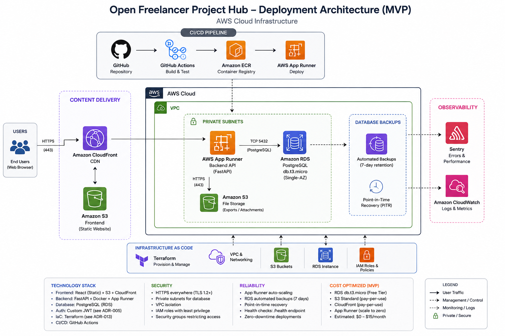

# Deployment & Infrastructure Architecture

| Attribute        | Value                       |
| ---------------- | --------------------------- |
| **Project**      | Open Projects Hub |
| **Version**      | 2.0                         |
| **Status**       | Draft                       |

## Table of Contents

- [Source References](#source-references)
- [1. Scope and NFR Alignment](#1-scope-and-nfr-alignment)
- [2. Cloud Platform Selection and Rationale](#2-cloud-platform-selection-and-rationale)
- [3. Deployment Architecture](#3-deployment-architecture)
- [4. Backup and Disaster Recovery](#4-backup-and-disaster-recovery)
- [5. Environment Strategy](#5-environment-strategy)
- [6. Cost Optimization Strategy](#6-cost-optimization-strategy)
- [7. Infrastructure as Code (IaC) Approach](#7-infrastructure-as-code-iac-approach)
- [8. Security Architecture Considerations](#8-security-architecture-considerations)
- [9. Deployment Impact Summary (GitHub Actions)](#9-deployment-impact-summary-github-actions)
- [10. Related ADRs](#10-related-adr)

---

## 1. Scope and NFR Alignment

This document defines production deployment architecture for the MVP and aligns it with key non-functional requirements for performance, reliability, and data integrity.

## 2. Cloud Platform Selection and Rationale

### 2.1 Decision: AWS-First Platform

**Selected:** **Amazon Web Services (AWS)** as the unified cloud platform for all infrastructure components.

**Rationale:**

- Unified platform simplifies billing, IAM, networking, and monitoring under single provider.
- AWS Free Tier eligibility for 12 months (~$0-15/month actual cost).
- Fully managed services (RDS, App Runner, S3, CloudFront) minimize operational overhead.
- Infrastructure as Code (Terraform) provides version-controlled, repeatable deployments.
- Scalability path available (Lambda, SQS, ElastiCache, ECS Fargate) as needs grow.
- Native integration between services (VPC, IAM roles, CloudWatch).

**Trade-offs Accepted:**

- Higher initial setup complexity vs. managed PaaS providers (Vercel, Render).
- Learning curve for AWS fundamentals (VPC, IAM, Terraform).
- No automatic PR preview environments (manual setup required, deferred post-MVP).
- ~3-5 days initial infrastructure setup vs. ~1 day for simpler platforms.

### 2.2 Selected Platform Architecture

**AWS Service Mapping:**

- **Frontend Hosting:** Amazon S3 (static website) + CloudFront (global CDN with HTTPS)
- **Backend Compute:** AWS App Runner (Docker container service with auto-scaling)
- **Database:** Amazon RDS PostgreSQL (db.t3.micro, single-AZ for MVP)
- **File Storage:** Amazon S3 (separate bucket for exports/attachments)
- **Container Registry:** Amazon Elastic Container Registry (ECR)
- **Authentication:** Custom JWT-based auth module in FastAPI backend (see ADR-005)
- **Infrastructure as Code:** Terraform managing all AWS resources
- **Observability:** Sentry (app errors/performance) + CloudWatch (infrastructure metrics/logs)
- **CI/CD:** GitHub Actions

This model provides consolidated AWS infrastructure while maintaining operational simplicity for a small team.

## 3. Deployment Architecture



See also: [ADR-006: Deployment Platform](../adrs/adr-006-deployment-platform.md) for detailed architecture.

### 3.1 Compute Resources

- **Backend API:** AWS App Runner service running Docker containers (FastAPI application)
  - Auto-scaling based on request volume and CPU/memory thresholds
  - Health checks via `/health` endpoint for deployment validation
  - Rolling deployments with zero-downtime updates
  - Automatic image deployment from Amazon ECR
- **Frontend:** Static React application served from Amazon S3 + CloudFront
  - Global CDN distribution with edge caching
  - HTTPS via AWS Certificate Manager (ACM)
  - CloudFront default domain (`*.cloudfront.net`) with optional custom domain post-MVP
- **Serverless functions:** Not used in MVP (future consideration for background tasks)

### 3.2 Database and Storage

- **Primary Database:** Amazon RDS PostgreSQL
  - Instance type: db.t3.micro (Free Tier: 750 hours/month for 12 months)
  - Deployment: Single-AZ for MVP (upgrade to Multi-AZ post-MVP for HA)
  - Storage: 20GB General Purpose SSD (gp2)
  - Backups: Automated daily backups with 7-day retention
  - Point-in-time recovery (PITR) available
  - Networking: Private subnet access only from App Runner via VPC connector
- **Authentication:** Custom JWT-based auth module within FastAPI backend (no external auth service)
  - JWT token issuance and validation in backend
  - User credentials stored in RDS `users` table with bcrypt password hashing
  - Session management via stateless JWT tokens
- **File Storage:** Amazon S3 bucket for exports and attachments
  - Server-side encryption at rest (SSE-S3)
  - Versioning enabled for data recovery
  - Lifecycle policies for cost optimization (future)

### 3.3 Networking

**Public Ingress (HTTPS):**

- CloudFront distribution -> S3 bucket (frontend static assets)
- App Runner public endpoint -> FastAPI backend API
- All traffic encrypted via TLS 1.2+

**Private Access:**

- RDS PostgreSQL accessible only from App Runner via VPC connector
- Security groups restrict database access to backend service IP ranges only
- No public internet access to RDS

**Network Architecture:**

```
Internet
   │
   ├─→ CloudFront (Frontend CDN) → S3 Bucket (Static Assets)
   │
   └─→ App Runner (Backend API) → VPC
                                     │
                                     ├─→ RDS PostgreSQL (Private Subnet)
                                     └─→ S3 (File Storage via VPC endpoint)
```

**DNS:**

- CloudFront default domain for MVP (`d123456.cloudfront.net`)
- App Runner default domain for API (`apprunner-service.region.awsapprunner.com`)
- Custom domains (optional post-MVP): Route 53 with CNAME/ALIAS records

### 3.4 Scaling Strategy

- **Horizontal scaling (primary):**
  - AWS App Runner automatically scales backend containers based on CPU/memory/request thresholds
  - Stateless design (JWT-based auth, no session storage) ensures safe horizontal replication
  - CloudFront CDN automatically distributes frontend load globally
- **Vertical scaling (secondary):**
  - Increase App Runner instance size (CPU/memory) when profiling indicates single-instance bottlenecks
  - RDS instance type upgrades (db.t3.micro -> db.t3.small) if database CPU becomes constraint
- **Database scaling:**
  - Connection pooling via SQLAlchemy pool (5-10 connections per App Runner instance)
  - RDS read replica strategy introduced when query volume requires read/write separation (post-MVP)
  - Query optimization and indexing (per database design) before vertical/horizontal database scaling

### 3.5 High Availability and Failover

- **AWS managed infrastructure:**
  - App Runner: Multi-AZ deployment by default, automatic unhealthy instance replacement
  - CloudFront: Global edge network with automatic failover between edge locations
  - S3: Multi-AZ replication (11 nines durability) for static assets and file storage
- **Database availability:**
  - RDS Single-AZ for MVP (acceptable for production during the Free Tier period)
  - RDS Multi-AZ upgrade path available post-MVP for automated failover
  - Automated daily backups + 7-day retention for disaster recovery
- **Health checks:**
  - App Runner health check endpoint (`/health`) validates backend instance health
  - Automatic traffic routing away from unhealthy instances
  - CloudWatch alarms for critical failures (RDS connectivity, App Runner errors)

## 4. Backup and Disaster Recovery

| Data/Service                        | Backup Approach                                        | RPO           | RTO       |
| ----------------------------------- | ------------------------------------------------------ | ------------- | --------- |
| RDS PostgreSQL (application data)   | Automated daily backups + PITR (7-day retention)       | ≤ 5 minutes   | ≤ 2 hours |
| S3 (file storage)                   | Versioning enabled + cross-region replication (future) | ≤ 1 hour      | ≤ 4 hours |
| S3 (frontend static assets)         | Git repository source + CI/CD rebuild capability       | 0 (instant)   | ≤ 30 min  |
| ECR (Docker images)                 | Image tag retention policy (last 10 images)            | 0 (immutable) | ≤ 15 min  |
| Application config/secrets metadata | Terraform state (S3 backend) + GitHub repository       | ≤ 1 hour      | ≤ 2 hours |

**Disaster Recovery Runbook:**

1. **Incident triage:** Identify failure scope (database, backend, frontend, infrastructure)
2. **Recovery priority:** Database first (RDS PITR restore) -> Backend (App Runner redeploy from ECR) -> Frontend (S3/CloudFront redeploy)
3. **Data validation:** Verify data integrity post-restore via smoke tests
4. **Service verification:** Run post-incident verification on critical user journeys (auth, project CRUD, requirements workflows)
5. **Post-mortem:** Document incident, update runbook, review threat model and monitoring alerts

## 5. Environment Strategy

For the MVP, the environment strategy is simplified to focus on local development and a single, deployed production environment running on the AWS Free Tier.

| Environment    | Purpose                | AWS Configuration                                     | Cost Target             |
| -------------- | ---------------------- | ----------------------------------------------------- | ----------------------- |
| **Local**      | Developer workstations | Docker Compose (no AWS infrastructure)                | $0                      |
| **Production** | Live user traffic      | App Runner auto-scaling, RDS with backups, CloudFront | $0-15/month (Free Tier) |

**Environment Isolation:**

- The **production** environment is fully isolated on AWS.
- The **local** environment uses Docker Compose and does not interact with deployed AWS resources.
- Environment-specific JWT secrets and database credentials are used for each environment.
- GitHub environment protection rules are used for the `main` branch to protect production deployments.

**Promotion Path:** `dev` branch -> Pull Request -> `main` branch -> Production Deployment

## 6. Cost Optimization Strategy

**AWS Free Tier Utilization (12 months):**

- App Runner: 2 GB storage free (MVP usage ~1 GB)
- RDS: 750 hours/month db.t3.micro (single instance runs ~720 hours/month)
- S3: 5 GB storage + 20K GET requests (MVP usage <1 GB, <10K requests)
- CloudFront: 1 TB data transfer + 10M requests (MVP usage <10 GB, ~100K requests)
- ECR: 500 MB storage free (MVP usage ~200 MB)

**Cost Management Actions:**

- Monthly AWS cost review via Cost Explorer and billing dashboard
- CloudWatch billing alarms for unexpected charges (>$20/month threshold)
- S3 lifecycle policies to delete old frontend build artifacts (retain last 10 builds)
- ECR image retention policy (retain last 10 Docker images per service)
- RDS storage monitoring to prevent unexpected growth
- Prefer managed services to reduce operational FTE cost during MVP
- Autoscaling configured to match usage patterns (avoid over-provisioning)

**Post-Free Tier Cost Projections (~$30-50/month):**

- App Runner: ~$10-15/month (based on usage)
- RDS db.t3.micro: ~$15/month
- S3 + CloudFront: ~$5-10/month
- ECR: ~$1-2/month

## 7. Infrastructure as Code (IaC) Approach

**Selected Tool:** Terraform (HashiCorp) as primary IaC tool for AWS infrastructure (see ADR-013)

**Managed Resources:**

- **Networking:** VPC, subnets (public/private), security groups, VPC endpoints
- **Compute:** AWS App Runner service configuration, scaling policies
- **Database:** RDS PostgreSQL instance, parameter groups, backup configuration
- **Storage:** S3 buckets (frontend, file storage), bucket policies, lifecycle rules
- **CDN:** CloudFront distributions, origins, cache behaviors, ACM certificates
- **Container Registry:** ECR repositories, image retention policies
- **Access Control:** IAM roles, policies, service accounts for App Runner and RDS
- **Monitoring:** CloudWatch log groups, metric alarms, SNS topics for alerts

**Terraform Configuration:**

- **State Management:** S3 backend for Terraform state + DynamoDB table for state locking
- **Module Structure:** Reusable modules per service (VPC, RDS, App Runner, S3, CloudFront)
- **Environment Configuration:** Terraform workspaces will be used to manage the single production environment.
- **Secrets Handling:** Sensitive values passed via GitHub Secrets as Terraform variables (never committed)

**Governance:**

- All infrastructure changes reviewed via pull request
- `terraform plan` runs automatically on PR (GitHub Actions)
- `terraform apply` executes on merge to main (protected branch)
- Drift detection via scheduled `terraform plan` in CI/CD pipeline
- Version control ensures infrastructure changes are auditable and reversible

## 8. Security Architecture Considerations

**Transport Security:**

- HTTPS/TLS 1.2+ enforced on all public endpoints (CloudFront, App Runner)
- AWS Certificate Manager (ACM) for SSL/TLS certificate management
- Secure cookie flags where applicable (`HttpOnly`, `Secure`, `SameSite`)

**Authentication & Authorization:**

- Custom JWT-based authentication module in FastAPI backend (see ADR-005)
- Backend validates JWT tokens and enforces role-based access control (RBAC)
- PostgreSQL Row Level Security (RLS) policies for data-level authorization
- Stateless token design enables horizontal scaling

**Network Security:**

- VPC isolation: RDS in private subnets, no public internet access
- Security groups restrict RDS access to App Runner service IP ranges only
- App Runner public endpoint exposed for API access (protected by authentication)
- CloudFront WAF rules (future enhancement) for DDoS and bot protection

**Secrets Management:**

- Secrets stored in AWS Secrets Manager (optional) or environment variables (ADR-011)
- GitHub Actions encrypted secrets for CI/CD workflows
- No secrets committed to source control
- Separate secrets per environment
- JWT signing key rotation procedures documented

**Data Protection:**

- RDS encryption at rest (AWS managed keys)
- S3 server-side encryption (SSE-S3) for file storage
- Automated backups encrypted at rest
- TLS for all data in transit (backend ↔ RDS, client ↔ CloudFront/App Runner)

**Input Validation & API Security:**

- Schema-driven validation (Pydantic models) for all API requests
- Rate limiting on authentication and mutation endpoints
- CORS allowlist for trusted frontend domains only
- Output encoding to prevent XSS
- Parameterized queries via SQLAlchemy ORM to prevent SQL injection

See [Security Architecture](../security/security-architecture.md) for detailed security controls.

## 9. Deployment Impact Summary (GitHub Actions)

**CI/CD Integration:**

- CI verifies docs and architecture artifacts where checks exist
- CD orchestrates deployment across AWS infrastructure:
  1. **Backend:** Build Docker image → Push to ECR → Deploy to App Runner
  2. **Frontend:** Build React app → Upload to S3 → Invalidate CloudFront cache
  3. **Database:** Run Alembic migrations via init container or pre-deployment step
  4. **Infrastructure:** Terraform plan on PR, apply on merge to protected branches

**Deployment Workflow:**

- Production deployments are triggered on merge to the `main` branch.
- Required approvals for production deployments are enforced via GitHub branch protection rules.
- Automated smoke tests run post-deployment (auth, core CRUD workflows).
- Sentry release tagging for error correlation.
- CloudWatch metrics monitoring for deployment health.

**Rollback Strategy:**

- Application: Redeploy previous Docker image from ECR to App Runner
- Frontend: Restore previous S3 artifacts or trigger CI/CD rebuild from prior commit
- Database: Forward-fix migrations preferred; PITR restore for severe data issues
- Infrastructure: Terraform state revert + apply previous configuration

## 10. Related ADRs

- [ADR-004: Database (Amazon RDS PostgreSQL)](../adrs/adr-004-database.md)
- [ADR-005: Authentication Strategy (Custom JWT Auth)](../adrs/adr-005-authentication.md)
- [ADR-006: Deployment Platform (AWS)](../adrs/adr-006-deployment-platform.md)
- [ADR-011: Secrets Management Strategy](../adrs/adr-011-secrets-management.md)
- [ADR-012: Containerization Strategy](../adrs/adr-012-containerization.md)
- [ADR-013: Infrastructure as Code Strategy](../adrs/adr-013-infrastructure-as-code.md)
- [ADR-017: Database Migration Strategy](../adrs/adr-017-database-migration-strategy.md)

## Source References

- [Requirements Home](../../01-requirements/README.md)
- [ADR-004: Database (Amazon RDS PostgreSQL)](../adrs/adr-004-database.md)
- [ADR-005: Authentication Strategy (Custom JWT Auth)](../adrs/adr-005-authentication.md)
- [ADR-006: Deployment Platform (AWS)](../adrs/adr-006-deployment-platform.md)
- [ADR-012: Containerization Strategy](../adrs/adr-012-containerization.md)
- [ADR-013: Infrastructure as Code Strategy](../adrs/adr-013-infrastructure-as-code.md)

---

**Last Updated**: 2026-08-04
