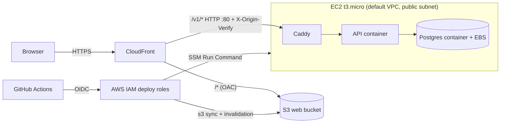

# Deployment & Infrastructure Architecture

| Attribute        | Value                       |
| ---------------- | --------------------------- |
| **Project**      | Open Projects Hub |
| **Version**      | 3.0                         |
| **Status**       | Accepted                    |

## Table of Contents

- [Source References](#source-references)
- [1. Scope and NFR Alignment](#1-scope-and-nfr-alignment)
- [2. Cloud Platform Selection and Rationale](#2-cloud-platform-selection-and-rationale)
- [3. Deployment Architecture](#3-deployment-architecture)
- [4. Backup and Disaster Recovery](#4-backup-and-disaster-recovery)
- [5. Environment Strategy](#5-environment-strategy)
- [6. Cost Optimization Strategy](#6-cost-optimization-strategy)
- [7. Infrastructure as Code (IaC) Approach](#7-infrastructure-as-code-iac-approach)
- [8. Security Architecture Considerations](#8-security-architecture-considerations)
- [9. Deployment Impact Summary (GitHub Actions)](#9-deployment-impact-summary-github-actions)
- [10. Related ADRs](#10-related-adrs)

---

## 1. Scope and NFR Alignment

This document defines the production deployment architecture for the master's-review release. It is sized for a handful of users and near-zero traffic, so cost takes priority over availability and recovery. The decision and its trade-offs are recorded in [ADR-021](../../04-decisions/adr-021-low-cost-single-host-deployment.md), which supersedes the compute, database and network parts of ADR-006.

## 2. Cloud Platform Selection and Rationale

### 2.1 Decision: AWS-First Platform

**Selected:** **Amazon Web Services (AWS)** as the single cloud provider.

**Rationale:**

- One provider for billing, IAM and monitoring.
- A new AWS account gets the **Free Plan**: about $200 in credits that end after six months or when they run out. The design costs about $12-13/month, which fits the credits comfortably for the review period.
- Infrastructure as Code (Terraform) makes the deployment repeatable and reviewable.

**Trade-offs Accepted:**

- No high availability, no managed database and no backups (see section 4).
- The Free Plan has a fixed lifetime; afterwards the account must be upgraded or the system rehosted.
- No custom domain, so the origin leg is plain HTTP (see section 8).

### 2.2 Selected Platform Architecture

**AWS Service Mapping:**

- **Frontend Hosting:** private Amazon S3 bucket behind CloudFront (origin access control)
- **Backend Compute:** one Amazon EC2 `t3.micro` running Docker Compose (Caddy, the FastAPI API, PostgreSQL)
- **Database:** PostgreSQL 15 container on the same host, data on the instance's EBS volume
- **Entry point:** a single CloudFront distribution that serves the web app and proxies `/v1/*` to the API
- **Container Registry:** public GitHub Container Registry (no ECR)
- **Secrets and configuration:** AWS Systems Manager Parameter Store (Standard tier)
- **Authentication:** Custom JWT-based auth module in the FastAPI backend (see ADR-005)
- **Infrastructure as Code:** Terraform in the `open-projects-hub-infra` repository
- **Observability:** Sentry (optional, off until a DSN is set) and container logs on the host
- **CI/CD:** GitHub Actions in each application repository, authenticated to AWS through OIDC

## 3. Deployment Architecture

See also: [ADR-021: Low-Cost Single-Host Deployment](../../04-decisions/adr-021-low-cost-single-host-deployment.md).

### 3.1 Compute Resources

- **Backend API:** one EC2 `t3.micro` (1 GB RAM, 2 GB swap) in the default VPC's public subnet, with an Elastic IP.
  - Docker Compose runs three containers: Caddy (port 80), the API (Gunicorn, one worker) and PostgreSQL.
  - Caddy rejects any request that lacks the `X-Origin-Verify` header CloudFront adds.
  - Health checks: `/health/live` (container health) and `/health/ready` (database check, used by the deploy script). These routes live at the root, not under `/v1`, and are reached from the host, not through CloudFront.
  - Database migrations run when the API container starts (`alembic upgrade head`); one instance means no migration race.
  - CPU credits run in `standard` mode so the instance throttles instead of billing surplus CPU.
- **Frontend:** static React build in a private S3 bucket, served only through CloudFront.
  - Deep links are rewritten to `/index.html` by a CloudFront Function attached to the web behavior only, so API 404s are never turned into HTML.
  - Hashed assets are cached for a year; `index.html` is never cached by browsers.
  - A managed response-headers policy adds HSTS, `X-Content-Type-Options`, `X-Frame-Options` and `Referrer-Policy`.
- **Serverless functions:** not used.

### 3.2 Database and Storage

- **Primary Database:** PostgreSQL 15 in a container.
  - `max_connections` is 30 and `shared_buffers` 64 MB; the API uses at most 20 connections from its single worker.
  - Data lives in a Docker volume on the instance's encrypted 20 GB gp3 EBS volume.
  - Not reachable from outside the host: no published port.
- **Authentication:** custom JWT module in the backend; credentials stored in the `users` table with bcrypt hashing.
- **File Storage:** none today. The application does not store files in S3.

### 3.3 Networking

**Public Ingress (HTTPS to the viewer):**

- CloudFront default domain (`*.cloudfront.net`) with the CloudFront certificate; HTTP is redirected to HTTPS.
- `/v1/*` is forwarded to the EC2 host over HTTP on port 80 with caching disabled. The behavior uses the managed `AllViewerAndCloudFrontHeaders` origin request policy, so cookies, the `Authorization` header, the `Origin` header and `CloudFront-Viewer-Address` reach the host.

**Host exposure:**

- The security group admits TCP 80 only from CloudFront's managed origin-facing prefix list. There is no SSH; operators use SSM Session Manager.
- Outbound traffic is open (image pulls, SSM, SMTP, AI providers).
- No NAT Gateway or load balancer is used, which keeps the cost near the instance price.

**DNS:** CloudFront default domain only. A custom domain is a possible later step and would also allow HTTPS to the origin.

### 3.4 Scaling Strategy

- Single instance, no autoscaling. The expected load is a handful of users.
- Vertical scaling is the only lever: a larger instance type, then a higher Gunicorn worker count and connection limits.
- CloudFront serves the web app from the edge, so static traffic does not reach the host.

### 3.5 High Availability and Failover

- None for the API and database: one host, one availability zone. A host failure means downtime until it is replaced.
- S3 and CloudFront are managed services with their own durability and availability.
- A deploy restarts the API container; expect a short interruption.

## 4. Backup and Disaster Recovery

**There are no database backups, by decision** (ADR-021). The deployment is a low-stakes review environment.

| Data/Service                | Backup Approach                                    | Recovery |
| --------------------------- | -------------------------------------------------- | -------- |
| PostgreSQL (application data) | None                                             | Data is lost if the instance volume or account is lost |
| Web assets (S3)             | Rebuilt from the tagged Git commit by CI/CD        | Re-run the web deploy workflow |
| API image                   | Rebuilt from the tagged Git commit by CI/CD        | Re-run the API deploy workflow |
| Infrastructure              | Terraform code in Git, state in a private versioned S3 bucket | `terraform apply` |
| Configuration and secrets   | SSM Parameter Store                                | Re-create manually if the account is lost |

**Protection against accidents:**

- The instance has termination protection and Terraform `prevent_destroy`.
- `API_KEY_ENCRYPTION_KEY` must never be rotated; stored user API keys become undecryptable.
- A manual `pg_dump` can be taken over SSM Session Manager if a copy is ever needed.

**Recovery runbook (host lost):** apply Terraform to recreate the host, run the API deploy workflow for the current tag, then seed the admin user again with the `seed-admin` Compose profile (it needs `ADMIN_EMAIL` and `ADMIN_PASSWORD`; see the infra repository README). User data is gone.

## 5. Environment Strategy

| Environment    | Purpose                | Configuration                                       | Cost Target |
| -------------- | ---------------------- | --------------------------------------------------- | ----------- |
| **Local**      | Developer workstations | `APP_ENV=local`, API run directly, local PostgreSQL | $0          |
| **Test**       | Automated tests        | `APP_ENV=test`                                      | $0          |
| **Container**  | Docker Compose run, same image that is deployed | `APP_ENV=container`        | $0          |
| **Production** | Master's-review release | EC2 + CloudFront, `APP_ENV=prod`                   | about $12-13/month from Free Plan credits |

**Environment Isolation:**

- Production is the only environment on AWS; the other environments never touch it.
- Environment-specific secrets (JWT key, database password, encryption key) are generated by Terraform and stored in SSM.
- The `container` environment is the pre-release smoke test, because it builds and runs the same Docker image.

**Promotion Path:** `dev` branch -> Pull Request -> `main` branch -> `vX.Y.Z` tag -> deployment.

## 6. Cost Optimization Strategy

**Expected monthly cost (us-east-1 list prices, always on):**

| Item | Approx. cost |
| --- | --- |
| EC2 `t3.micro` | $7.60 |
| Public IPv4 address (Elastic IP) | $3.65 |
| 20 GB gp3 volume | $1.60 |
| CloudFront, S3, SSM, CloudFront Function, IAM | $0 (within always-free allowances) |
| **Total** | **about $12.85, paid from Free Plan credits** |

**Cost Management Actions:**

- A $1 budget alerts on any real (post-credit) charge; a second budget alerts when gross usage passes $16 in a month so credit burn is visible.
- No NAT Gateway, load balancer, RDS, ECR, Route 53 zone or snapshots.
- Logs rotate (10 MB x 3 files per container) so they cannot fill the disk.
- The instance can be stopped between review sessions to save about $7.60/month; the data survives a stop.

**After the Free Plan ends:** the account must be upgraded (about $13/month for this design) or the system moved elsewhere.

## 7. Infrastructure as Code (IaC) Approach

**Selected Tool:** Terraform (see ADR-013), in the separate `open-projects-hub-infra` repository.

**Managed Resources:**

- **Compute:** EC2 instance, Elastic IP, security group, instance role and profile, first-boot script (Docker, Compose plugin, swap).
- **CDN and storage:** S3 web bucket, CloudFront distribution, origin access control, CloudFront Function, response-headers policy attachment.
- **Secrets:** generated secrets and placeholders in SSM Parameter Store.
- **Delivery access:** GitHub OIDC provider, deploy roles, and the restricted SSM deploy document.
- **Cost control:** AWS Budgets.

**Terraform Configuration:**

- **State Management:** private, versioned, encrypted S3 bucket with native state locking (no DynamoDB table).
- **Layout:** `bootstrap/` (state bucket, applied once), `envs/prod/`, and three modules: `compute`, `frontend`, `github-oidc`.
- **Secrets Handling:** secrets are generated in Terraform and stored in SSM; the state bucket is private because state contains them.

**Governance:**

- A pull-request workflow runs `terraform fmt -check` and `validate`.
- `terraform apply` is run locally by the owner after reviewing the plan. CI never applies.

## 8. Security Architecture Considerations

**Transport Security:**

- Viewers always use HTTPS (CloudFront certificate, HTTP redirected, HSTS header).
- **Accepted risk:** the CloudFront-to-EC2 leg is plain HTTP, because there is no custom domain to issue an origin certificate for. Bearer tokens and login requests cross this leg in cleartext over the public internet. A custom domain would allow HTTPS to the origin.
- The refresh-token cookie is `HttpOnly`, `SameSite=Lax` and `Secure`, scoped to `/v1/auth`.

**Authentication & Authorization:**

- Custom JWT-based authentication in the FastAPI backend (see ADR-005) with role-based access control.

**Network Security:**

- Only CloudFront can reach port 80 (security group prefix list). Because that prefix list is shared by all CloudFront customers, Caddy also requires a secret `X-Origin-Verify` header. Caddy replaces `X-Forwarded-For` with the viewer address that CloudFront supplies in `CloudFront-Viewer-Address`, so a client-supplied `X-Forwarded-For` is ignored.
- No SSH; shell access is through SSM Session Manager, and instance metadata requires IMDSv2.
- The database is not published outside the Docker network.

**Secrets Management:**

- Secrets live in SSM Parameter Store (SecureString) and are written to a root-only `.env` on the host by the deploy script (see ADR-011, ADR-021).
- Placeholder values (`N/A`) are not written to `.env`, so the variable stays unset.
- GitHub Actions use short-lived OIDC credentials; no long-lived AWS keys are stored in GitHub.

**Deploy access:**

- The API deploy role can only run one SSM document on one instance. The document accepts only a `vX.Y.Z` tag and fetches the deploy script from the tagged commit of the public repository. The deploy roles trust any `v*` tag on any commit, so anyone who can push a tag can deploy as root on the host. Tag protection on `v*` is required and is set up by hand (see the infra repository README).

**Data Protection:**

- The EBS volume is encrypted; the Terraform state bucket is private and encrypted.

**Input Validation & API Security:**

- Pydantic validation, rate limiting (per viewer address, taken from `CloudFront-Viewer-Address`), CORS allowlist, and parameterized queries via SQLAlchemy.

See [Security Architecture](../security/security-architecture.md) for detailed security controls.

## 9. Deployment Impact Summary (GitHub Actions)

**CI/CD Integration:**

- Each application repository has a `ci.yml` (lint, tests, build) and a `deploy.yml`.
  1. **Backend:** build the Docker image, push it to GHCR, then run the `ophub-prod-deploy` SSM document, which pulls the image and restarts the stack.
  2. **Frontend:** build the React app (same-origin API, no build-time URL), sync it to S3, invalidate CloudFront.
  3. **Database:** Alembic migrations run when the API container starts.
  4. **Infrastructure:** Terraform is applied locally; CI only validates it.

**Deployment Workflow:**

- Deployments are triggered by pushing a `vX.Y.Z` tag, or manually from a tag ref.
- The deploy script fails the workflow if the stack does not start healthy: Docker Compose waits for the API health check (about two minutes at most), then the script waits up to 90 more seconds for `/health/ready`.

**Rollback Strategy:**

- Application: re-run the deploy workflow on the previous tag. Migrations are forward-only, so a rollback across a schema change needs a forward fix.
- Frontend: re-run the deploy workflow on the previous tag.
- Infrastructure: revert the Terraform change and apply.

## 10. Related ADRs

- [ADR-004: Database](../../04-decisions/adr-004-database.md) (database now runs as a container; see ADR-021)
- [ADR-005: Authentication Strategy (Custom JWT Auth)](../../04-decisions/adr-005-authentication.md)
- [ADR-006: Deployment Platform (AWS)](../../04-decisions/adr-006-deployment-platform.md) (superseded in part)
- [ADR-011: Secrets Management Strategy](../../04-decisions/adr-011-secrets-management.md)
- [ADR-012: Containerization Strategy](../../04-decisions/adr-012-containerization.md)
- [ADR-013: Infrastructure as Code Strategy](../../04-decisions/adr-013-infrastructure-as-code.md)
- [ADR-014: Environment Strategy](../../04-decisions/adr-014-environment-strategy.md)
- [ADR-017: Database Migration Strategy](../../04-decisions/adr-017-database-migration-strategy.md)
- [ADR-021: Low-Cost Single-Host Deployment](../../04-decisions/adr-021-low-cost-single-host-deployment.md)

## Source References

- [Requirements Home](../../01-requirements/README.md)
- [ADR-021: Low-Cost Single-Host Deployment](../../04-decisions/adr-021-low-cost-single-host-deployment.md)
- [ADR-006: Deployment Platform (AWS)](../../04-decisions/adr-006-deployment-platform.md)
- [ADR-013: Infrastructure as Code Strategy](../../04-decisions/adr-013-infrastructure-as-code.md)

---

**Last Updated**: 2026-10-10
