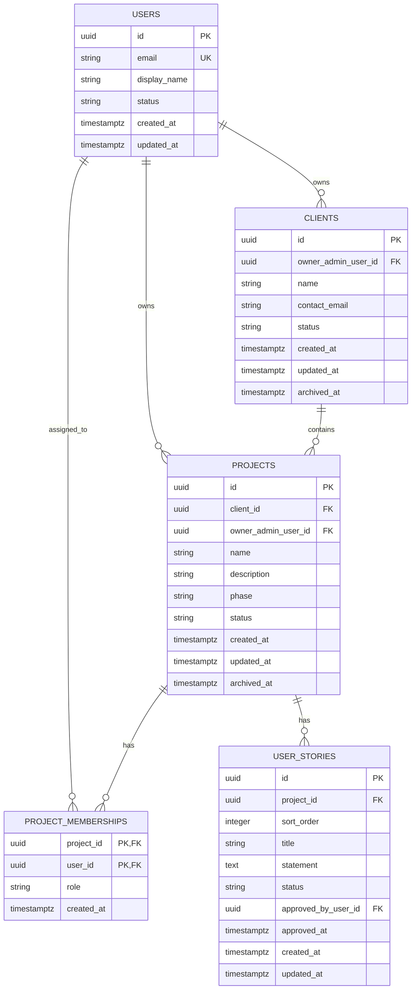

# Database Design

| Attribute        | Value                       |
| ---------------- | --------------------------- |
| **Project**      | Open Freelancer Project Hub |
| **Version**      | 1.4                         |
| **Status**       | Draft                       |
| **Last Updated** | 2026-08-11                  |

## Sources

- [Project Overview](../overview.md)
- [F-001 Client and Project Lifecycle Management](../01-requirements/f-001-client-and-project-lifecycle-management.md)
- [F-002 AI Refinement and Approval Workflow](../01-requirements/f-002-ai-refinement-and-approval-workflow.md)
- [F-003 Access Control and Visibility Boundaries](../01-requirements/f-003-access-control-and-visibility-boundaries.md)
- [ADR-003: Database (Supabase PostgreSQL)](../03-architecture/adrs/adr-003-database.md)
- [ADR-005: Authentication and Authorization Strategy](../03-architecture/adrs/adr-005-authentication.md)

## Design Scope and Assumptions

- Covers the MVP core: user identity, client basics, project lifecycle, role-based access, and AI-refined user stories.
- Internal notes are out of scope for this simplified MVP schema and are not persisted in database entities.
- Removed in this version: ambiguity tracking, acceptance-criteria child tables, requirements promotion workflow, and Markdown export tracking. These can be reintroduced post-MVP.
- Supabase Auth owns credentials, password-reset tokens, and token lifecycle. The application schema stores user profile and authorization projection data only.
- Database engine selection is decided by ADR-003; migration scripts and physical deployment are out of scope here.

## Data Domains

- **Identity and Access:** User profile projection plus per-project role assignment for `admin` and `viewer` boundaries.
- **Client and Project Lifecycle:** Basic client info, project metadata, phase/status, and archive behavior.
- **Refinement and User Stories:** AI-generated user stories produced from refinement input, linked directly to projects with per-story approval tracking.

## Core Entities

| Entity                | Purpose                                                    | Bounded Context     | Lifecycle States     |
| --------------------- | ---------------------------------------------------------- | ------------------- | -------------------- |
| `users`               | Application-visible user profile keyed to auth identity    | Identity and Access | `active`, `disabled` |
| `clients`             | Basic client info managed by the freelancer Admin          | Client Lifecycle    | `active`, `archived` |
| `projects`            | Project metadata, phase, and status                        | Project Lifecycle   | `active`, `archived` |
| `project_memberships` | Per-project role assignment (admin or viewer)              | Identity and Access | active by record     |
| `user_stories`        | AI-generated user stories produced from refinement input   | Refinement Workflow | `draft`, `approved`  |

## Relationships

- `users` owns `clients` and `projects` as the freelancer Admin boundary.
- `projects` belongs to a `client` and has `project_memberships` and `user_stories`.
- `user_stories` are approved individually and linked directly to their parent project.

## Entity-Relationship Diagram (ERD)

## Schema Documentation

### 1. `users`

- **Purpose:** Represents authenticated platform users visible to the application as Admin or Viewer profiles.
- **Primary key:** `id` (UUID), aligned with the Supabase Auth user key.
- **Constraints:** `email` unique, `status` check (`active`, `disabled`).
- **Indexes:** unique index on `email`.
- **Design note:** Password hashes, reset tokens, and session state remain in Supabase Auth and are excluded from this schema.

### 2. `clients`

- **Purpose:** Basic client records owned by an Admin.
- **Primary key:** `id` (UUID).
- **Foreign keys:** `owner_admin_user_id -> users.id`.
- **Constraints:** `status` check (`active`, `archived`), nullable `archived_at` for soft archive.
- **Indexes:** `(owner_admin_user_id, status)`.

### 3. `projects`

- **Purpose:** Project metadata, lifecycle phase, and status.
- **Primary key:** `id` (UUID).
- **Foreign keys:** `client_id -> clients.id`, `owner_admin_user_id -> users.id`.
- **Constraints:**
  - `phase` check (`discovery`, `planning`).
  - `status` check (`active`, `archived`).
- **Indexes:** `(owner_admin_user_id, status, created_at DESC)`, `(client_id, status)`.
- **Business rule:** max 3 active projects per Admin, enforced at the service layer within a single transaction.

### 4. `project_memberships`

- **Purpose:** Per-project role assignment used for authorization and RLS decisions.
- **Primary key:** `(project_id, user_id)`.
- **Foreign keys:** `project_id -> projects.id`, `user_id -> users.id`.
- **Constraints:** `role` check (`admin`, `viewer`).
- **Uniqueness:** partial unique index on `(project_id)` where `role = 'admin'`; partial unique index on `(project_id)` where `role = 'viewer'`.

### 5. `user_stories`

- **Purpose:** AI-generated user stories directly linked to a project; individually approvable.
- **Primary key:** `id` (UUID).
- **Foreign keys:** `project_id -> projects.id`, `approved_by_user_id -> users.id`.
- **Constraints:**
  - `status` check (`draft`, `approved`).
  - `sort_order >= 1`.
  - unique `(project_id, sort_order)` for deterministic ordering within a project.
  - `approved_by_user_id` and `approved_at` are `NULL` until explicit approval; a `CHECK` constraint requires both when `status = 'approved'`.
- **Indexes:** `(project_id, sort_order)`, `(project_id, status, created_at DESC)`, `(approved_by_user_id)`.

## Constraints and Integrity Rules

- **Primary keys:** UUIDs on all root entities; composite key on `project_memberships`.
- **Foreign keys:** all child records reference their parent entities to prevent orphaned stories.
- **Uniqueness:** `users.email`, one admin and one viewer membership per project, ordered stories within each project.
- **Check constraints:** lifecycle enums on all status fields, `projects.phase`, approval metadata pairing on `user_stories`.
- **Soft archive:** `clients` and `projects` use `status + archived_at` for privacy-aligned archival.

## Access Patterns and Indexing Notes

- **Dashboard list:** active projects by owner -> `(owner_admin_user_id, status, created_at DESC)` on `projects`.
- **Project detail:** stories by project and status -> `(project_id, status, created_at DESC)` on `user_stories`.
- **Story rendering:** ordered stories within a project -> `(project_id, sort_order)` on `user_stories`.

## Migration and Evolution Considerations

- **Additive-first policy:** new columns and tables before destructive changes for MVP iterations.
- **Post-MVP additions:** acceptance criteria, requirements promotion, Markdown export tracking, and ambiguity logging can all be appended without changing this core schema.
- **Auth evolution:** extend the `users` projection and membership model for invites or onboarding without duplicating credential storage.

## Security and Data Governance

- **Sensitive fields:** user email and client contact email.
- **Access controls:** backend authorization and Supabase RLS enforce Admin and Viewer boundaries with least-privilege defaults.
- **Auditability:** `created_at`, `updated_at`, `approved_at`, and `archived_at` provide lifecycle traceability.
- **Provider boundary:** credentials, reset tokens, and refresh tokens remain under Supabase Auth governance.

## Risks and Open Questions

- **Risk:** Max-3-active-project rule lives in the service layer; concurrent requests could bypass it. **Mitigation:** single-transaction check with `SELECT FOR UPDATE` or equivalent.
- **Risk:** draft stories could be exposed to Viewer users if approval filtering is inconsistent across API responses and RLS policies. **Mitigation:** enforce `status = 'approved'` visibility for Viewer paths and add role-based test coverage.
- **Open question:** Should `user_stories` support individual archival or only project-level lifecycle transitions?
- **Open question:** When acceptance criteria are added post-MVP, should they be a child table of `user_stories` or a structured JSON field?

## Traceability to Requirements

| Requirement | Database Coverage                                                                                       |
| ----------- | ------------------------------------------------------------------------------------------------------- |
| FR-001-01   | `clients` and `projects` with `client_id` FK model the Admin-managed client and project relationship.   |
| FR-001-02   | `projects.status` and owner index support the max-3-active-project validation path.                     |
| FR-001-03   | `projects.phase` constrained to `discovery` and `planning`.                                             |
| FR-002-01   | Raw input acceptance handled at application layer; refined output stored in `user_stories`.             |
| FR-002-02   | `user_stories` stores generated stories with ordering, approval status, and approval audit fields.      |
| FR-002-03   | `user_stories.status` plus `approved_by_user_id` and `approved_at` preserve the explicit approval gate. |
| FR-003-01   | `project_memberships.role` and `users.status` support Admin and Viewer authorization.                   |
| FR-003-02   | Partial unique membership indexes limit to one Admin and one Viewer per project.                        |
| FR-003-03   | Approved `user_stories` and `projects.phase` provide the Viewer-safe story and phase visibility model.  |
| FR-007-01   | `users` stores the identity projection; Supabase Auth owns credentials.                                 |
| FR-009-01   | Password-reset artifacts remain external to this schema per ADR-005.                                    |
| NFR-001-01  | Soft archive fields on `clients` and `projects` support privacy-aligned archival.                       |
| NFR-003-01  | Membership-driven RBAC and RLS-compatible ownership fields support least-privilege access.              |
| NFR-X01     | Auth-provider boundary and sensitive-field handling support secure credential design.                   |
| NFR-X06     | UUID keys and targeted indexes support MVP growth without logical schema changes.                       |

## Change Log

| Date       | Version | Change Summary                                                                                                                                                                                        | Author    |
| ---------- | ------- | ----------------------------------------------------------------------------------------------------------------------------------------------------------------------------------------------------- | --------- |
| 2026-08-11 | 1.4     | Removed `refinement_sessions` table (raw input not persisted per FR-002 analysis). Added approval audit fields (`approved_by_user_id`, `approved_at`) to `user_stories`. Simplified to 5-entity model. | Tech Lead |
| 2026-03-24 | 1.3     | Validation pass against current requirements direction. Removed `internal_notes` from `projects` and updated security/risk guidance to focus on story approval visibility.                            | Tech Lead |
| 2026-03-24 | 1.2     | Simplified to 6-entity model. Removed ambiguity tracking, acceptance-criteria tables, requirements promotion, and export tracking. Renamed draft_stories to user_stories with direct approval status. | Tech Lead |
| 2026-03-23 | 1.1     | Refactored to template structure, updated source links, aligned requirement IDs, and clarified auth boundary ownership.                                                                               | Tech Lead |
| 2026-02-28 | 1.0     | Initial database design draft created.                                                                                                                                                                | Tech Lead |
