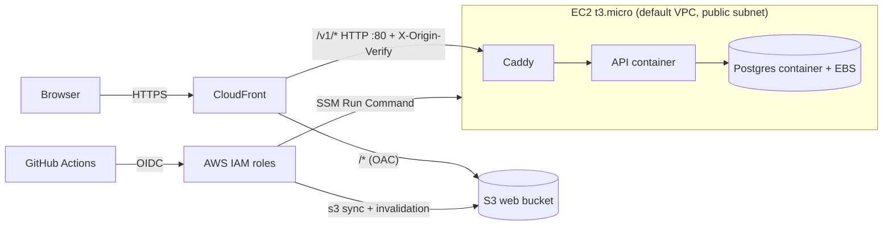

# ADR-021: Low-Cost Single-Host Deployment (CloudFront + EC2)

- **Status**: Accepted
- **Date**: 2026-10-10
- **Supersedes**: [ADR-006](./adr-006-deployment-platform.md) (compute, database, secrets, registry and network decisions); the AWS-only and S3 + CloudFront frontend decisions of ADR-006 stand.
- **Affects**: [ADR-004](./adr-004-database.md) (the database runs as a PostgreSQL container, not Amazon RDS), [ADR-011](./adr-011-secrets-management.md) (secrets live in SSM Parameter Store), [ADR-014](./adr-014-environment-strategy.md) (unchanged: one deployed environment).

## Context

The production deployment exists to show the project at the master's review, with a handful of users and almost no traffic. The hosting budget is effectively zero.

A new AWS account (created after 2025-07-15) gets the **Free Plan**: about $200 in credits that end after six months or when they run out, after which the account closes unless upgraded. The 12-month service allowances ADR-006 relied on (750 RDS hours, App Runner free storage) do not apply to such accounts.

The design in ADR-006 does not fit this budget:

- App Runner bills provisioned memory while idle.
- App Runner reaching a private RDS instance needs a VPC connector, and any egress from a private subnet needs a NAT Gateway (about $32/month).
- RDS db.t3.micro is the largest fixed cost in that design.

Constraints:

- Only one deployed environment; day-to-day work happens in the `local`, `test` and `container` environments (ADR-014).
- No custom domain, so TLS must come from the default `*.cloudfront.net` certificate.
- The API image already runs migrations at start (`scripts/start-api.sh`) and needs only one instance.

## Decision

Run one `prod` environment with the smallest components that satisfy the requirements:

| Component | Choice |
| --- | --- |
| Frontend | Private S3 bucket behind CloudFront (origin access control) |
| API | Docker containers on one EC2 `t3.micro`, started with Docker Compose |
| Reverse proxy | Caddy on the same host |
| Database | PostgreSQL 15 container on the same host, data on the instance's EBS volume |
| Entry point | One CloudFront distribution: `/*` to S3, `/v1/*` to the EC2 host over HTTP port 80 |
| TLS | CloudFront default certificate; the CloudFront-to-EC2 hop is plain HTTP |
| Image registry | Public GitHub Container Registry (no ECR) |
| Secrets and config | SSM Parameter Store (Standard), read by the deploy script |
| Host access | SSM Session Manager and Run Command only; no SSH, no inbound ports except HTTP from CloudFront |
| Infrastructure as Code | Terraform in the separate `open-projects-hub-infra` repository, S3 state with native locking |
| Deploys | GitHub Actions in each app repository on a `vX.Y.Z` tag, authenticated to AWS with OIDC |
| Backups | **None**, by decision |

Because the web app and the API share the CloudFront origin, no CORS configuration is needed for browsers and the web build leaves `VITE_API_BASE_URL` empty.

## Consequences

### Positive

- About $12-13/month, paid from the Free Plan credits (EC2 about $7.60, public IPv4 about $3.65, EBS about $1.60). CloudFront, S3, SSM and the deploy roles stay inside always-free allowances.
- No NAT Gateway, load balancer, RDS or ECR charges.
- Small moving-part count: one host, one `docker compose up`.
- The `container` environment runs the same Docker image that is deployed, so it doubles as the pre-release smoke test.
- Deploys use short-lived OIDC credentials. The API role may only run one SSM document that accepts a `vX.Y.Z` tag.

### Negative

- **No backups.** If the instance or the account is lost, the data is lost. The instance has termination protection and `prevent_destroy`, but that guards only against accidents. A manual `pg_dump` over SSM is the escape hatch.
- **Single point of failure.** One host, one AZ, no failover. A deploy briefly restarts the API.
- **Plain HTTP between CloudFront and EC2.** Without a domain there is no certificate for the origin. Requests are protected by a security group that admits only CloudFront's origin-facing addresses and by a secret `X-Origin-Verify` header that Caddy requires, but the traffic is not encrypted on that leg. Moving to a custom domain would allow HTTPS to the origin.
- **Fixed lifetime.** The Free Plan ends after six months or when credits run out. After that the account must be upgraded or the system rehosted.
- **Email.** Without a verified sending domain, the transactional email provider cannot deliver verification and reset emails to arbitrary users.
- **Capacity.** 1 GB of RAM (plus swap) and a 30-connection Postgres limit are sized for a handful of users.
- **CloudFront limits.** The origin response timeout is 60 seconds, so very slow synchronous AI calls return 504.

## Architecture

Deploy flow for a release tag:

1. The API repository builds the image and pushes `ghcr.io/alonsovndev/open-projects-hub-api:<tag>`.
2. The workflow assumes the API deploy role and runs the `ophub-prod-deploy` SSM document with the tag.
3. On the host, `deploy.sh` reads `/ophub/prod/*` from SSM Parameter Store, fetches the compose file and Caddyfile for that tag, pulls images, restarts the stack and waits for `/health/ready`.
4. The web repository builds the React app, syncs it to S3 and invalidates CloudFront.

## Alternatives Considered

1. **App Runner + RDS (ADR-006).** Matches the original design but costs more than the budget allows and depends on 12-month allowances this account does not have.
2. **ECS Fargate + ALB.** The ALB alone is about $16/month, plus Fargate compute.
3. **Lambda + API Gateway.** The API runs migrations at start, uses asyncpg connections and has no Lambda adapter; it would need code changes and a database reachable without a VPC.
4. **PostgreSQL on an external free tier (Neon, Supabase).** Cheapest, but moves data outside AWS and weakens the single-provider goal.
5. **Lightsail container service.** Comparable price and no long-term credits; the EC2 route keeps everything in Terraform alongside CloudFront and S3.
6. **RDS db.t3.micro instead of a container.** Managed backups and patching, but a fixed cost of roughly $13-15/month on top of the host, which the credits would burn faster.
