# Prototype — Open Projects Hub

UI/UX prototype for the MVP planning experience, built in **Pencil** (`.pen` file) with reusable components and design tokens.

## Files

| File                  | Purpose                                                                                                  |
| --------------------- | -------------------------------------------------------------------------------------------------------- |
| `README.md`           | This file — directory overview and quick start                                                           |
| `prototype-brief.md`  | Authoritative source of truth: page definitions, user flows, scope, requirements coverage matrix         |
| `design-direction.md` | Visual direction, color strategy, typography, component inventory, accessibility, responsive breakpoints |
| `pen/open-projects-hub.pen` | Interactive Pencil design file with 12 screens and 12 reusable components                           |

## Opening the Prototype

The `.pen` file opens in **Pencil** — a collaborative design tool.

```bash
# File location
open-projects-hub-docs/docs/05-prototype/pen/open-projects-hub.pen
```

Open it from Pencil via **File → Open** and navigate to the path above, or use the Pencil CLI.

## Screens Preview

Static exports of the 12 core pages, so the prototype can be browsed without opening Pencil. Modal, empty, and validation-error states aren't captured here — see the full artboard list below or open the `.pen` file for those.

| Screen | Preview |
| --- | --- |
| Landing / Home | 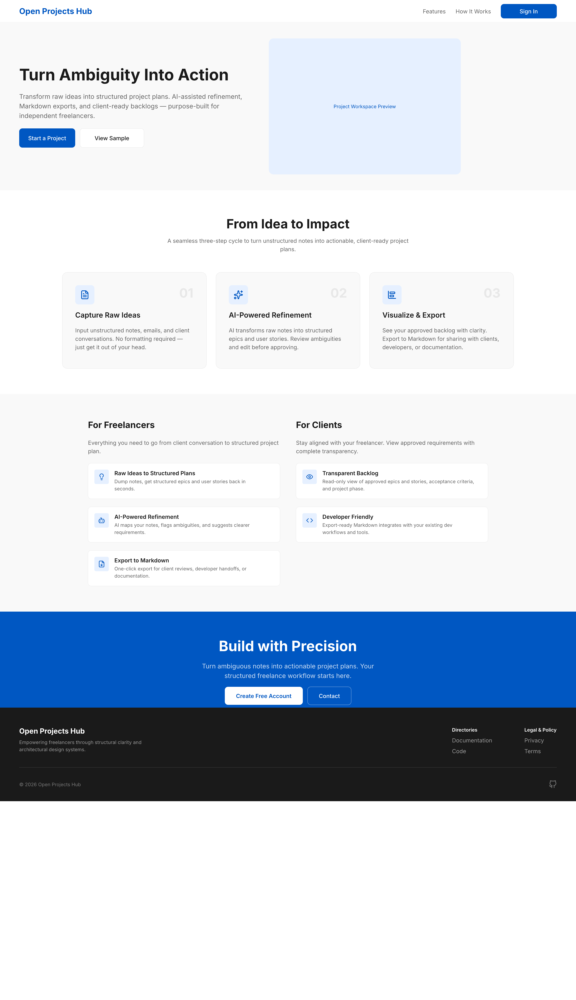 |
| Entry & Role Selection | 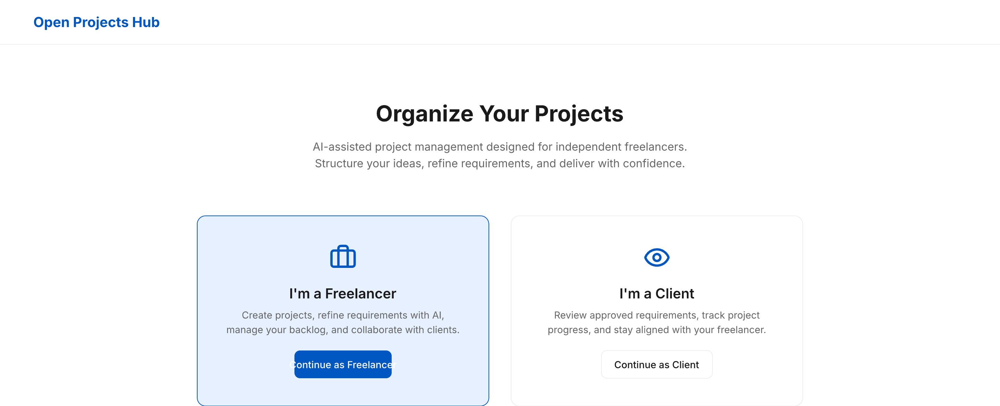 |
| Admin Sign Up | 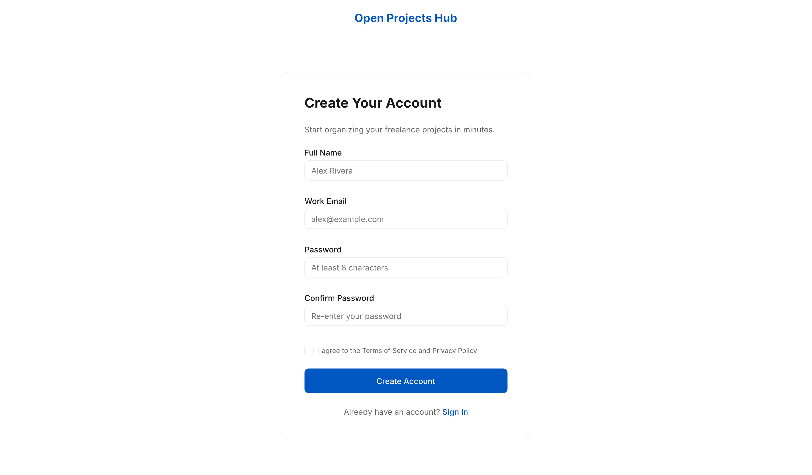 |
| Admin Sign In | 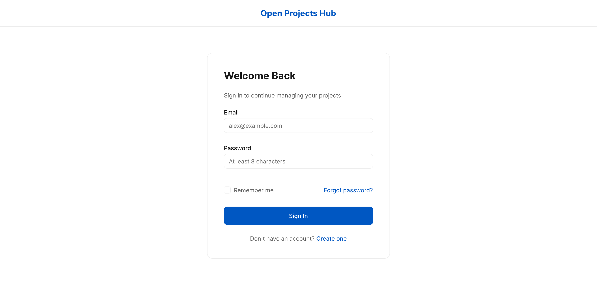 |
| Forgot Password | 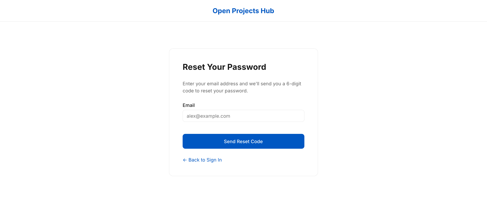 |
| Reset Password | 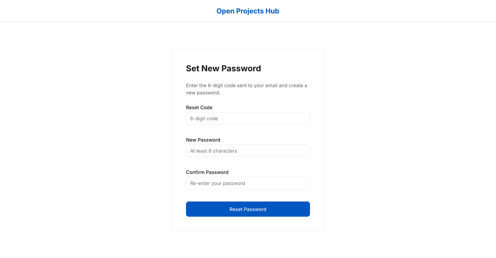 |
| AI Refinement Workspace | 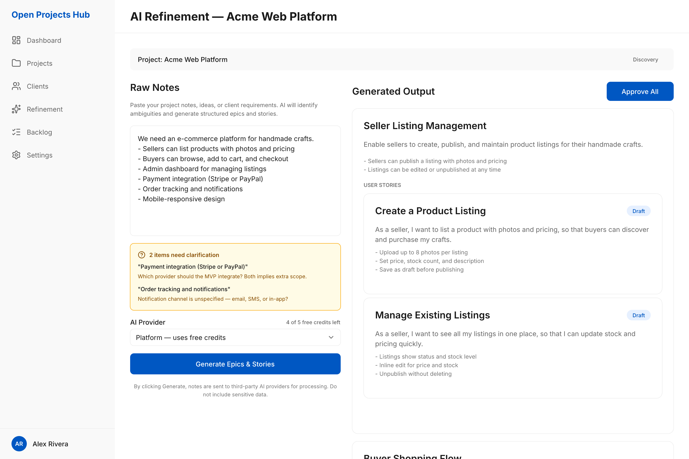 |
| Admin Backlog | 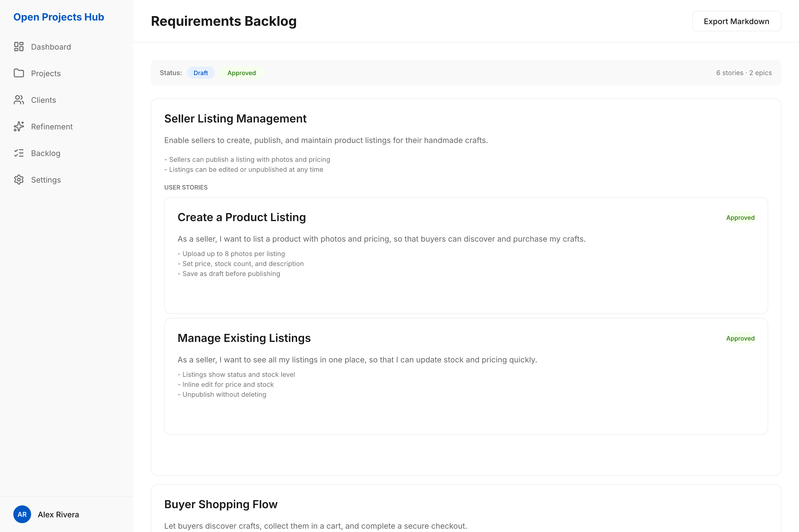 |
| Admin Dashboard | 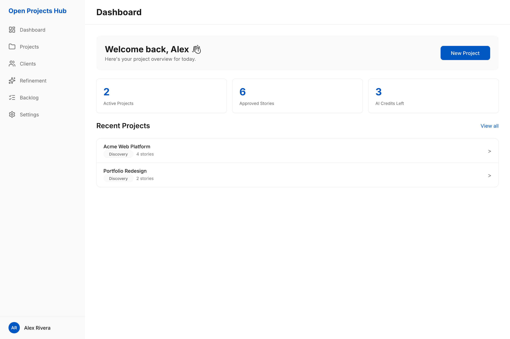 |
| Admin Settings | 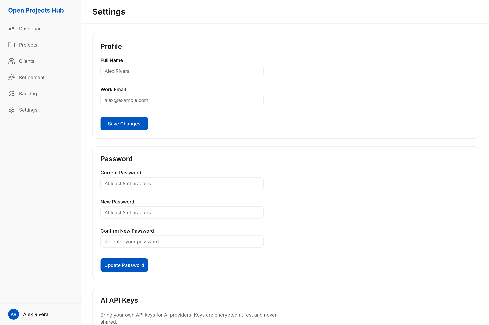 |
| Viewer Backlog | 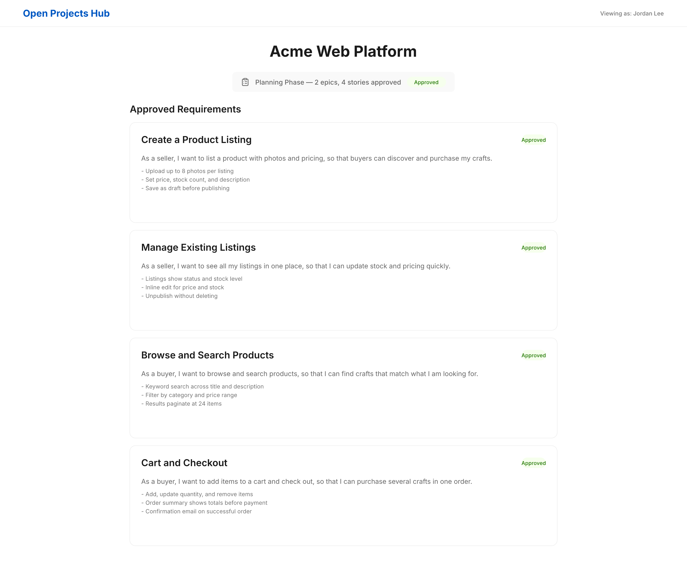 |
| Onboarding Overlay | 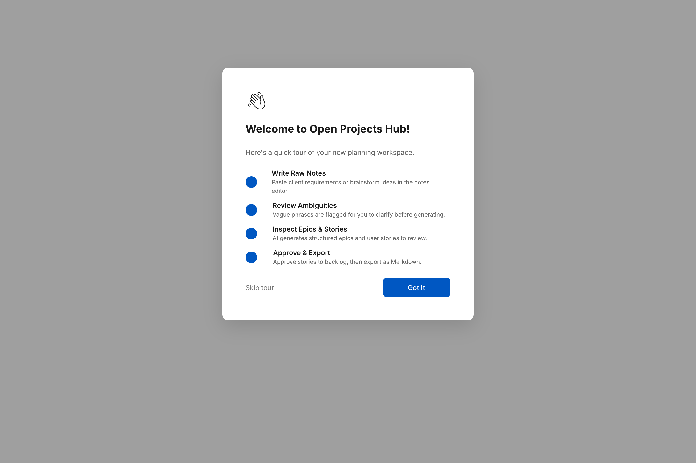 |

## What's Inside

### 22 Artboards

| #   | Artboard                    | Layout  | Key Features                                                              |
| --- | --------------------------- | ------- | ------------------------------------------------------------------------- |
| 1   | Landing / Home              | Public  | Hero, features grid, info cards, CTA section, footer                      |
| 2   | Entry & Role Selection      | Public  | Two role cards (Admin / Viewer) with CTAs                                 |
| 3   | Admin Sign Up               | Public  | Registration form: name, email, password, confirm, terms                  |
| 4   | Admin Sign In               | Public  | Email + password, remember-me, forgot/create links                        |
| 5   | Forgot Password             | Public  | Email capture for reset code                                              |
| 6   | Reset Password              | Public  | 6-digit code + new password + confirm                                     |
| 7   | AI Refinement Workspace     | Admin   | Split-pane: raw notes → generated epics & stories, ambiguity bar, provider + credits, approve |
| 8   | Admin Backlog               | Admin   | Filter bar, epic + story list, Markdown export                            |
| 9   | Admin Dashboard             | Admin   | Welcome card, stats (projects/stories/credits), recent projects list      |
| 10  | Admin Settings              | Admin   | Profile, password, API keys management, danger zone                       |
| 11  | Projects                    | Admin   | Search + status/client/date filters, project rows with phase & status     |
| 12  | New Project                 | Admin   | Name, client, phase, description, active-slot hint                        |
| 13  | Clients                     | Admin   | Client list, search, per-row Edit + Archive-or-Delete (FR-001-04)         |
| 14  | Viewer Backlog              | Public  | Read-only stories with status tags, phase badge, no edit controls         |
| 15  | Onboarding Overlay          | Overlay | 4-step welcome tour: notes, ambiguities, epics & stories, approval        |
| 16  | Privacy Policy              | Public  | Legal content page                                                        |
| 17  | Terms of Service            | Public  | Legal content page                                                        |
| 18  | Modal: Project Limit Reached| Overlay | Blocks a 4th active project; prompts to archive (FR-001-02, FR-001-07)    |
| 19  | Modal: Client Delete Blocked| Overlay | Blocks deleting a client with active projects (FR-001-04)                 |
| 20  | Modal: New Client           | Overlay | Client name + contact email, Cancel/Create                                |
| 21  | Projects — Empty            | Admin   | Empty state before any project exists                                     |
| 22  | New Project — Validation Error | Admin | Inline alert + field error state for a missing project name              |

### 17 Reusable Components

| Component          | Type                                                |
| ------------------ | --------------------------------------------------- |
| `Button/Primary`   | Filled blue button                                  |
| `Button/Secondary` | Outlined button                                     |
| `Tag/Draft`        | Blue-light pill                                     |
| `Tag/Approved`     | Green pill                                          |
| `Tag/Phase`        | Surface pill (Discovery/Planning)                   |
| `FormField`        | Label + bordered input                              |
| `StoryCard`        | Title + description + acceptance criteria           |
| `EpicCard`         | Title + description + criteria + nested story cards |
| `SiderNavItem`     | Icon + label navigation item                        |
| `Sider`            | Sidebar: logo, 6 nav items, user area               |
| `AdminLayout`      | 240px sider + page header + scrollable content body |
| `AmbiguityBar`     | Flagged phrases with clarification reasons          |
| `Select`           | Label + control with chevron                        |
| `Alert`            | Inline error/warning message with icon              |
| `EmptyState`       | Icon + title + description + CTA                    |
| `ListRow`          | Primary/secondary text + tags + row actions         |
| `Modal`            | Dimmed overlay + centred card with actions          |

### 47 Design Tokens

Colors (`$primary`, `$surface`, `$text-primary`, `$success`, `$warning`, `$error`, etc.), spacing scale (4px grid, 7 tiers), typography (Inter, 5 sizes, 4 weights), layout constants (sider widths, radii, shadows).

## Scope

The prototype covers the MVP **Discovery** and **Planning** workflows only. Out of scope: delivery, sprint, handoff, collaboration, and maintenance workflows.

## History

| Date       | Event                                                                                          |
| ---------- | ---------------------------------------------------------------------------------------------- |
| 2026-03    | Initial Stitch-generated prototype (14 static HTML screens)                                    |
| 2026-08-11 | Migrated to Pencil — interactive `.pen` file, reusable components, design tokens, epic support |
| 2026-08-11 | Removed Stitch screens; added Home, Dashboard, Settings pages                                  |
| 2026-09-08 | Wired Sider into AdminLayout; replaced all placeholder labels/content; added AmbiguityBar, provider selector, and story status tags; fixed two WCAG AA contrast failures |
| 2026-09-08 | Added F-001 coverage: Projects list, New Project form, and the limit-reached / delete-blocked modals; added Select, Alert, EmptyState, ListRow, Modal components and a Clients nav item |
| 2026-09-08 | Rebuilt Clients on `AdminLayout` for shell consistency; unified sample data across Projects/Clients/modals; added New Client modal plus empty and validation-error states |

## Source References

- [Prototype Brief](./prototype-brief.md)
- [Design Direction](./design-direction.md)
- [Project Overview](../00-context/overview.md)
- [Requirements by Feature](../01-requirements/)
- [Architecture](../03-architecture/)
