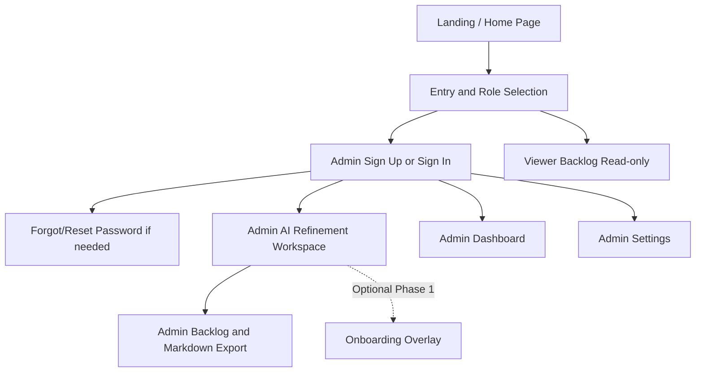

# Prototype Brief: Open Projects Hub

## Table of Contents

- [Purpose](#purpose)
- [Product Context](#product-context)
- [Goals](#goals)
- [Success Criteria](#success-criteria)
- [Target Users](#target-users)
- [MVP Prototype Scope](#mvp-prototype-scope)
- [Pages and Sections per Page](#pages-and-sections-per-page)
- [Information Architecture](#information-architecture)
- [Key User Flows](#key-user-flows)
- [Assumptions](#assumptions)
- [Requirements Coverage Matrix](#requirements-coverage-matrix)
- [Source References](#source-references)

## Purpose

Create a lightweight prototype brief that turns the repository planning documentation into a single source of truth for Pencil-based prototype design and stakeholder review.

The prototype pack should help stakeholders validate the MVP planning experience without introducing undocumented product scope or implementation detail.

## Product Context

The Open Projects Hub is an open-source web platform that helps freelancers turn ambiguous client notes into structured project requirements. The MVP is limited to **Discovery** and **Planning** workflows, with role-based access for:

- **Admin**: freelancer owner with full CRUD on planning content
- **Viewer**: client with read-only access to approved requirements and project phase visibility

## Goals

1. Show lightweight account entry and authentication views needed to reach the planning workspace.
2. Show how raw notes or bullet lists become structured draft user stories.
3. Make ambiguity visibility, editability, and explicit approval easy to understand.
4. Demonstrate a readable backlog experience for both Admin and Viewer roles.
5. Make scope boundaries obvious: Discovery/Planning only, no delivery or handoff workflows.

## Success Criteria

- Stakeholders can explain the end-to-end MVP path (entry, auth, refinement, approval, export, Viewer review) after one walkthrough.
- Admin and Viewer permissions are visually distinct without extra explanation.
- Viewer-facing screens contain no edit affordances.
- The prototype terminology stays aligned with documented feature requirements and roadmap scope.

## Target Users

| Persona     | Role in prototype              | Primary needs                                                                                            |
| ----------- | ------------------------------ | -------------------------------------------------------------------------------------------------------- |
| Alex Rivera | Admin / Independent Freelancer | Turn vague notes into structured requirements, keep projects organized, approve official backlog content |
| Jordan Lee  | Viewer / Client                | Review approved requirements in plain language and understand current project phase                      |
| Maya Chen   | Secondary stakeholder          | Understand the documented workflow and planning structure for learning or contribution context           |

## MVP Prototype Scope

### In Scope

- Landing / Home page with hero, features, and CTAs
- Entry and role selection page
- Admin Sign Up, Sign In, Forgot Password, and Reset Password pages
- Admin AI refinement workspace with epic and user story generation
- Admin backlog view with approved epics, user stories, and Markdown export action
- Admin dashboard with project stats and quick actions
- Admin settings with profile, password, and API key management
- Viewer backlog view with read-only access
- Optional Phase 1 onboarding overlay for first-time Admin guidance

### Out of Scope

- Delivery, sprint, handoff, or maintenance workflows
- Additional collaborator roles beyond Admin and Viewer
- Comments, audit history, version comparison, or team collaboration flows
- Final production copy for every project artifact

## Pages and Sections per Page

### 1. Entry and Role Selection

- Product summary and MVP context
- Two role cards only: Admin and Viewer
- Primary action for Admin path and secondary action for Viewer path
- State coverage: default, role selection feedback, minimal helper guidance

### 2. Landing / Home Page

- Top navigation bar with logo and Sign In CTA
- Hero section with headline, subhead, and dual CTAs (Start Project, View Sample)
- Three-card feature grid: Capture Raw Ideas, AI Refinement, Visualize & Export
- Two-column info grid: For Freelancers and For Clients feature cards
- Full-width CTA section with primary action
- Footer with brand, directories, legal links, and copyright

### 3. Admin Sign Up

- Admin account creation form
- Required field validation and terms acknowledgment
- Link to sign in
- State coverage: default, validation error, loading, success

### 4. Admin Sign In

- Email/password authentication form
- Remember-me and support links for account recovery and creation
- State coverage: default, validation error, loading, unconfirmed/blocked notice

### 5. Forgot Password

- Email capture for reset request
- Return to sign-in action
- State coverage: default, validation error, loading, success

### 6. Reset Password

- New password and confirmation inputs
- Return-to-sign-in action
- State coverage: default, validation error, loading, success

### 7. Admin AI Refinement Workspace

- Project context header with phase tag
- Raw notes and bullet-list input area
- Ambiguity review with inline highlights
- AI-generated epics with nested user stories
- Draft story cards within epic containers
- Edit and explicit approval controls
- Bulk approve all action
- State coverage: empty, loading, validation/error, draft-ready, approved confirmation

### 8. Admin Backlog View and Markdown Export

- Project summary header with phase
- Approved epic and story list with nested structure
- Optional draft vs approved distinction for review context
- Markdown export action
- State coverage: empty backlog, mixed status, export-ready

### 9. Admin Dashboard

- Welcome greeting with project stats
- Stat cards: Active Projects, Approved Stories, AI Credits
- Recent projects list with phase tags and story counts
- Quick action: New Project CTA

### 10. Admin Settings

- Profile section: Full Name and Work Email fields
- Password section: Current, New, and Confirm fields
- API Keys section: masked key display with Add/Replace/Delete actions
- Danger Zone: account deletion with confirmation guard

### 11. Viewer Backlog View

- Project summary header with phase
- Approved requirements list
- Read-only presentation cues
- Plain-language status visibility
- Explicit omissions: no draft-only content, no edit controls

### 12. Optional Phase 1 Onboarding Overlay

- Welcome message
- Tooltip for note entry
- Tooltip for ambiguity highlights
- Tooltip for draft review and editing
- Tooltip for approval action
- Skip, dismiss, and don't-show-again states

## Information Architecture

### Sitemap

### Navigation Model

Use a **small multi-page prototype** instead of a single-page concept.

- **Why**: the documentation separates entry, auth, refinement, backlog review, and Viewer visibility into distinct flows.
- **Prototype navigation**: lightweight page switching only, such as simple tabs or a review switcher.
- **Guardrail**: do not invent a full application navigation system, because it is not defined in the source docs.

## Key User Flows

### Flow 1: Alex Rivera enters and authenticates

1. Open entry and role-selection page.
2. Choose Admin path.
3. Create account or sign in.
4. If needed, request and complete password reset.
5. Enter Admin planning workspace.

### Flow 2: Alex Rivera moves from raw notes to approved backlog

1. Open a project in Discovery or Planning.
2. Enter raw notes or bullet lists.
3. Review inline ambiguity highlights.
4. Inspect generated draft stories.
5. Edit story text and acceptance criteria.
6. Explicitly approve content.
7. See approved stories in the official backlog.
8. Export approved requirements to Markdown.

### Flow 3: Jordan Lee reviews approved requirements safely

1. Open the Viewer read-only page.
2. See the current phase in plain language.
3. Review approved user stories and acceptance criteria.
4. Confirm there are no edit controls or draft-only items.
5. Leave with a clear understanding of what is being planned.

### Flow 4: Alex Rivera completes first-time onboarding

1. See a welcome message on first use.
2. Follow guidance for note entry.
3. Learn how ambiguity highlights work.
4. Learn where to review and edit draft stories.
5. Learn when and why approval is required.
6. Skip, dismiss, or finish the guidance flow.

## Assumptions

- The prototype focuses on documented MVP planning workflows plus lightweight auth entry.
- Admin and Viewer are the only product roles shown in the prototype.
- Navigation remains intentionally minimal because the docs define workflows, not a full app shell.
- Sample content should use structured placeholders rather than finalized marketing or client copy.

## Requirements Coverage Matrix

Every Must requirement should appear in at least one row before prototype sign-off.

| Screen / Flow                   | Covers FR(s)                               | Covers NFR(s)                      | Story (US-\*) | Milestone |
| ------------------------------- | ------------------------------------------ | ---------------------------------- | ------------- | --------- |
| Landing / Home Page             | FR-006-01, FR-006-02, FR-006-03            | NFR-006-01, NFR-006-02            | US-P1-UX-004  | MVP       |
| Entry and Role Selection        | FR-006-01, FR-006-02                       | NFR-006-02                         | US-P1-UX-004  | MVP       |
| Admin Sign Up                   | FR-008-01, FR-008-02                       | NFR-008-01, NFR-008-02             | US-P1-UX-004  | MVP       |
| Admin Sign In + Recovery        | FR-007-01, FR-007-02, FR-009-01, FR-009-02 | NFR-007-01, NFR-009-02             | US-P1-UX-004  | MVP       |
| Admin AI Refinement Workspace   | FR-002-01, FR-002-02, FR-002-03            | NFR-002-03                         | US-MVP-UX-001 | MVP       |
| Admin Backlog + Markdown Export | FR-004-01, FR-004-02                       | NFR-004-02                         | US-MVP-UX-002 | MVP       |
| Admin Dashboard                 | FR-001-01, FR-010-01                       | NFR-006-02                         | US-MVP-UX-001 | MVP       |
| Admin Settings                  | FR-010-02, FR-010-03                       | NFR-010-01                         | US-MVP-UX-001 | MVP       |
| Viewer Backlog Read-only        | FR-003-01, FR-003-03                       | NFR-003-02, NFR-003-03, NFR-004-01 | US-MVP-UX-002 | MVP       |
| Optional Onboarding Overlay     | FR-005-01                                  | NFR-005-01                         | US-P1-UX-003  | Phase 1   |

## Source References

- [Project Overview](../00-context/overview.md)
- [User Personas](../00-context/user-personas.md)
- [Open Questions](../00-context/open-questions.md)
- [Project Requirements by Feature](../01-requirements/README.md)
- [F-002 AI Refinement and Approval Workflow](../01-requirements/f-002-ai-refinement-and-approval-workflow.md)
- [F-003 Access Control and Visibility Boundaries](../01-requirements/f-003-access-control-and-visibility-boundaries.md)
- [F-004 Requirements Backlog and Markdown Export](../01-requirements/f-004-requirements-backlog-and-markdown-export.md)
- [F-005 Minimal Onboarding](../01-requirements/f-005-minimal-onboarding.md)
- [F-006 Landing Page](../01-requirements/f-006-landing-page.md)
- [F-007 Admin Login](../01-requirements/f-007-admin-login.md)
- [F-008 Create Account](../01-requirements/f-008-create-account.md)
- [F-009 Reset Password](../01-requirements/f-009-reset-password.md)
- [Phased Roadmap](../02-planning/phased-roadmap.md)
- [Role Mapping](../02-planning/role-mapping.md)
- [Architecture Solution Design](../03-architecture/architecture-solution-design.md)
- [UI/UX Designer User Stories](../06-user-stories/ui-ux-designer-stories.md)
- [Product Epics](../06-user-stories/epics.md)

---

**Last Updated**: 2026-08-11
