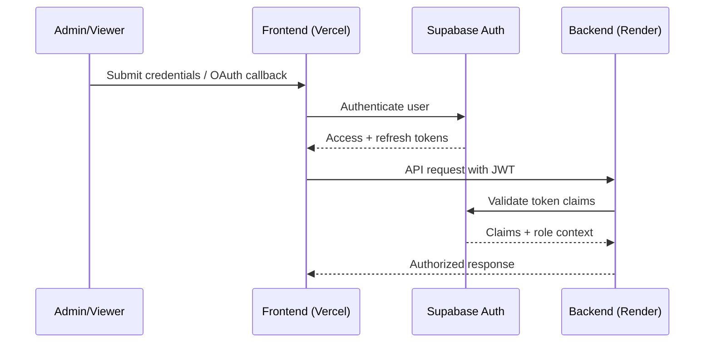
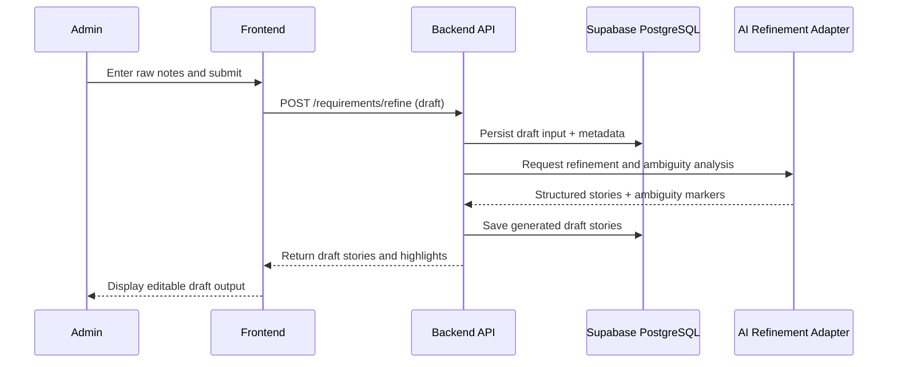
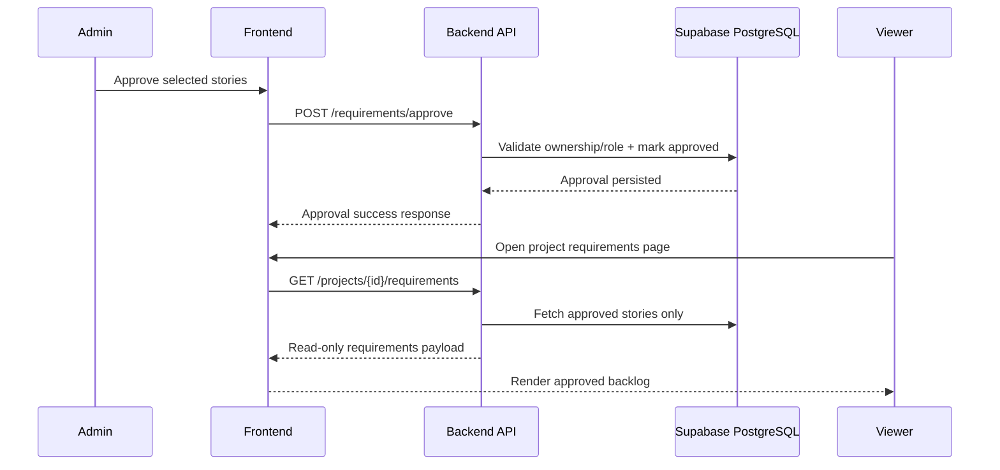
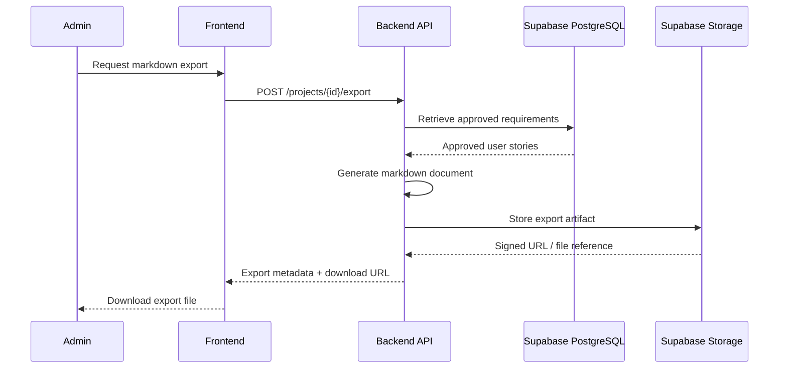
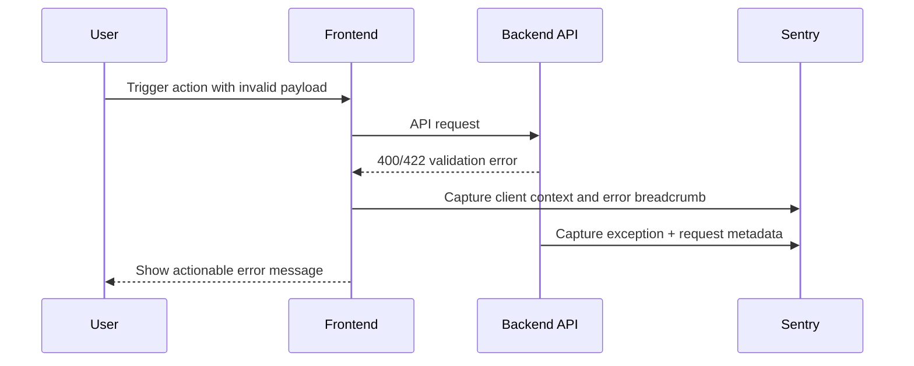

# Sequence Diagrams

This document captures key user and system interaction flows for the Open Freelancer Project Hub.

## 1) Authentication and Session Validation

## 2) AI-Assisted Requirements Refinement

## 3) Explicit Approval and Viewer Visibility

## 4) Markdown Export Workflow

## 5) Error Handling and Observability Path

