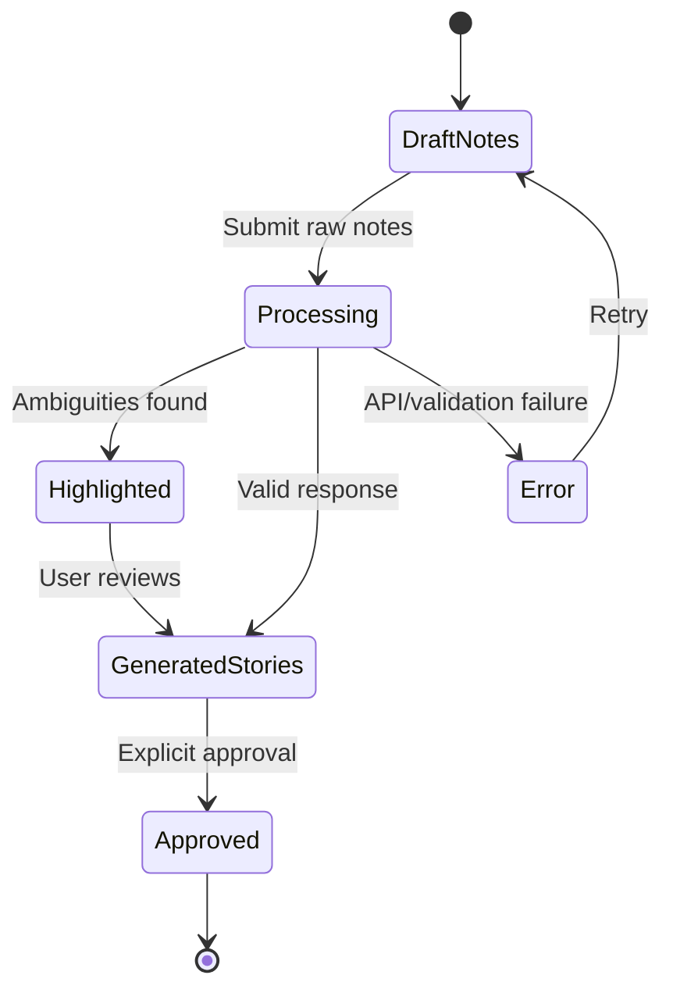
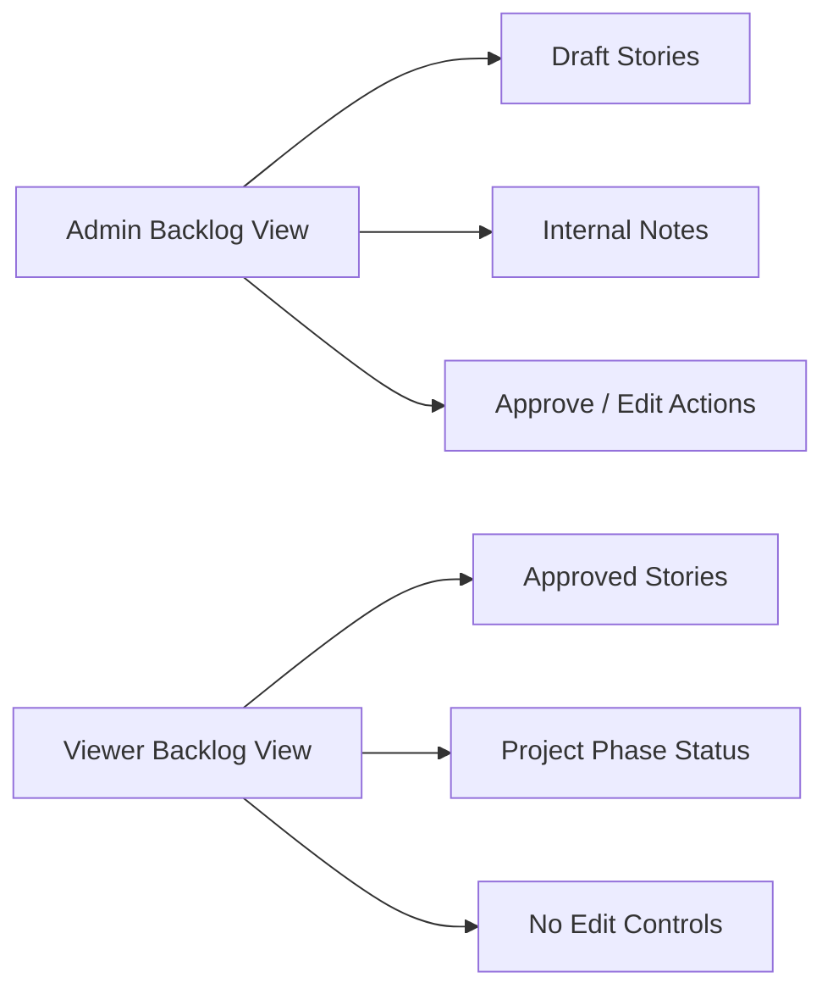

# UI/UX Designer User Stories

| Attribute | Value |
| --- | --- |
| **Project** | Open Freelancer Project Hub |
| **Role** | UI/UX Designer |
| **Last Updated** | 2026-02-28 |

## Context and Design Constraints

- Scope focuses on MVP discovery/planning workflows only (FR-003).
- Admin workflows must support AI refinement input, ambiguity highlighting, story editing, and approval (FR-004 to FR-007).
- Viewer experience must remain read-only and understandable to non-technical stakeholders (FR-014, NFR-004).
- UI quality must support accessibility expectations (NFR-007) and MVP usability improvements (FR-013).
- Design system and implementation baseline: React + TypeScript + Ant Design, with SCSS Modules for customization.

## Role-Specific User Stories and Acceptance Criteria

### Story UX-001: AI Refinement Workspace Prototype

**User Story**  
As a UI/UX Designer, I want to produce a low- and high-fidelity prototype for the Admin AI refinement workspace, so that stakeholders can validate the end-to-end discovery experience before implementation.

**Acceptance Criteria**

1. Prototype includes raw-notes input area, inline ambiguity highlighting state, generated story draft panel, and explicit approval action (FR-004 to FR-007).
2. Prototype documents five states: default, loading, ambiguity-highlighted, validation error, and approved confirmation.
3. Layout specs define desktop (≥1200px), tablet (768–1199px), and mobile (<768px) behavior with clear content hierarchy.
4. Interaction notes identify primary CTA, secondary actions, and empty-state guidance.

### Story UX-002: Requirements Backlog and Viewer Read-Only Prototype

**User Story**  
As a UI/UX Designer, I want to prototype Admin and Viewer backlog views, so that stakeholder presentations clearly show role-based visibility and readable requirement artifacts.

**Acceptance Criteria**

1. Admin prototype shows editable draft and approved states, while Viewer prototype is strictly read-only (FR-008 to FR-011, FR-014).
2. Internal notes are visible only in Admin view and explicitly absent in Viewer view (FR-010).
3. Story cards follow a consistent template: title, “As a / I want / so that”, and acceptance criteria block (FR-006, FR-011).
4. Readability checks are documented for plain-language headings and scannable spacing for non-technical users (NFR-004).

### Story UX-003: Onboarding and Contextual Guidance Prototype

**User Story**  
As a UI/UX Designer, I want to design first-use onboarding and contextual tooltips, so that new Admin users can quickly understand the refinement and approval workflow.

**Acceptance Criteria**

1. Prototype includes welcome message and at least one contextual tooltip on first-use Admin flow (FR-013).
2. Tooltip content explains where to add raw notes, review ambiguities, and approve generated stories.
3. Dismiss and “don’t show again” behavior is specified for onboarding elements.
4. Focus order and keyboard navigation for all onboarding interactions are documented (NFR-007).

### Story UX-004: Stakeholder Presentation Prototype Package

**User Story**  
As a UI/UX Designer, I want to provide a presentation-ready prototype package, so that Product Owner and stakeholders can review design intent, flows, and success/error states.

**Acceptance Criteria**

1. Package contains at least one visual mockup for each major flow: refinement, backlog review, and export handoff context (FR-004 to FR-012).
2. User-flow diagram shows transitions for submit, review, approve, retry-on-error, and read-only viewer access.
3. Each flow includes success and error-state screens/messages.
4. Handoff notes map prototype coverage to requirement IDs and phase scope (MVP vs Phase 1).

## Prototype and Mockup Deliverables

| Deliverable | Type | Audience | Coverage |
| --- | --- | --- | --- |
| Admin AI Refinement Board | High-fidelity clickable prototype | Product Owner, Frontend Engineer | FR-004 to FR-007 |
| Requirements Backlog (Admin + Viewer) | High-fidelity comparative mockup | Stakeholders, Tech Lead | FR-008 to FR-011, FR-014 |
| Onboarding Tooltip Flow | Low-fidelity interaction prototype | Product Owner, Frontend Engineer | FR-013 |
| Flow and State Package | User-flow + state diagrams | Stakeholders, QA planning | FR/NFR traceability |

## Visual Mockups (Documentation Prototypes)

### 1) Refinement Flow State Diagram

### 2) Admin vs Viewer Visibility Mockup

## Accessibility and Quality Checklist (WCAG 2.1 AA)

- [ ] Color contrast documented at 4.5:1 minimum for text and 3:1 for UI boundaries.
- [ ] Keyboard-only navigation path documented for all interactive prototype steps.
- [ ] Focus-visible behavior defined for primary actions and modal/tooltips.
- [ ] Error and status messages include screen-reader announcement notes.
- [ ] Touch targets for mobile interactions meet minimum 44x44px.

## Requirement Traceability

| Story ID | Primary Requirements |
| --- | --- |
| UX-001 | FR-004, FR-005, FR-006, FR-007 |
| UX-002 | FR-008, FR-009, FR-010, FR-011, FR-014, NFR-004 |
| UX-003 | FR-013, NFR-007 |
| UX-004 | FR-004 to FR-012, NFR-004, NFR-007 |
