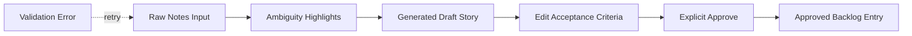
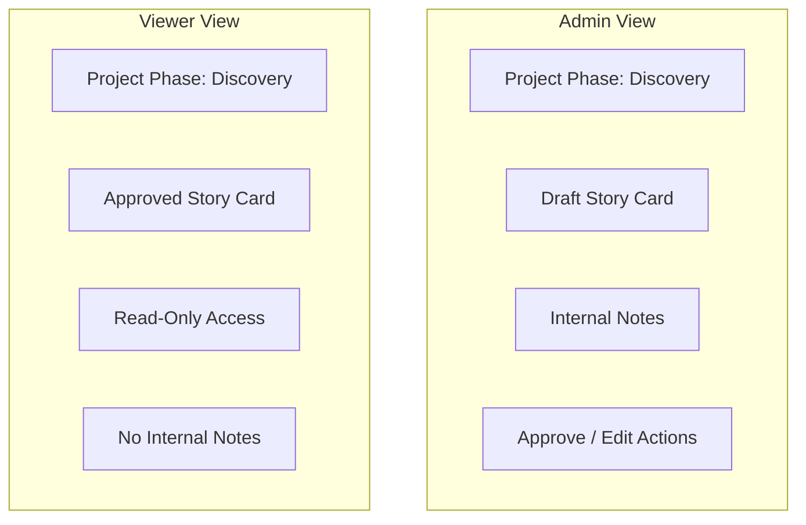
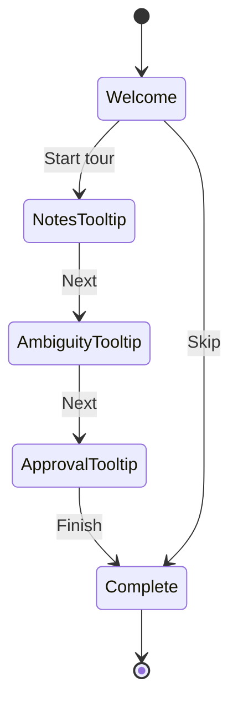

# UI/UX Designer User Stories

| Attribute        | Value                       |
| ---------------- | --------------------------- |
| **Project**      | Open Freelancer Project Hub |
| **Role**         | UI/UX Designer              |
| **Version**      | 1.0                         |
| **Status**       | Draft                       |
| **Last Updated** | 2026-03-16                  |

## Sources

- [Project Overview](../overview.md)
- [Functional Requirements](../1-requirements/functional-requirements.md)
- [Non-Functional Requirements](../1-requirements/non-functional-requirements.md)
- [Role Mapping](../2-planning/role-mapping.md)
- [Phased Roadmap](../2-planning/phased-roadmap.md)
- [Architecture Solution Design](../3-architecture/architecture-solution-design.md)
- [Technology Stack](../3-architecture/technology-stack.md)
- [API Contract](../3-architecture/api-contract.md)
- [Data Flow Diagram](../3-architecture/diagrams/data-flow.mmd)

## Objective

Define stakeholder-ready UI/UX user stories and documentation prototypes that help the team present the MVP discovery and planning experience before implementation begins.

## Design Scope and Constraints

- Scope is limited to discovery and planning workflows only, consistent with FR-003.
- Admin flows must support raw-note refinement, ambiguity visibility, story editing, and explicit approval, consistent with FR-004 to FR-007.
- Viewer flows must remain read-only, readable, and free of internal notes, consistent with FR-008 to FR-014 and NFR-004.
- Prototype outputs must support stakeholder presentation and feedback collection without implying production-ready implementation.
- Prototype assumptions align with the documented implementation baseline of React, TypeScript, Ant Design, and responsive web delivery.

## MoSCoW Prioritization Summary

| Priority | Story ID        | Theme                                               | Rationale                                                                 |
| -------- | --------------- | --------------------------------------------------- | ------------------------------------------------------------------------- |
| Must     | US-MVP-UX-001   | AI refinement workspace prototype                   | Covers the main MVP workflow where Admin users create structured stories. |
| Must     | US-MVP-UX-002   | Admin and Viewer backlog presentation prototype     | Ensures stakeholder-visible deliverables are readable and role-safe.      |
| Should   | US-P1-UX-003    | Onboarding and contextual guidance prototype        | Supports first-use clarity and reduced friction for Admin users.          |
| Should   | US-P1-UX-004    | Stakeholder presentation prototype package          | Enables reviews, sign-off discussions, and roadmap-aligned feedback.      |

## User Stories

**Story ID**: US-MVP-UX-001  
**Epic**: AI-Assisted Requirements Refinement  
**Priority**: Must Have  
**Effort Estimate**: Story Points: 5

**As a** UI/UX Designer,  
**I want to** create a prototype for the Admin AI refinement workspace,  
**So that** stakeholders can validate how raw notes become structured user stories before engineering starts.

**Acceptance Criteria**:

- [ ] Given the Admin enters raw notes or bullet lists, When the refinement prototype is presented, Then it includes an input area that clearly accepts both formats without requiring file uploads.
- [ ] Given ambiguous phrases are detected, When the draft state is shown, Then the prototype highlights ambiguous text inline and explains the meaning of the highlight state.
- [ ] Given AI output is generated, When the Admin reviews the prototype, Then it shows title, user story sentence, editable acceptance criteria, and an explicit approval action.
- [ ] Given stakeholders review responsive behavior, When the prototype is demonstrated, Then desktop, tablet, and mobile layouts are documented with preserved content hierarchy.
- [ ] Given error and success scenarios are discussed, When the workflow states are reviewed, Then the prototype shows loading, validation error, draft-ready, and approved states.

**Deliverables**:

- Low-fidelity layout for the Admin refinement screen
- High-fidelity click-through of the refinement-to-approval workflow
- State annotations for loading, ambiguity highlight, validation error, and approval confirmation

**Dependencies**:

- FR-004, FR-005, FR-006, FR-007
- NFR-007
- Admin workflow ownership defined in `../2-planning/role-mapping.md`

**Success Metrics**:

- Stakeholders can identify the complete Admin refinement workflow in one review session
- Prototype covers 100% of MVP refinement states referenced by FR-004 to FR-007
- Review feedback produces no unresolved ambiguity about approval-gate behavior

## Reference

- [Project Overview](../overview.md)
- [Functional Requirements](../1-requirements/functional-requirements.md)
- [Architecture Solution Design](../3-architecture/architecture-solution-design.md)
- [Data Flow Diagram](../3-architecture/diagrams/data-flow.mmd)
- [API Contract](../3-architecture/api-contract.md)

---

**Story ID**: US-MVP-UX-002  
**Epic**: Requirements Review and Stakeholder Visibility  
**Priority**: Must Have  
**Effort Estimate**: Story Points: 5

**As a** UI/UX Designer,  
**I want to** prototype both Admin and Viewer backlog experiences,  
**So that** stakeholder presentations clearly show editable Admin capabilities and read-only Viewer visibility.

**Acceptance Criteria**:

- [ ] Given the backlog prototype is reviewed, When the Admin view is shown, Then it displays editable drafts, approval status, and internal notes placement.
- [ ] Given the Viewer view is reviewed, When the same backlog content is presented, Then internal notes are absent and all controls are read-only.
- [ ] Given non-technical stakeholders review the prototype, When story cards are displayed, Then each card follows a readable title plus “As a / I want / so that” structure with visible acceptance criteria.
- [ ] Given project phase visibility is required, When the Viewer page is demonstrated, Then discovery and planning states are visible in plain language without introducing delivery workflows.
- [ ] Given the prototype is assessed for accessibility, When navigation order is documented, Then keyboard access, headings, and contrast expectations are explicitly noted for primary backlog screens.

**Deliverables**:

- Comparative Admin and Viewer backlog mockups
- Role-visibility annotation sheet showing what is hidden in Viewer mode
- Plain-language readability checklist for stakeholder-facing screens

**Dependencies**:

- FR-003, FR-008, FR-010, FR-011, FR-014
- NFR-004, NFR-007
- Viewer transparency priorities from `../2-planning/phased-roadmap.md`

**Success Metrics**:

- Stakeholders can distinguish Admin and Viewer permissions without verbal clarification
- Prototype demonstrates zero internal-note leakage in Viewer screens
- Backlog presentation format matches the approved requirements template for all sample cards

## Reference

- [Functional Requirements](../1-requirements/functional-requirements.md)
- [Non-Functional Requirements](../1-requirements/non-functional-requirements.md)
- [Role Mapping](../2-planning/role-mapping.md)
- [Phased Roadmap](../2-planning/phased-roadmap.md)
- [Architecture Solution Design](../3-architecture/architecture-solution-design.md)

---

**Story ID**: US-P1-UX-003  
**Epic**: Guided Onboarding and Accessibility  
**Priority**: Should Have  
**Effort Estimate**: Story Points: 3

**As a** UI/UX Designer,  
**I want to** design onboarding and contextual guidance prototypes for first-time Admin users,  
**So that** new users understand where to add notes, how to review AI output, and when to approve stories.

**Acceptance Criteria**:

- [ ] Given a first-time Admin opens the workflow, When the onboarding prototype is demonstrated, Then it includes a welcome message and at least one contextual tooltip.
- [ ] Given the tooltip sequence is reviewed, When each step is presented, Then the guidance explains note entry, ambiguity review, editing, and approval actions in plain language.
- [ ] Given users may not want repeated guidance, When onboarding behavior is documented, Then dismiss and “don’t show again” states are included.
- [ ] Given accessibility is in scope, When the prototype annotations are reviewed, Then focus order, keyboard navigation, and screen-reader labeling expectations are documented.
- [ ] Given Phase 1 priorities are discussed, When the prototype is handed off, Then it is explicitly marked as a usability enhancement and not an MVP blocker.

**Deliverables**:

- First-use onboarding flow mockup
- Tooltip content inventory for key workflow moments
- Accessibility notes for focus and keyboard behavior

**Dependencies**:

- FR-013
- NFR-007
- Phase 1 usability scope from `../2-planning/phased-roadmap.md`

**Success Metrics**:

- Stakeholders can explain the first-time Admin journey after one walkthrough
- Prototype covers all onboarding touchpoints required by FR-013
- Accessibility notes identify primary interaction expectations before implementation planning begins

## Reference

- [Functional Requirements](../1-requirements/functional-requirements.md)
- [Non-Functional Requirements](../1-requirements/non-functional-requirements.md)
- [Role Mapping](../2-planning/role-mapping.md)
- [Phased Roadmap](../2-planning/phased-roadmap.md)
- [Technology Stack](../3-architecture/technology-stack.md)

---

**Story ID**: US-P1-UX-004  
**Epic**: Stakeholder Review and Prototype Presentation  
**Priority**: Should Have  
**Effort Estimate**: Story Points: 3

**As a** UI/UX Designer,  
**I want to** assemble a presentation-ready prototype package,  
**So that** the Product Owner and stakeholders can review the design vision, user flows, and edge cases in a single artifact.

**Acceptance Criteria**:

- [ ] Given a stakeholder review session is scheduled, When the package is opened, Then it contains at least one prototype or mockup for refinement, backlog review, and onboarding.
- [ ] Given reviewers need flow context, When the package is presented, Then it includes a user-flow diagram covering submit, review, approve, retry, and Viewer access paths.
- [ ] Given error handling must be visible, When the package is inspected, Then each major flow includes at least one success state and one error or empty state.
- [ ] Given roadmap alignment is important, When deliverables are reviewed, Then the package labels which prototypes are MVP Must Have versus Phase 1 Should Have.
- [ ] Given handoff is needed, When the documentation is completed, Then every prototype section links back to relevant requirement and architecture references.

**Deliverables**:

- Stakeholder review deck outline in Markdown
- Prototype coverage matrix by requirement ID and roadmap phase
- Consolidated prototype package suitable for asynchronous review

**Dependencies**:

- US-MVP-UX-001
- US-MVP-UX-002
- US-P1-UX-003
- `../2-planning/phased-roadmap.md`

**Success Metrics**:

- Review package covers all documented UI/UX stories in one location
- Product Owner can map every prototype to MVP or Phase 1 scope without additional notes
- Stakeholder review feedback is captured against clearly labeled flows and states

## Reference

- [Project Overview](../overview.md)
- [Role Mapping](../2-planning/role-mapping.md)
- [Phased Roadmap](../2-planning/phased-roadmap.md)
- [Architecture Solution Design](../3-architecture/architecture-solution-design.md)
- [Data Flow Diagram](../3-architecture/diagrams/data-flow.mmd)

---

## Prototype and Mockup Deliverables

| Deliverable                        | Type                              | Audience                         | Related Stories                    |
| ---------------------------------- | --------------------------------- | -------------------------------- | ---------------------------------- |
| Admin AI Refinement Workspace      | High-fidelity workflow prototype  | Product Owner, stakeholders      | US-MVP-UX-001, US-P1-UX-004        |
| Admin vs Viewer Backlog Comparison | Comparative visual mockup         | Product Owner, stakeholders      | US-MVP-UX-002, US-P1-UX-004        |
| First-Use Onboarding Flow          | Guided tooltip and message mockup | Product Owner, Frontend Engineer | US-P1-UX-003, US-P1-UX-004         |
| Flow and State Review Package      | Diagram set and review notes      | Stakeholders, delivery planners  | US-MVP-UX-001 to US-P1-UX-004      |

## Visual Prototypes (Documentation Mockups)

### 1. Admin AI Refinement Workspace

### 2. Admin and Viewer Backlog Comparison

### 3. First-Time Onboarding Flow

## Prototype Coverage Matrix

| Story ID      | Priority  | Requirement Coverage                 | Prototype Evidence                                  |
| ------------- | --------- | ------------------------------------ | --------------------------------------------------- |
| US-MVP-UX-001 | Must Have | FR-004, FR-005, FR-006, FR-007       | Refinement workflow diagram and state annotations   |
| US-MVP-UX-002 | Must Have | FR-003, FR-008, FR-010, FR-011, FR-014 | Admin/Viewer comparison mockup and readability notes |
| US-P1-UX-003  | Should Have | FR-013, NFR-007                    | Onboarding state diagram and tooltip content plan   |
| US-P1-UX-004  | Should Have | MVP + Phase 1 prototype packaging  | Consolidated review package and traceability links  |

## Review Checklist

- All stories are role-specific to the UI/UX Designer.
- Acceptance criteria use measurable Given/When/Then phrasing.
- Prototype deliverables are included and suitable for stakeholder review.
- MVP and Phase 1 scope boundaries remain aligned with the phased roadmap.
- References point to existing repository documentation for implementation handoff.
