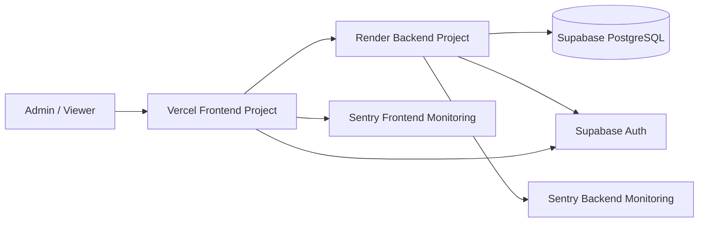
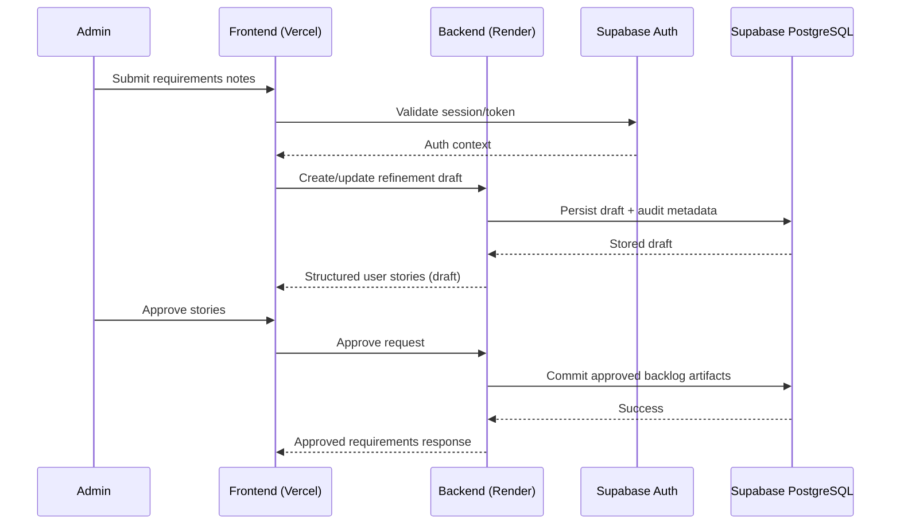

# Open Freelancer Project Hub Architecture

## System Context

The Open Freelancer Project Hub must support AI-assisted requirement refinement, role-based collaboration (Admin/Viewer), and secure project management for freelancers within MVP limits. Based on functional and non-functional requirements, the architecture must prioritize:

- rapid MVP delivery for a small team,
- strong maintainability through clear boundaries,
- secure-by-design access control and data handling,
- an explicit evolution path for future scale.

To satisfy these needs, the system is designed as separate frontend and backend projects with shared domain language and contracts.

## Architectural Approach

### Selected Pattern

**Modular Monolith backend using Clean Architecture + DDD, with a separately deployed frontend application.**

### Candidate Pattern Comparison

| Pattern                                                    | Strengths                                                                            | Weaknesses                                                                   | Fit for Current Requirements                                                   |
| ---------------------------------------------------------- | ------------------------------------------------------------------------------------ | ---------------------------------------------------------------------------- | ------------------------------------------------------------------------------ |
| Layered Monolith                                           | Fast to start, simple deployment                                                     | Boundaries erode quickly, lower long-term maintainability                    | Partial fit; weak for long-term modularity goals                               |
| Hexagonal Architecture                                     | Strong ports/adapters isolation, high testability                                    | Requires more upfront abstraction discipline                                 | Good fit, but overlaps significantly with Clean Architecture for current scope |
| Microservices                                              | Independent scaling/deployment, strong service isolation                             | High operational and coordination complexity for small team and MVP timeline | Not fit for MVP phase                                                          |
| **Modular Monolith + Clean Architecture + DDD (Selected)** | Clear domain boundaries, low operational overhead, easier evolution to microservices | Requires governance to keep module boundaries clean                          | **Best fit for MVP constraints, team expertise, and future scalability path**  |

### High-Level Design Principles

1. **Separation of concerns**: frontend and backend remain independent projects.
2. **Domain-centric design**: bounded contexts define module boundaries.
3. **Dependency inversion**: domain and application rules stay independent from frameworks.
4. **Security by design**: authorization and data-access rules are enforced at domain/application and data policy layers.
5. **Evolutionary architecture**: module seams support future extraction to services if growth demands it.

## Component Design

- **Frontend Project (Vercel):** UI workflows for project management, AI refinement interaction, and read-only viewer access.
- **Backend Project (Render):** modular monolith organized by bounded contexts (clients, projects, requirements, access control, exports).
- **Data Layer (Supabase PostgreSQL):** transactional persistence with policy-based protection.
- **Auth Layer (Supabase Auth):** identity lifecycle and token issuance.

## Data Flow

## Integration Points

- **Vercel frontend → Render backend:** HTTPS REST APIs with token-based authentication.
- **Backend → Supabase database:** persistence through backend-owned access patterns and policy enforcement.
- **Authentication flow:** Supabase Auth issues identity context consumed by frontend and validated by backend.
- **External service integrations:** Sentry for centralized frontend/backend error and performance observability.

## Observability (Sentry)

- Capture frontend runtime errors, failed API interactions, and degraded user journeys.
- Capture backend exceptions, request failures, and high-latency endpoints.
- Track release versions from CI/CD for regression correlation.
- Monitor key signals:
  - API error rate,
  - p95 latency for core requirement workflows,
  - authentication failure trends,
  - export failure rate.
- Configure alerting for:
  - sustained elevated error rate,
  - repeated auth failures,
  - critical path latency degradation.

## Deployment Impact (GitHub Actions)

- **Pipeline stages:** documentation checks (if configured), quality gates for app repos, and environment-based deployments.
- **Deployment strategy:** preview environments for frontend changes, controlled deploys for backend changes.
- **Rollback:** revert deployment artifact/commit and redeploy prior stable version.
- **Migration strategy:** versioned, backward-compatible database migrations; apply before backend rollout requiring new schema.
- **Environment management:** separate dev/staging/prod secrets and endpoints per environment.
- **Zero-downtime approach:** stateless backend processes with health checks and rolling replacement.
- **Pre-deploy verification:** validate auth flow, core CRUD flows, and requirements export workflow in non-production.

## Security Considerations

- Enforce role-based authorization for Admin and Viewer capabilities.
- Apply least-privilege access across frontend, backend, and database policies.
- Use HTTPS-only communication across all service boundaries.
- Protect sensitive data with managed encryption at rest and in transit.
- Prevent abuse with request validation, rate limiting, and secure session/token lifecycle controls.

## Scalability Considerations

- Maintain stateless backend components to allow horizontal scaling.
- Keep modules isolated so hotspots can be independently optimized or extracted later.
- Use database indexing and query discipline for requirements and project listing paths.
- Add asynchronous/background processing when AI/refinement throughput grows.
- Keep frontend independently scalable via global edge distribution.

## Trade-offs and Alternatives

- **Chosen now:** modular monolith with strict module boundaries for speed and manageable complexity.
- **Deferred:** microservices, since current scope/team size does not justify distributed-system overhead.
- **Risk:** module boundary erosion over time.  
  **Mitigation:** explicit architecture governance, ADR-driven decisions, and periodic boundary reviews.
- **Risk:** growth in AI-related workload could pressure synchronous APIs.  
  **Mitigation:** planned path to asynchronous processing and selective module extraction.

## ADR Reference

- `docs/03-architecture/03.14-adrs/03.14.02-adr-001-high-level-architecture.md`
