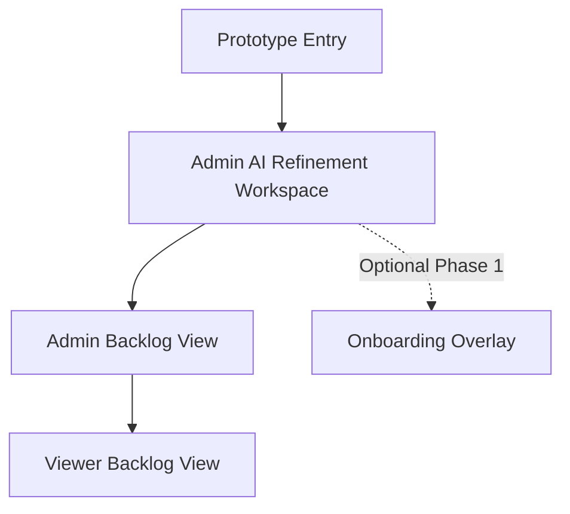

# Prototype Brief: Open Freelancer Project Hub

## Purpose

Create a lightweight prototype brief that turns the repository's planning documentation into a fast-start source of truth for Stitch prototypes and later iteration in Figma.

The prototype pack should help stakeholders validate the MVP planning experience without introducing undocumented product scope or implementation detail.

## Product Context

The Open Freelancer Project Hub is an open-source web platform that helps freelancers turn ambiguous client notes into structured project requirements. The MVP is limited to **discovery** and **planning** workflows, with role-based access for:

- **Admin**: freelancer owner with full CRUD on planning content
- **Viewer**: client with read-only access to approved requirements and project phase visibility

## Goals

1. Show how raw notes or bullet lists become structured draft user stories.
2. Make ambiguity visibility, editability, and explicit approval easy to understand.
3. Demonstrate a readable backlog experience for both Admin and Viewer roles.
4. Make scope boundaries obvious: discovery/planning only, no delivery or handoff workflows.

## Success Criteria

- Stakeholders can explain the Admin refinement-to-approval workflow after one walkthrough.
- Admin and Viewer permissions are visually distinct without extra explanation.
- Viewer-facing screens contain no internal notes and no edit affordances.
- The prototype terminology stays aligned with the documented requirements, roadmap, and architecture.

## Target Users

| Persona | Role in prototype | Primary needs |
| --- | --- | --- |
| Alex Rivera | Admin / Independent Freelancer | Turn vague notes into structured requirements, keep projects organized, approve official backlog content |
| Jordan Lee | Viewer / Client | Review approved requirements in plain language and understand current project phase |
| Maya Chen | Secondary stakeholder | Understand the documented workflow and planning structure for learning or contribution context |

## MVP Prototype Scope

### In Scope

- Admin AI refinement workspace
- Admin backlog view with approved requirements and Markdown export action
- Viewer backlog view with read-only access
- Optional Phase 1 onboarding overlay for first-time Admin guidance

### Out of Scope

- Delivery, sprint, handoff, or maintenance workflows
- Additional collaborator roles beyond Admin and Viewer
- Comments, audit history, version comparison, or team collaboration flows
- Final production copy for every project artifact

## Pages and Sections per Page

### 1. Admin AI Refinement Workspace

- Project context header
- Raw notes and bullet-list input area
- Ambiguity review with inline highlights
- Generated draft story cards
- Edit and explicit approval controls
- State coverage: empty, loading, validation/error, draft-ready, approved confirmation

### 2. Admin Backlog View

- Project summary header with phase
- Approved backlog list
- Optional draft vs approved distinction for review context
- Internal notes area visible only to Admin
- Markdown export action
- State coverage: empty backlog, mixed status, export-ready

### 3. Viewer Backlog View

- Project summary header with phase
- Approved requirements list
- Read-only presentation cues
- Plain-language status visibility
- Explicit omissions: no internal notes, no draft-only content, no edit controls

### 4. Optional Phase 1 Onboarding Overlay

- Welcome message
- Tooltip for note entry
- Tooltip for ambiguity highlights
- Tooltip for draft review and editing
- Tooltip for approval action
- Skip, dismiss, and don't-show-again states

## Information Architecture

### Sitemap

### Navigation Model

Use a **small multi-page prototype** instead of a single-page concept.

- **Why**: the documentation separates refinement, backlog review, and Viewer visibility into distinct flows.
- **Prototype navigation**: lightweight page switching only, such as simple tabs or a review switcher.
- **Guardrail**: do not invent a full application navigation system, because it is not defined in the source docs.

## Key User Flows

### Flow 1: Alex Rivera moves from raw notes to approved backlog

1. Open a project in Discovery or Planning.
2. Enter raw notes or bullet lists.
3. Review inline ambiguity highlights.
4. Inspect generated draft stories.
5. Edit story text and acceptance criteria.
6. Explicitly approve content.
7. See approved stories in the official backlog.
8. Export approved requirements to Markdown.

### Flow 2: Jordan Lee reviews approved requirements safely

1. Open the Viewer read-only page.
2. See the current phase in plain language.
3. Review approved user stories and acceptance criteria.
4. Confirm there are no edit controls or draft-only items.
5. Leave with a clear understanding of what is being planned.

### Flow 3: Alex Rivera completes first-time onboarding

1. See a welcome message on first use.
2. Follow guidance for note entry.
3. Learn how ambiguity highlights work.
4. Learn where to review and edit draft stories.
5. Learn when and why approval is required.
6. Skip, dismiss, or finish the guidance flow.

## Assumptions

- The prototype focuses on the documented MVP and optional Phase 1 onboarding only.
- Admin and Viewer are the only product roles shown in the prototype.
- Navigation remains intentionally minimal because the docs define workflows, not a full app shell.
- Sample content should use structured placeholders rather than finalized marketing or client copy.

## Source References

- `../overview.md`
- `../user-personas.md`
- `../open-questions.md`
- `../01-requirements/01.01-functional-requirements.md`
- `../01-requirements/01.02-non-functional-requirements.md`
- `../02-planning/02.01-phased-roadmap.md`
- `../02-planning/02.02-role-mapping.md`
- `../03-architecture/03.04-architecture-solution-design.md`
- `../04-user-stories/04.04-ui-ux-designer-stories.md`
- `../04-user-stories/04.02-epics.md`
