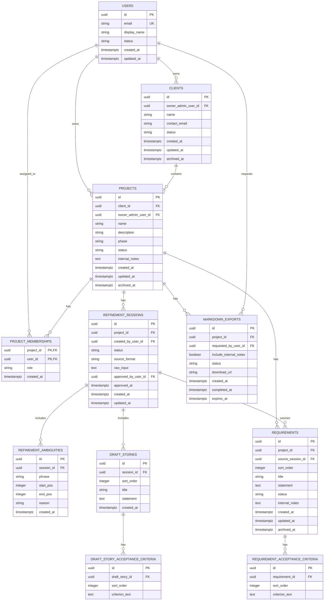

# Database Design

| Attribute        | Value                       |
| ---------------- | --------------------------- |
| **Project**      | Open Freelancer Project Hub |
| **Version**      | 1.0                         |
| **Status**       | Draft                       |
| **Last Updated** | 2026-02-28                  |

## Sources

- [Project Overview](../overview.md)
- [Functional Requirements](../01-requirements/01.01-functional-requirements.md)
- [Non-Functional Requirements](../01-requirements/01.02-non-functional-requirements.md)
- [Phased Roadmap](../02-planning/02.01-phased-roadmap.md)
- [Architecture Solution Design](../03-architecture/03.04-architecture-solution-design.md)
- [API Contract](../03-architecture/03.02-api-contract.md)
- [ADR-003: Database (Supabase PostgreSQL)](../03-architecture/03.14-adrs/03.14.04-adr-003-database.md)

## Design Scope and Assumptions

- This schema is for MVP planning scope (discovery and planning phases only).
- The model is normalized to 3NF for transactional consistency and clear ownership boundaries.
- Database engine selection and migration scripts are out of scope for this document.
- `internal_notes` fields are admin-only by authorization policy (application + RLS), not by separate table duplication.

## Entity-Relationship Diagram (ERD)

## Schema Documentation

### 1. `users`

- **Purpose:** Represents authenticated platform users (Admin or Viewer).
- **Primary key:** `id` (UUID)
- **Constraints:** `email` unique, `status` check (`active`, `disabled`)
- **Indexes:** unique index on `email`

### 2. `clients`

- **Purpose:** Client records managed by an Admin (FR-001).
- **Primary key:** `id` (UUID)
- **Foreign keys:** `owner_admin_user_id -> users.id`
- **Constraints:** `status` check (`active`, `archived`), nullable `archived_at` for soft archive
- **Indexes:** `(owner_admin_user_id, status)`, `contact_email`

### 3. `projects`

- **Purpose:** Project metadata and lifecycle (FR-002, FR-003, FR-010).
- **Primary key:** `id` (UUID)
- **Foreign keys:** `client_id -> clients.id`, `owner_admin_user_id -> users.id`
- **Constraints:**
  - `phase` check (`discovery`, `planning`)
  - `status` check (`active`, `archived`)
  - `internal_notes` is admin-visible only via authorization rules
- **Indexes:**
  - `(owner_admin_user_id, status, created_at DESC)` for active project checks/listing
  - `(client_id, status)` for client project views
- **Business rule:** max 3 active projects per Admin (FR-002) enforced in application/service layer with transactional validation using indexed active-project query.

### 4. `project_memberships`

- **Purpose:** Explicit role assignment per project (FR-008, FR-009).
- **MVP cardinality:** one `admin` and one `viewer` membership per project.
- **Primary key:** `(project_id, user_id)`
- **Foreign keys:** `project_id -> projects.id`, `user_id -> users.id`
- **Constraints:** `role` check (`admin`, `viewer`)
- **Indexes/uniqueness:**
  - unique partial index on `(project_id)` where `role = 'admin'`
  - unique partial index on `(project_id)` where `role = 'viewer'`

### 5. `refinement_sessions`

- **Purpose:** Stores raw input and draft/approval state for AI refinement workflow (FR-004 to FR-007).
- **Primary key:** `id` (UUID)
- **Foreign keys:** `project_id -> projects.id`, `created_by_user_id -> users.id`, `approved_by_user_id -> users.id`
- **Constraints:**
  - `status` check (`draft`, `approved`)
  - `source_format` check (`plain_text`, `bullet_list`)
  - `approved_by_user_id` and `approved_at` remain `NULL` until session approval
  - database `CHECK` constraint enforces approval pairing (`status = 'approved'` requires both `approved_by_user_id` and `approved_at`)
- **Indexes:** `(project_id, status, created_at DESC)`

### 6. `refinement_ambiguities`

- **Purpose:** Stores ambiguity highlights with text offsets (FR-005).
- **Primary key:** `id` (UUID)
- **Foreign keys:** `session_id -> refinement_sessions.id`
- **Constraints:** `start_pos >= 0`, `end_pos > start_pos`
- **Indexes:** `(session_id, start_pos)`

### 7. `draft_stories` and `draft_story_acceptance_criteria`

- **Purpose:** Stores generated draft stories and criteria before approval (FR-006, FR-007).
- **Primary keys:** `id` (UUID) on both tables
- **Foreign keys:**
  - `draft_stories.session_id -> refinement_sessions.id`
  - `draft_story_acceptance_criteria.draft_story_id -> draft_stories.id`
- **Constraints:**
  - `sort_order >= 1`
  - unique `(session_id, sort_order)`
  - unique `(draft_story_id, sort_order)`
- **Indexes:** `(session_id, sort_order)` and `(draft_story_id, sort_order)`

### 8. `requirements` and `requirement_acceptance_criteria`

- **Purpose:** Official approved backlog records and acceptance criteria (FR-011).
- **Primary keys:** `id` (UUID) on both tables
- **Foreign keys:**
  - `requirements.project_id -> projects.id`
  - `requirements.source_session_id -> refinement_sessions.id`
  - `requirement_acceptance_criteria.requirement_id -> requirements.id`
- **Constraints:**
  - `requirements.status` check (`approved`, `archived`)
  - `sort_order >= 1`
  - unique `(project_id, sort_order)` for stable ordered backlog
  - unique `(requirement_id, sort_order)` for criterion ordering
- **Indexes:**
  - `(project_id, status, updated_at DESC)`
  - `(project_id, created_at DESC)`

### 9. `markdown_exports`

- **Purpose:** Tracks Markdown export requests and output metadata (FR-012).
- **Primary key:** `id` (UUID)
- **Foreign keys:** `project_id -> projects.id`, `requested_by_user_id -> users.id`
- **Constraints:** `status` check (`queued`, `ready`, `failed`)
- **Indexes:** `(project_id, created_at DESC)`, `(requested_by_user_id, created_at DESC)`

## Normalization and Integrity Rationale

- **3NF alignment:** user stories and acceptance criteria are split into parent-child tables to avoid repeating criteria blobs and to support deterministic ordering.
- **Referential integrity:** all child workflow artifacts (`ambiguities`, draft stories, requirements criteria, exports) are tied to parent entities with foreign keys.
- **Soft-archive strategy:** core business entities use `status` + `archived_at` for auditability and GDPR-aligned lifecycle handling.
- **Role isolation:** membership table prevents role data duplication across project records.

## Scalability and Performance Considerations

- Indexes prioritize MVP hot paths from the API contract: project listing, requirement listing, refinement session retrieval, and export history.
- Composite indexes are designed for common filters (`project_id`, `status`, time sorting).
- Ordered child records (`sort_order`) prevent expensive text parsing and preserve deterministic export output.
- UUID keys support distributed-safe ID generation; narrow selective indexes keep read performance predictable under NFR-005/NFR-006 limits.
- Authorization-sensitive fields (`internal_notes`) remain in canonical tables while data visibility is enforced by backend policies and RLS.

## Traceability to Requirements

| Requirement       | Schema Coverage                                                    |
| ----------------- | ------------------------------------------------------------------ |
| FR-001            | `clients`, `projects` relationship with Admin ownership            |
| FR-002            | `projects` status model + indexed active-project validation path   |
| FR-003            | `projects.phase` constrained to discovery/planning                 |
| FR-004 / FR-005   | `refinement_sessions` + `refinement_ambiguities`                   |
| FR-006 / FR-007   | draft story tables + approval fields + promotion to `requirements` |
| FR-008 / FR-009   | `project_memberships.role` constrained to admin/viewer             |
| FR-010            | `internal_notes` fields restricted by authorization policy         |
| FR-011            | `requirements` + `requirement_acceptance_criteria`                 |
| FR-012            | `markdown_exports` lifecycle and metadata                          |
| NFR-001 / NFR-002 | audit-friendly soft archive + RLS-compatible ownership model       |
| NFR-005 / NFR-006 | index strategy for MVP load and read latency targets               |
