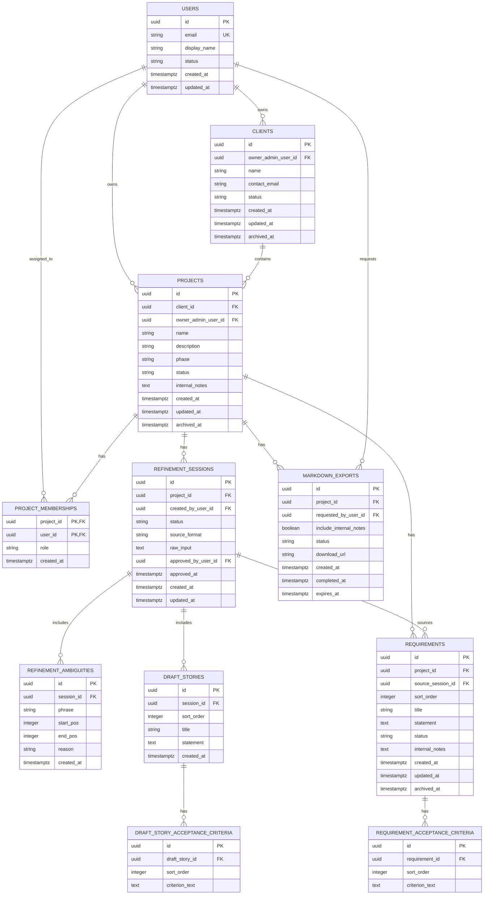

# Database Design

| Attribute        | Value                       |
| ---------------- | --------------------------- |
| **Project**      | Open Freelancer Project Hub |
| **Version**      | 1.1                         |
| **Status**       | Draft                       |
| **Last Updated** | 2026-03-23                  |

## Sources

- [Project Overview](../overview.md)
- [Project Requirements by Feature](../01-requirements/readme.md)
- [F-001 Client and Project Lifecycle Management](../01-requirements/f-001-client-and-project-lifecycle-management.md)
- [F-002 AI Refinement and Approval Workflow](../01-requirements/f-002-ai-refinement-and-approval-workflow.md)
- [F-003 Access Control and Visibility Boundaries](../01-requirements/f-003-access-control-and-visibility-boundaries.md)
- [F-004 Requirements Backlog and Markdown Export](../01-requirements/f-004-requirements-backlog-and-markdown-export.md)
- [F-007 Admin Login](../01-requirements/f-007-admin-login.md)
- [F-009 Reset Password](../01-requirements/f-009-reset-password.md)
- [Phased Roadmap](../02-planning/phased-roadmap.md)
- [Architecture Solution Design](../03-architecture/architecture-solution-design.md)
- [API Contract](../03-architecture/api-contract.md)
- [Security Architecture](../03-architecture/security-architecture.md)
- [ADR-003: Database (Supabase PostgreSQL)](../03-architecture/adrs/adr-003-database.md)
- [ADR-005: Authentication and Authorization Strategy](../03-architecture/adrs/adr-005-authentication.md)

## Design Scope and Assumptions

- This document covers the MVP planning workflow only: client/project lifecycle, AI refinement review, approved backlog management, role-safe viewing, and Markdown export metadata.
- The model remains normalized to 3NF for transactional consistency, deterministic ordering, and clean ownership boundaries.
- Supabase Auth owns credentials, password-reset artifacts, token lifecycle, and password hashing. The application schema stores user profile and authorization projection data only.
- Database engine selection is already decided by ADR-003; migration scripts, provider-specific SQL, and physical deployment setup are out of scope here.
- Sensitive `internal_notes` stay in canonical project and requirement records. Visibility is enforced through backend authorization plus Row Level Security, not by duplicating records into separate stakeholder tables.

## Data Domains

- **Identity and Access**: User profile projection plus per-project role assignment for `admin` and `viewer` access boundaries.
- **Client and Project Lifecycle**: Client ownership, project metadata, phase/status constraints, and archive lifecycle behavior.
- **Refinement Workflow**: Raw input capture, ambiguity highlights, draft story generation, and explicit approval metadata.
- **Approved Backlog and Export Delivery**: Official requirements, acceptance criteria, and Markdown export request/delivery tracking.

## Core Entities

| Entity                            | Purpose                                                             | Bounded Context     | Owned By (Role/Team) | Required By                              | Lifecycle States                    |
| --------------------------------- | ------------------------------------------------------------------- | ------------------- | -------------------- | ---------------------------------------- | ----------------------------------- |
| `users`                           | Stores application-visible user profile data keyed to auth identity | Identity and Access | Tech Lead            | FR-003-01, FR-007-01, FR-009-01, NFR-X01 | `active`, `disabled`                |
| `clients`                         | Stores client accounts managed by the freelancer Admin              | Client Lifecycle    | Product Owner        | FR-001-01, NFR-001-01                    | `active`, `archived`                |
| `projects`                        | Stores project metadata, lifecycle, and private planning notes      | Project Lifecycle   | Product Owner        | FR-001-01, FR-001-02, FR-001-03          | `active`, `archived`                |
| `project_memberships`             | Assigns exactly one Admin and one Viewer to a project in MVP        | Identity and Access | Tech Lead            | FR-003-01, FR-003-02, NFR-003-01         | role membership is active by record |
| `refinement_sessions`             | Stores raw refinement input and approval status                     | Refinement Workflow | Product Owner        | FR-002-01, FR-002-03                     | `draft`, `approved`                 |
| `refinement_ambiguities`          | Stores ambiguity spans and reasons detected during refinement       | Refinement Workflow | Product Owner        | FR-002-01, FR-002-02                     | immutable after insert              |
| `draft_stories`                   | Stores AI-generated editable draft stories before approval          | Refinement Workflow | Product Owner        | FR-002-02, FR-002-03                     | draft-only until promotion          |
| `draft_story_acceptance_criteria` | Stores ordered acceptance criteria for each draft story             | Refinement Workflow | Product Owner        | FR-002-02                                | draft-only until promotion          |
| `requirements`                    | Stores approved backlog items as official planning artifacts        | Approved Backlog    | Product Owner        | FR-002-03, FR-004-01, FR-003-03          | `approved`, `archived`              |
| `requirement_acceptance_criteria` | Stores ordered acceptance criteria for approved requirements        | Approved Backlog    | Product Owner        | FR-004-01                                | active by parent record             |
| `markdown_exports`                | Tracks Markdown export request history and delivery metadata        | Export Delivery     | Tech Lead            | FR-004-02, NFR-004-02                    | `requested`, `ready`, `failed`      |

## Relationships

- `users` owns `clients` and `projects` as the freelancer Admin boundary.
- `projects` belongs to a `client` and has `project_memberships`, `refinement_sessions`, `requirements`, and `markdown_exports`.
- `refinement_sessions` stores raw input and generates `refinement_ambiguities` plus `draft_stories` and their acceptance criteria.
- Approved refinement output is promoted into `requirements` and `requirement_acceptance_criteria`, which become the only backlog records visible to Viewer and export workflows.
- `markdown_exports` references the project being exported and the requesting user, while the exported file itself is expected to live in object storage or an equivalent delivery channel.

## Entity-Relationship Diagram (ERD)

## Schema Documentation

### 1. `users`

- **Purpose:** Represents authenticated platform users visible to the application as Admin or Viewer profiles.
- **Primary key:** `id` (UUID), expected to align with the identity-provider user key.
- **Constraints:** `email` unique, `status` check (`active`, `disabled`).
- **Indexes:** unique index on `email`.
- **Design note:** Password hashes, reset tokens, and refresh-token state are intentionally excluded because Supabase Auth owns those concerns for FR-007 and FR-009.

### 2. `clients`

- **Purpose:** Stores client records managed by an Admin for FR-001-01.
- **Primary key:** `id` (UUID).
- **Foreign keys:** `owner_admin_user_id -> users.id`.
- **Constraints:** `status` check (`active`, `archived`), nullable `archived_at` for soft archive.
- **Indexes:** `(owner_admin_user_id, status)`, `contact_email`.

### 3. `projects`

- **Purpose:** Stores project metadata, lifecycle phase, and admin-only planning notes.
- **Primary key:** `id` (UUID).
- **Foreign keys:** `client_id -> clients.id`, `owner_admin_user_id -> users.id`.
- **Constraints:**
  - `phase` check (`discovery`, `planning`).
  - `status` check (`active`, `archived`).
  - `internal_notes` remains application-visible only to Admin paths.
- **Indexes:**
  - `(owner_admin_user_id, status, created_at DESC)` for active-project checks and dashboard listing.
  - `(client_id, status)` for client-scoped project retrieval.
- **Business rule:** max 3 active projects per Admin for FR-001-02, enforced in the application/service layer with transactional validation against indexed active-project queries.

### 4. `project_memberships`

- **Purpose:** Stores explicit project role assignment for authorization and RLS decisions.
- **MVP cardinality:** one `admin` and one `viewer` membership per project.
- **Primary key:** `(project_id, user_id)`.
- **Foreign keys:** `project_id -> projects.id`, `user_id -> users.id`.
- **Constraints:** `role` check (`admin`, `viewer`).
- **Indexes and uniqueness:**
  - unique partial index on `(project_id)` where `role = 'admin'`.
  - unique partial index on `(project_id)` where `role = 'viewer'`.

### 5. `refinement_sessions`

- **Purpose:** Stores raw input and approval state for the AI refinement workflow.
- **Primary key:** `id` (UUID).
- **Foreign keys:** `project_id -> projects.id`, `created_by_user_id -> users.id`, `approved_by_user_id -> users.id`.
- **Constraints:**
  - `status` check (`draft`, `approved`).
  - `source_format` check (`plain_text`, `bullet_list`).
  - `approved_by_user_id` and `approved_at` remain `NULL` until approval.
  - database `CHECK` constraint enforces approval pairing so `status = 'approved'` requires both `approved_by_user_id` and `approved_at`.
- **Indexes:** `(project_id, status, created_at DESC)`.

### 6. `refinement_ambiguities`

- **Purpose:** Stores ambiguity highlights and text offsets returned by the refinement flow.
- **Primary key:** `id` (UUID).
- **Foreign keys:** `session_id -> refinement_sessions.id`.
- **Constraints:** `start_pos >= 0`, `end_pos > start_pos`.
- **Indexes:** `(session_id, start_pos)`.

### 7. `draft_stories` and `draft_story_acceptance_criteria`

- **Purpose:** Stores generated draft stories and ordered acceptance criteria before Admin approval.
- **Primary keys:** `id` (UUID) on both tables.
- **Foreign keys:**
  - `draft_stories.session_id -> refinement_sessions.id`.
  - `draft_story_acceptance_criteria.draft_story_id -> draft_stories.id`.
- **Constraints:**
  - `sort_order >= 1`.
  - unique `(session_id, sort_order)`.
  - unique `(draft_story_id, sort_order)`.
- **Indexes:** `(session_id, sort_order)` and `(draft_story_id, sort_order)`.

### 8. `requirements` and `requirement_acceptance_criteria`

- **Purpose:** Stores the official approved backlog and its ordered acceptance criteria.
- **Primary keys:** `id` (UUID) on both tables.
- **Foreign keys:**
  - `requirements.project_id -> projects.id`.
  - `requirements.source_session_id -> refinement_sessions.id`.
  - `requirement_acceptance_criteria.requirement_id -> requirements.id`.
- **Constraints:**
  - `requirements.status` check (`approved`, `archived`).
  - `sort_order >= 1`.
  - unique `(project_id, sort_order)` for stable ordered backlog rendering and export generation.
  - unique `(requirement_id, sort_order)` for deterministic acceptance-criteria ordering.
- **Indexes:**
  - `(project_id, status, updated_at DESC)`.
  - `(project_id, created_at DESC)`.

### 9. `markdown_exports`

- **Purpose:** Tracks Markdown export requests and delivery metadata for approved requirements.
- **Primary key:** `id` (UUID).
- **Foreign keys:** `project_id -> projects.id`, `requested_by_user_id -> users.id`.
- **Constraints:**
  - `status` check (`requested`, `ready`, `failed`).
  - `completed_at` is only populated for terminal states.
  - `download_url` is nullable until export completion.
- **Indexes:** `(project_id, created_at DESC)`, `(requested_by_user_id, created_at DESC)`.
- **Design note:** `include_internal_notes` is retained for policy-aware export requests, but Admin-only enforcement must happen before generation so Viewer-safe deliverables never expose internal notes.

## Constraints and Integrity Rules

- **Primary keys:** UUIDs for all root records plus one composite key on `project_memberships` for role assignment uniqueness.
- **Foreign keys:** All child workflow records reference parent entities directly to prevent orphaned draft, requirement, and export artifacts.
- **Uniqueness rules:**
  - `users.email` unique.
  - one Admin and one Viewer membership per project via partial unique indexes.
  - ordered child collections use unique `sort_order` within the parent scope.
- **Check constraints:**
  - lifecycle enums on user, client, project, requirement, session, and export status fields.
  - `projects.phase` limited to `discovery` and `planning`.
  - ambiguity offsets enforce valid ranges.
  - approval metadata pair is required when refinement status is `approved`.
- **Soft archive policy:** `clients`, `projects`, and `requirements` use `status` plus `archived_at` to support privacy-aligned archival without losing audit context.

## Access Patterns and Indexing Notes

- **Hot read path 1:** Admin dashboard and active-project validation by owner and status -> index `(owner_admin_user_id, status, created_at DESC)` on `projects`.
- **Hot read path 2:** Project requirements listing for Admin and Viewer -> indexes `(project_id, status, updated_at DESC)` on `requirements` and `(requirement_id, sort_order)` on `requirement_acceptance_criteria`.
- **Hot read path 3:** Refinement review screen by project and latest session state -> index `(project_id, status, created_at DESC)` on `refinement_sessions`.
- **Hot read path 4:** Export history by project and requesting Admin -> indexes `(project_id, created_at DESC)` and `(requested_by_user_id, created_at DESC)` on `markdown_exports`.
- **Write-heavy path:** Draft refinement generation writes a session, ambiguities, stories, and criteria in one workflow. Ordering columns reduce downstream parsing work and keep export rendering deterministic.
- **Ordering strategy:** `sort_order` is used for all story and criterion collections; descending timestamps serve list and history views.

## Migration and Evolution Considerations

- **Backward compatibility policy:** additive-first schema changes for MVP and early post-MVP iterations; avoid destructive column or enum changes in a single release.
- **Promotion strategy:** draft records are not updated into approved records in place. Approval promotes content from `draft_stories` into `requirements`, preserving a clear workflow boundary.
- **Archive evolution:** if hard deletion becomes required for privacy requests beyond the current 24-hour inaccessibility rule, implement a controlled purge workflow after archive state and retention checks.
- **Auth evolution:** if future requirements demand local profile enrichment or invite workflows, extend the `users` projection and membership model without duplicating credential storage now owned by Supabase Auth.
- **Rollback posture:** forward-fix is preferred for schema changes; point-in-time restore is reserved for data corruption or severe migration failure scenarios handled by Supabase recovery capabilities.

## Security and Data Governance

- **Sensitive fields:** `internal_notes`, user email addresses, client contact email, and export download URLs.
- **Access controls:** backend authorization plus Supabase RLS enforce Admin and Viewer visibility, project ownership, and deny-by-default access for internal notes.
- **Retention policy:** archived business entities remain retained for auditability until explicit deletion policy is defined; export URLs should expire and be rotated out of active use.
- **Auditability:** `created_at`, `updated_at`, `approved_at`, `archived_at`, and `requested_by_user_id` fields provide baseline lifecycle traceability for core artifacts.
- **Provider boundary:** login credentials, password reset tokens, and refresh tokens are outside the application schema and remain under Supabase Auth governance, which aligns with FR-007, FR-009, and NFR-X01.

## Normalization and Integrity Rationale

- **3NF alignment:** story and acceptance-criteria data is split into parent-child tables to avoid repeated text blobs and support stable ordering.
- **Workflow separation:** draft artifacts and approved backlog artifacts are separated so unapproved AI output cannot leak into official records or exports by accident.
- **Referential integrity:** ambiguity, draft, backlog, and export artifacts are all anchored to parent entities with foreign keys.
- **Role isolation:** project memberships centralize authorization context instead of duplicating role flags across project or requirement records.

## Risks and Open Questions

- **Risk:** The max-3-active-project rule lives in the application layer, so concurrent create or reactivate requests could bypass it without transactional enforcement. - **Mitigation:** enforce the check and state transition in one transaction and add concurrency-focused test coverage.
- **Risk:** Viewer-safe output can leak if `internal_notes` filtering is implemented inconsistently across API, RLS, and export generation. - **Mitigation:** keep a deny-by-default policy and test Admin and Viewer access through API and export scenarios.
- **Risk:** `download_url` persistence can outlive intended access duration. - **Mitigation:** use expiring signed URLs and treat `expires_at` as a hard contract for clients and export consumers.
- **Open question:** Should future export delivery metadata include object-storage key and checksum fields in addition to `download_url` once operational design is finalized?
- **Open question:** Does the future invite and onboarding model require a separate pending-membership state, or is the MVP assumption of pre-provisioned Admin and Viewer users sufficient until post-MVP collaboration expands?

## Traceability to Requirements

| Requirement | Database Coverage                                                                                                                                    |
| ----------- | ---------------------------------------------------------------------------------------------------------------------------------------------------- |
| FR-001-01   | `clients` and `projects` plus the `client_id` foreign key model the Admin-managed client and project relationship.                                   |
| FR-001-02   | `projects.status`, owner relationship, and indexed owner-status reads support the max-3-active-project validation path.                              |
| FR-001-03   | `projects.phase` is constrained to `discovery` and `planning`.                                                                                       |
| FR-002-01   | `refinement_sessions.raw_input` and `source_format` persist raw notes and bullet-list inputs.                                                        |
| FR-002-02   | `draft_stories`, `draft_story_acceptance_criteria`, and `refinement_ambiguities` store generated refinement outputs in editable draft form.          |
| FR-002-03   | Approval fields on `refinement_sessions` plus promotion into `requirements` preserve the explicit approval gate.                                     |
| FR-003-01   | `project_memberships.role` and `users.status` support Admin and Viewer authorization boundaries.                                                     |
| FR-003-02   | Partial unique membership indexes preserve the MVP limit of one Admin and one Viewer per project.                                                    |
| FR-003-03   | `requirements` and `projects.phase` provide the Viewer-safe approved backlog and phase visibility model.                                             |
| FR-004-01   | `requirements` and `requirement_acceptance_criteria` define the official structured backlog artifact.                                                |
| FR-004-02   | `markdown_exports` tracks Markdown export requests, completion state, and delivery metadata.                                                         |
| FR-007-01   | `users` stores the application-visible identity projection while Supabase Auth owns credentials and login artifacts.                                 |
| FR-009-01   | Password-reset request and token data remain external to this schema by ADR-005 design; the application schema references only stable user identity. |
| NFR-001-01  | Soft archive fields on business entities support privacy-aligned archival behavior.                                                                  |
| NFR-003-01  | Membership-driven RBAC and RLS-compatible ownership fields support least-privilege access control.                                                   |
| NFR-004-02  | Query-driven indexes support backlog and export responsiveness at MVP load.                                                                          |
| NFR-X01     | Auth-provider boundary plus explicit sensitive-field handling supports secure credential and access design.                                          |
| NFR-X02     | Archive strategy and ownership modeling align with GDPR-oriented handling assumptions.                                                               |
| NFR-X05     | Indexed hot paths target responsive project and requirement retrieval.                                                                               |
| NFR-X06     | UUID keys and selective composite indexes support MVP growth without changing the logical schema.                                                    |

## Change Log

| Date       | Version | Change Summary                                                                                                          | Author    |
| ---------- | ------- | ----------------------------------------------------------------------------------------------------------------------- | --------- |
| 2026-03-23 | 1.1     | Refactored to template structure, updated source links, aligned requirement IDs, and clarified auth boundary ownership. | Tech Lead |
| 2026-02-28 | 1.0     | Initial database design draft created.                                                                                  | Tech Lead |
