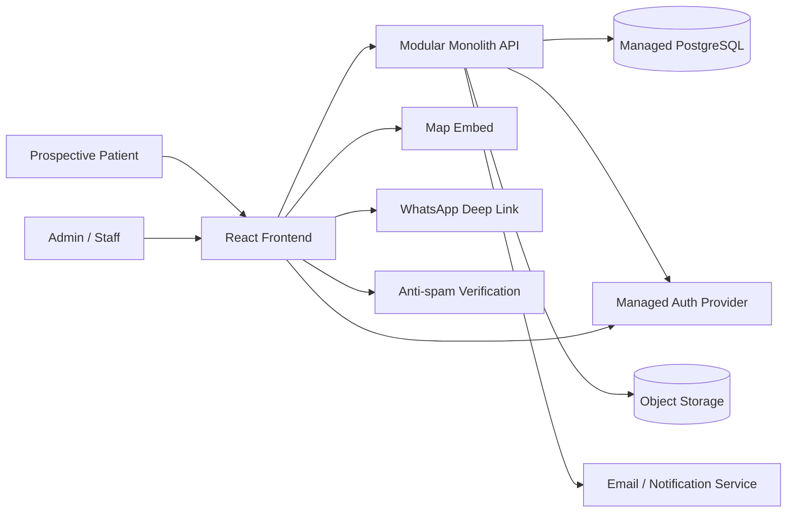
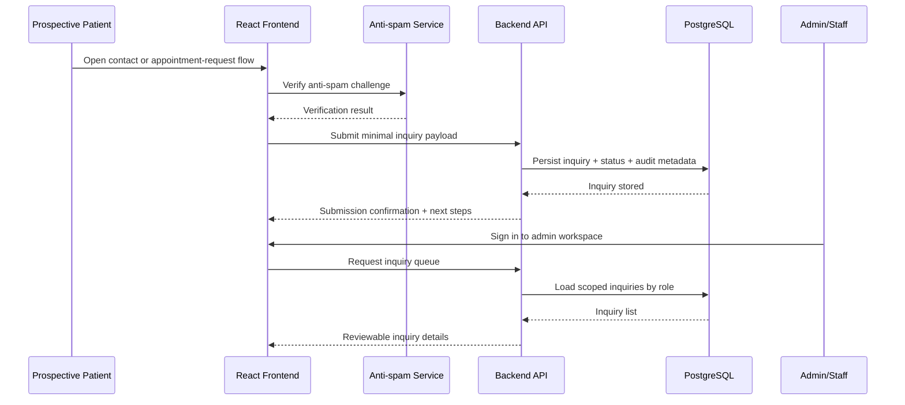

# Orthopedic Spine — Architecture Solution Design

| Attribute        | Value            |
| ---------------- | ---------------- |
| **Project**      | Orthopedic Spine |
| **Version**      | 1.2              |
| **Status**       | Draft            |
| **Last Updated** | 2026-04-18       |
| **Owner**        | Tech Lead        |

## Sources

- [Project Overview](../overview.md)
- [Open Questions](../open-questions.md)
- [User Personas](../user-personas.md)
- [Project Requirements by Feature](../01-requirements/readme.md)
- [Phased Roadmap](../02-planning/phased-roadmap.md)
- [Architecture Styles Decision](./architecture-styles.md)

---

## System Context

Orthopedic Spine needs a bilingual public website and a lightweight admin workspace that help prospective patients understand services, trust the clinic, and submit a privacy-conscious inquiry or appointment request without introducing unsupported clinical-system complexity.

Based on the current requirements and roadmap, the architecture must prioritize:

- rapid MVP delivery for a small team in a 6-8 week window,
- clear separation between public experience, admin workflows, and operational data handling,
- secure-by-default handling of admin access and minimal patient inquiry data,
- simple content and testimonial publishing workflows for non-technical clinic users,
- a low-complexity foundation that can evolve later without forcing a rewrite.

The solution is designed as a separately deployed React frontend backed by one modular application API and a managed relational data platform.

## Architectural Approach

### Selected Pattern

**Separate React frontend + modular monolith backend organized around public content, inquiry management, and access control domains.**

See [Architecture Styles Decision](./architecture-styles.md) and [ADR-001: High-Level Architecture Pattern](./adrs/adr-001-high-level-architecture.md).

### Candidate Pattern Comparison

| Pattern                                     | Strengths                                                                    | Weaknesses                                                                  | Fit for Current Requirements                                                   |
| ------------------------------------------- | ---------------------------------------------------------------------------- | --------------------------------------------------------------------------- | ------------------------------------------------------------------------------ |
| Static site + external CMS/forms            | Low infrastructure overhead, fast public pages                               | Harder to enforce custom role boundaries and inquiry-review workflows       | Partial fit for marketing pages, weak fit for integrated admin operations      |
| Traditional full-stack monolith             | Simple deployment model, quick setup                                         | Public, admin, and data concerns can blur quickly                           | Acceptable for MVP speed, but weaker long-term boundary control                |
| Serverless/API-per-feature                  | Flexible scaling for independent endpoints                                   | Operational fragmentation for a small team and modest traffic expectations   | Not justified for MVP scope                                                    |
| **React frontend + modular monolith API**   | Clear domain boundaries, manageable complexity, supports future decomposition | Requires architecture discipline to keep modules clean                      | **Best fit for bilingual public content, role-based admin, and inquiry scope** |

### High-Level Design Principles

1. **Public/admin separation**: public browsing and protected clinic workflows share UX patterns but not runtime trust boundaries.
2. **Domain-focused backend modules**: content, testimonials, inquiries, clinic profile, and identity/roles evolve behind clear module contracts.
3. **Minimal-data handling**: MVP stores only the contact and request data needed for manual follow-up.
4. **Managed services first**: prefer proven managed auth, database, file storage, and anti-spam capabilities over custom platform work.
5. **Evolution without premature distribution**: keep one backend deployable until real scaling or integration pressure requires extraction.

## Component Design

- **React Frontend**: serves bilingual public pages plus protected admin/staff UI for content, testimonials, clinic profile, and inquiry review.
- **Modular Monolith API**: central enforcement point for role checks, validation, publishing rules, inquiry handling, and admin-facing data access.
- **Managed PostgreSQL**: stores structured clinic content, bilingual copy, testimonial approval state, inquiry records, and role assignments.
- **Managed Auth Provider**: handles sign-in, session lifecycle, and role-aware identity context for admin and staff users.
- **Object Storage**: stores media assets such as testimonial images or clinic content attachments when needed.
- **External Integrations**: map embed for location display, anti-spam verification for public submissions, and notification services for staff follow-up awareness.

## Key Backend Boundaries

| Domain Module | Responsibilities | Primary Consumers |
| ------------- | ---------------- | ----------------- |
| Public Content | Services, clinic profile, bilingual page content, social links | Public frontend, admin workflows |
| Testimonials | Drafting, approval state, publishing eligibility | Public frontend, admin workflows |
| Inquiries | Request intake, validation, minimal-data persistence, staff review queue | Public frontend, staff/admin workflows |
| Access Control | Authentication integration, admin/staff role mapping, protected-route authorization | Admin/staff frontend, all protected API endpoints |
| Shared Platform | Audit metadata, file references, notification hooks, anti-spam verification | Internal backend modules |

## Data Flow

## Integration Points

- **Frontend → API**: HTTPS JSON APIs for public submissions, protected admin reads/writes, and publishing actions.
- **Frontend → Auth Provider**: managed sign-in/session flow for admin and staff access.
- **API → Database**: backend-owned persistence for content, inquiry, and approval workflows.
- **Frontend → Map/WhatsApp**: low-maintenance external integrations kept outside the protected data plane.
- **API → Notification Service**: optional staff alerts for new inquiries without introducing a full scheduling or CRM workflow.

## Security Considerations

- Enforce authenticated access for every admin or staff route and API action.
- Apply least-privilege permissions so staff can review inquiries and scoped operational details without full publishing control.
- Keep public request forms limited to approved minimal fields and exclude unnecessary health data.
- Add anti-spam controls, server-side validation, and rate limiting on inquiry endpoints.
- Keep testimonial publication blocked until approval state is recorded.
- Use HTTPS everywhere and managed encryption at rest for stored inquiry and admin data.

## Deployment and Operations

- **Frontend**: independently deployable React application optimized for fast public content delivery and protected admin screens.
- **Backend**: one deployable API service with health checks and environment-based configuration.
- **Database/Auth/Storage**: managed platform services to reduce operational burden for the MVP.
- **Operational posture**: no analytics pipeline is required in MVP; focus operational visibility on submission failures, auth failures, and admin publishing issues.
- **Rollback**: revert frontend or backend independently when a release affects public content or protected workflows.
- **Operational detail docs**:
  - [Deployment & Infrastructure Architecture](./ops/deployment-architecture.md)
  - [CI/CD Pipeline Architecture](./ops/ci-cd-pipeline.md)
  - [Monitoring & Observability Architecture](./ops/monitoring-observability.md)

## Scalability Considerations

- Public content should favor cache-friendly delivery and lightweight read APIs.
- The backend remains stateless so it can scale horizontally if inquiry volume grows.
- Domain modules create future seams for extracting inquiry handling or content management only if traffic or operational complexity proves it necessary.
- Keeping analytics and direct booking out of MVP reduces early infrastructure and compliance load.

## Trade-offs and Alternatives

- **Chosen now**: one backend application with clean internal boundaries and a separate React frontend to balance speed, control, and maintainability.
- **Deferred**: full CMS-only architecture because staff inquiry handling and role boundaries need more custom control than a pure marketing stack provides.
- **Deferred**: microservices and event-heavy integrations because the MVP team size and workflow complexity do not justify distributed-system overhead.
- **Primary risk**: boundary erosion between content management and operational inquiry workflows.  
  **Mitigation**: keep module ownership explicit and preserve role/publishing rules at the API boundary.
- **Primary risk**: privacy expectations expanding after launch planning.  
  **Mitigation**: keep inquiry schema minimal and require explicit approval before adding sensitive fields or external integrations.

## References

- [Architecture Styles Decision](./architecture-styles.md)
- [ADR-001: High-Level Architecture Pattern](./adrs/adr-001-high-level-architecture.md)
- [Project Requirements by Feature](../01-requirements/readme.md)
- [Phased Roadmap](../02-planning/phased-roadmap.md)
- [Deployment & Infrastructure Architecture](./ops/deployment-architecture.md)
- [CI/CD Pipeline Architecture](./ops/ci-cd-pipeline.md)
- [Monitoring & Observability Architecture](./ops/monitoring-observability.md)

---

## Change Log

| Date       | Version | Change Summary                                          | Author    |
| ---------- | ------- | ------------------------------------------------------- | --------- |
| 2026-04-18 | 1.2     | Added links to deployment, CI/CD, and observability docs. | Tech Lead |
| 2026-04-18 | 1.1     | Linked solution design to the architecture styles doc.  | Tech Lead |
| 2026-04-17 | 1.0     | Added initial high-level solution design for MVP scope. | Tech Lead |
