# Orthopedic Spine — CI/CD Pipeline Architecture

| Attribute        | Value            |
| ---------------- | ---------------- |
| **Project**      | Orthopedic Spine |
| **Version**      | 1.0              |
| **Status**       | Draft            |
| **Last Updated** | 2026-04-18       |
| **Owner**        | Tech Lead        |

## Sources

- [Project Requirements by Feature](../../01-requirements/readme.md)
- [Phased Roadmap](../../02-planning/phased-roadmap.md)
- [Architecture Solution Design](../architecture-solution-design.md)
- [Technology Stack](../technology-stack.md)
- [Deployment & Infrastructure Architecture](./deployment-architecture.md)
- [Security Architecture](../security/security-architecture.md)

---

## 1. CI/CD Tool Selection

**Selected:** GitHub Actions

Rationale: it fits the planned delivery workflow, supports environment protection rules, keeps secrets centralized, and can orchestrate separate frontend and backend deployment steps without forcing a heavier delivery platform.

## 2. Pipeline Stages

```mermaid
flowchart LR
    A[Pull Request Opened or Updated] --> B[Static Validation]
    B --> C[App Quality Gates]
    C --> D[Build Artifacts]
    D --> E[Deploy Preview]
    E --> F[Manual Review]
    F --> G[Merge to Protected Release Flow]
    G --> H[Deploy Staging]
    H --> I[Smoke Verification]
    I --> J[Production Approval]
    J --> K[Production Deploy]
    K --> L[Post-Deploy Health Check]
```

## 3. Build and Verification Responsibilities

- **Static validation**
  - Documentation and configuration checks in supporting repositories where applicable.
  - Dependency and secret scanning on application repositories before deployment is allowed.
- **App quality gates**
  - Frontend linting, type checks, and test suite for public plus admin routes.
  - Backend linting, API tests, and validation of role-protected inquiry workflows.
- **Build artifacts**
  - Vercel build output for the React frontend.
  - Container image or equivalent deployable package for the Render-hosted backend.
- **Smoke verification**
  - Public home page availability.
  - Inquiry submission path with anti-spam verification enabled.
  - Admin sign-in and scoped inquiry review access for protected routes.

## 4. Deployment Stages

| Stage      | Trigger                                   | Approval Required       | Target |
| ---------- | ----------------------------------------- | ----------------------- | ------ |
| Preview    | Pull request update                       | No                      | Vercel preview environment |
| Staging    | Protected staging deployment workflow     | Optional tech lead gate | Integrated staging stack |
| Production | Manual promotion after staging verification | Yes                   | Live Vercel, Render, and Supabase production stack |

The frontend can publish preview deployments independently, but production promotion must still confirm backend/API compatibility for inquiry and admin flows.

## 5. Database and Configuration Change Strategy

- Keep schema and configuration changes versioned and reviewed through pull requests.
- Use backward-compatible database changes first so the API and admin UI can roll forward safely.
- Apply changes in this order:
  1. introduce additive schema or configuration changes,
  2. deploy the backend that uses the new path,
  3. deploy frontend behavior that depends on the backend change,
  4. remove deprecated paths only in a later release.
- Treat failed migration or seed validation as a hard deployment stop.

## 6. Rollback Strategy

- **Frontend rollback:** promote the last known-good Vercel deployment.
- **Backend rollback:** redeploy the previous stable Render service revision.
- **Database rollback:** prefer forward-fix changes; use Supabase point-in-time recovery only for severe incidents.
- **Rollback triggers:** elevated inquiry submission failures, auth/sign-in outage, repeated `5xx` spikes, or failed post-deploy smoke checks.

## 7. Secrets and Environment Management

- Store environment secrets only in GitHub Actions, Vercel, Render, and Supabase managed secret stores.
- Separate preview, staging, and production secrets so lower environments cannot reach production services.
- Require protected environments and manual approval for production deployment jobs.
- Rotate Turnstile, Resend, Sentry, and Supabase credentials when access changes or exposure is suspected.

## 8. Zero-Downtime and Release Safety Posture

- Keep the backend stateless with readiness and health checks before traffic is shifted.
- Preserve API and schema compatibility during rollout windows.
- Separate frontend and backend deployment paths to minimize blast radius.
- Use staging smoke checks plus observability review before production approval for high-risk changes affecting inquiry or admin workflows.

## 9. Risks and Trade-offs

- **Single CI/CD system:** simple to govern, but pipeline sprawl can grow quickly.  
  **Mitigation:** keep workflows modular by concern and reuse shared actions.
- **Preview-heavy frontend workflow:** speeds review, but can hide backend dependency gaps.  
  **Mitigation:** require staging verification for any change that touches inquiry, auth, or protected admin behavior.
- **Forward-fix migration bias:** safer than frequent rollbacks, but increases pressure on change discipline.  
  **Mitigation:** keep schema changes small, additive, and validated in staging first.

## References

- [Deployment & Infrastructure Architecture](./deployment-architecture.md)
- [Monitoring & Observability Architecture](./monitoring-observability.md)
- [Security Architecture](../security/security-architecture.md)

---

## Change Log

| Date       | Version | Change Summary                                  | Author    |
| ---------- | ------- | ----------------------------------------------- | --------- |
| 2026-04-18 | 1.0     | Added initial CI/CD pipeline architecture doc. | Tech Lead |
