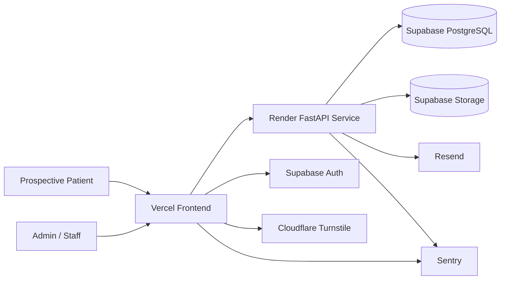

# Orthopedic Spine — Deployment & Infrastructure Architecture

| Attribute        | Value            |
| ---------------- | ---------------- |
| **Project**      | Orthopedic Spine |
| **Version**      | 1.0              |
| **Status**       | Draft            |
| **Last Updated** | 2026-04-18       |
| **Owner**        | Tech Lead        |

## Sources

- [Project Requirements by Feature](../../01-requirements/readme.md)
- [F-002 Inquiry and Appointment Request Flow](../../01-requirements/f-002-inquiry-and-appointment-request-flow.md)
- [F-005 Inquiry Review and Staff Operations](../../01-requirements/f-005-inquiry-review-and-staff-operations.md)
- [F-006 Admin Access and Role Boundaries](../../01-requirements/f-006-admin-access-and-role-boundaries.md)
- [Phased Roadmap](../../02-planning/phased-roadmap.md)
- [Architecture Solution Design](../architecture-solution-design.md)
- [Technology Stack](../technology-stack.md)
- [Security Architecture](../security/security-architecture.md)

---

## 1. Scope and NFR Alignment

This document defines the MVP deployment and infrastructure model for the bilingual public website, protected admin workspace, and inquiry-handling backend.

It is aligned to:

- **NFR-X04:** keep public pages fast on mobile-first traffic with cache-friendly delivery.
- **NFR-X06:** preserve a secure deployment baseline for admin access and inquiry handling.
- **NFR-002-01:** enforce resilient anti-spam protections for public submissions.
- **NFR-005-02** and **NFR-006-01:** keep protected operational workflows behind consistent role-aware API boundaries.
- **Reliability target (MVP):** 99.5% monthly availability for public browsing, inquiry submission, and admin sign-in paths.

## 2. Platform Selection

### 2.1 Options Considered

| Option                                      | Strengths                                                            | Risks / Trade-offs                                  | Decision             |
| ------------------------------------------- | -------------------------------------------------------------------- | --------------------------------------------------- | -------------------- |
| AWS-first IaaS/PaaS                         | Maximum control, broad service catalog                               | Too much setup and operational overhead for the MVP | Not selected for MVP |
| Azure-first                                 | Strong identity and enterprise tooling                               | Similar operational burden for a small clinic team  | Not selected for MVP |
| GCP-first                                   | Good managed data and networking services                            | Still heavier than needed for current scope         | Not selected for MVP |
| Single-host VM or shared hosting            | Lowest apparent upfront cost                                         | Weak isolation, scaling, and rollback posture       | Not selected         |
| **Managed multi-platform cloud (selected)** | Fast delivery, low ops burden, easy rollback, strong managed posture | Vendor coordination across providers                | **Selected**         |

### 2.2 Selected Platform Model

- **Frontend hosting:** Vercel for fast global delivery, preview deployments, and cache-friendly public pages.
- **Backend hosting:** Render for the stateless FastAPI service with health checks and environment-based configuration.
- **Database / Auth / Storage:** Supabase for PostgreSQL, Auth, and object storage.
- **Abuse protection:** Cloudflare Turnstile for public inquiry and request flows.
- **Notifications:** Resend for staff notifications tied to inquiry or publishing workflows.
- **Observability:** Sentry plus provider-native platform logs.
- **Delivery automation:** GitHub Actions for validation, release orchestration, and environment-gated deploy workflows.

This model fits the roadmap goal of launching within 6-8 weeks without introducing Kubernetes, self-managed networking, or a custom platform team.

## 3. Deployment Topology

### 3.1 Compute

- **Frontend compute:** one React application on Vercel serving public marketing routes and protected admin routes behind auth checks.
- **Backend compute:** one stateless Render web service for public submissions, protected admin APIs, and publishing workflows.
- **Background processing:** no dedicated worker tier in MVP; notifications remain lightweight and backend-triggered until real volume justifies queue separation.
- **Edge behavior:** Vercel CDN and cache controls accelerate public pages; protected admin data remains non-cacheable.

### 3.2 Data and Storage

- **Primary store:** Supabase PostgreSQL for bilingual content, testimonials, inquiries, role assignments, and audit metadata.
- **Identity:** Supabase Auth for admin and staff sign-in, session refresh, and role-bearing identity context.
- **Media storage:** Supabase Storage for testimonial images and clinic media assets.
- **Backups:** managed PostgreSQL backups with point-in-time recovery and provider-managed storage redundancy.

### 3.3 Networking and Trust Boundaries

- Public HTTPS ingress is exposed only through approved domains for:
  - the Vercel-hosted public/admin frontend,
  - the Render-hosted API,
  - managed Supabase endpoints used by the application.
- The frontend is the only browser-facing entry point; direct database access from the public client is out of scope for MVP.
- Backend-to-provider traffic is limited to Supabase, Resend, Turnstile verification, and Sentry.
- CORS and origin allowlists must restrict API access to approved frontend domains per environment.

## 4. Environment Strategy

| Environment | Purpose                                      | Deployment Pattern                                        | Data / Access Posture |
| ----------- | -------------------------------------------- | --------------------------------------------------------- | --------------------- |
| Preview     | Fast review of frontend and low-risk changes | Vercel preview deployments on pull requests               | Non-production credentials only |
| Staging     | Integrated validation before release         | Vercel + Render + Supabase staging stack                  | Production-like config with sanitized test data |
| Production  | Live clinic website and admin operations     | Protected promotion after staging verification            | Strict least-privilege access and audited secrets |

- Staging and production must use separate Supabase projects or equivalent environment isolation.
- Production access is limited to a small approved operator set because inquiry workflows contain protected operational data.

## 5. Scaling and Availability Strategy

- **Primary scaling approach:** keep the backend stateless so Render can scale horizontally if inquiry traffic grows.
- **Public-read performance:** favor CDN caching and static asset delivery for public pages, while keeping protected admin reads dynamic.
- **Database efficiency:** prioritize connection pooling and targeted indexes before adding new infrastructure layers.
- **Availability controls:** use health checks, managed provider failover, and isolated frontend/backend rollbacks.
- **Deferred complexity:** no message broker, dedicated cache layer, or multi-region active-active design is required for MVP.

## 6. Backup and Disaster Recovery

| Service / Data                     | Recovery Approach                                 | RPO          | RTO       |
| ---------------------------------- | ------------------------------------------------- | ------------ | --------- |
| Supabase PostgreSQL                | Managed backups + point-in-time recovery          | ≤ 15 minutes | ≤ 4 hours |
| Supabase Storage                   | Provider-managed redundancy + export snapshots    | ≤ 24 hours   | ≤ 8 hours |
| Vercel / Render configuration      | Recreate from versioned app config and env stores | ≤ 1 hour     | ≤ 2 hours |

Recovery order:

1. Restore database and identity dependencies.
2. Restore backend service connectivity and health checks.
3. Re-enable frontend routes and validate public inquiry plus admin sign-in journeys.

## 7. Infrastructure Governance

- **Secrets management:** keep environment secrets only in Vercel, Render, Supabase, and GitHub Actions secret stores.
- **Configuration posture:** start with provider-native managed configuration for MVP; formal cross-provider IaC can be added later if environment count or drift risk grows.
- **Release ownership:** separate frontend and backend deployments so content delivery issues or admin/API regressions can be rolled back independently.
- **Operational guardrail:** preview environments must never use production secrets or live patient inquiry data.

## 8. Risks and Trade-offs

- **Managed multi-provider model:** improves delivery speed and lowers ops burden, but increases vendor coordination.  
  **Mitigation:** keep business rules in the application layer and document environment ownership clearly.
- **No dedicated worker or cache in MVP:** reduces complexity and cost, but limits headroom for sudden traffic spikes.  
  **Mitigation:** keep notifications lightweight, track submission latency, and introduce async infrastructure only after observed need.
- **Single backend service:** simplifies deployment and rollback, but centralizes operational blast radius.  
  **Mitigation:** preserve modular boundaries inside the backend and use health-checked rolling deploys.

## References

- [Architecture Solution Design](../architecture-solution-design.md)
- [Technology Stack](../technology-stack.md)
- [Security Architecture](../security/security-architecture.md)
- [CI/CD Pipeline Architecture](./ci-cd-pipeline.md)
- [Monitoring & Observability Architecture](./monitoring-observability.md)

---

## Change Log

| Date       | Version | Change Summary                                                     | Author    |
| ---------- | ------- | ------------------------------------------------------------------ | --------- |
| 2026-04-18 | 1.0     | Added initial deployment and infrastructure architecture for MVP. | Tech Lead |
