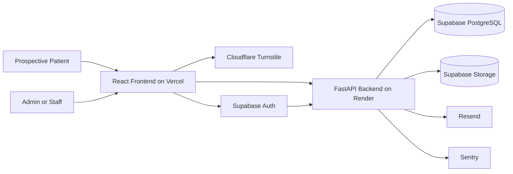

# Orthopedic Spine — Security Architecture

| Attribute        | Value            |
| ---------------- | ---------------- |
| **Project**      | Orthopedic Spine |
| **Version**      | 1.0              |
| **Status**       | Draft            |
| **Last Updated** | 2026-04-18       |
| **Owner**        | Tech Lead        |

## Sources

- [Project Overview](../../overview.md)
- [Open Questions](../../open-questions.md)
- [Project Requirements by Feature](../../01-requirements/readme.md)
- [F-002 Inquiry and Appointment Request Flow](../../01-requirements/f-002-inquiry-and-appointment-request-flow.md)
- [F-006 Admin Access and Role Boundaries](../../01-requirements/f-006-admin-access-and-role-boundaries.md)
- [Phased Roadmap](../../02-planning/phased-roadmap.md)
- [Architecture Solution Design](../architecture-solution-design.md)
- [Architecture Styles Decision](../architecture-styles.md)
- [Technology Stack](../technology-stack.md)
- [API Design Standards](../api/api-design-standards.md)

---

## Security Objectives and Scope

This document defines the MVP security architecture for a bilingual public clinic website and its protected admin workspace.

It is aligned to:

- **FR-002-02** and **NFR-X01** for minimal inquiry-data collection.
- **NFR-002-01** for public submission anti-spam protections.
- **FR-006-01** to **FR-006-04** and **NFR-006-01** to **NFR-006-02** for admin/staff role enforcement and secure sign-in behavior.
- **NFR-X06** for the overall secure baseline across admin access and inquiry handling.

Security principles applied:

1. Defense in depth across frontend, backend, provider, and data layers.
2. Least privilege for users, service identities, and operational access.
3. Privacy-conscious MVP boundaries that avoid unsupported health-data scope.
4. Secure-by-default controls with explicit exceptions and review.

## Security Architecture Overview

The MVP uses a layered model across **Vercel (frontend)**, **Render (backend)**, **Supabase (Auth, PostgreSQL, Storage)**, **Cloudflare Turnstile**, **Resend**, and **Sentry**.

- Identity is issued by **Supabase Auth** for protected users.
- Protected access is enforced in the **backend authorization layer** using the approved `admin` and `staff` roles.
- Public inquiry submissions are gated by **Turnstile verification**, server-side validation, and rate limiting.
- Inquiry and admin data are encrypted in transit with TLS and protected at rest by managed platform controls.
- Observability captures auth, abuse, and failure signals without retaining sensitive inquiry payloads in telemetry.

## Authentication Strategy

### Selected Model (MVP)

- **Primary:** Supabase Auth with short-lived JWT access tokens and rotating refresh tokens for `admin` and `staff` users.
- **Public users:** no account creation or authenticated patient workflow exists in MVP.
- **Session stance:** stateless token validation is preferred for the backend to preserve simple horizontal scaling and a clear API trust boundary.

### Authentication Controls

- Require authenticated access before any admin or staff route or API action is exposed.
- Keep sign-in entry points separate from public marketing paths to reduce trust-boundary confusion.
- Validate token signature, expiration, audience, and role claims on every protected API request.
- Return safe auth feedback that avoids revealing whether a username, email, or internal role mapping exists.
- Rate limit sign-in and refresh paths through managed auth controls and backend protections.
- Keep MFA, SSO, and more advanced adaptive-auth controls explicitly out of MVP unless requirements change.

## Authorization Model

### RBAC Baseline

| Role    | Allowed Scope | Restricted Scope |
| ------- | ------------- | ---------------- |
| `admin` | Full control over content, testimonials, inquiry workflows, and approval/publishing actions | No access to unsupported clinical-record workflows because those remain out of scope |
| `staff` | Review inquiries and maintain approved operational details needed for follow-up | No testimonial publication or unrestricted content-governance control |

- The backend is the system of record for permission decisions.
- Role claims must come from Supabase-managed identity context, never from client-submitted payloads.
- Protected frontend routes must mirror backend policy but never replace server-side authorization.

### Least-Privilege Rules

- Deny access by default when a route or action has no explicit allow rule.
- Keep public content read paths separate from protected write and review paths.
- Scope service credentials by environment and responsibility (runtime, CI/CD, provider integrations).
- Restrict inquiry visibility to the approved operational roles and minimal-data schema only.

## Data Protection

### Data Classification for MVP

| Data Category | Examples | Security Posture |
| ------------- | -------- | ---------------- |
| Public content | Services, clinic profile, approved testimonials | Publicly readable; protected publishing workflow |
| Protected operational data | Inquiry records, role assignments, audit metadata | Authenticated access only; least privilege; sanitized logging |
| Secrets and credentials | Supabase keys, Turnstile secret, Resend API key, Sentry DSN | Provider secret stores only; no source control exposure |

### Encryption and Storage Controls

- Use HTTPS/TLS for all browser-to-frontend, frontend-to-backend, and backend-to-provider traffic.
- Rely on managed encryption at rest for PostgreSQL, storage, and provider-managed backups.
- Keep object storage access mediated by backend-owned rules for non-public assets.
- Exclude unnecessary health or diagnostic details from inquiry schemas, logs, notifications, and dashboards.

### Privacy-Conscious Handling

- Collect only approved minimal inquiry data for manual follow-up.
- Redact contact details and free-text inquiry content from error payloads and observability events where practical.
- Keep analytics and lead-attribution tooling out of MVP so security controls do not drift into unapproved data capture.
- Require explicit approval before any future field expansion that could introduce higher privacy or compliance risk.

## Public Submission and API Security

- Require Cloudflare Turnstile verification on public inquiry and appointment-request submissions.
- Apply backend schema validation and reject unknown or malformed fields by default.
- Enforce stricter rate limits on public submission endpoints than on authenticated operational reads.
- Use canonical error responses that are safe for UI display and do not leak stack traces, infrastructure paths, or secrets.
- Keep CORS restricted to approved frontend origins only.
- Validate outbound provider calls and webhook-like interactions against known integrations only.

## Web and Content Security Controls

- Enforce `Strict-Transport-Security`, `Content-Security-Policy`, `X-Content-Type-Options`, `Referrer-Policy`, and `Permissions-Policy`.
- Use `frame-ancestors` or equivalent controls so admin pages cannot be embedded by untrusted origins.
- Keep rich-text or testimonial content normalized and safely rendered to reduce XSS risk.
- Use secure cache directives for protected admin responses and inquiry-related pages.
- Keep map embeds, social links, and WhatsApp continuation flows outside the protected data plane.

## Secrets and Environment Security

- Store environment-specific secrets in Vercel, Render, Supabase, and GitHub Actions secret stores.
- Prohibit secrets in repository files, PR descriptions, screenshots, or copied logs.
- Split credentials by environment and provider responsibility to limit blast radius.
- Rotate third-party integration credentials when access changes or exposure is suspected.
- Restrict break-glass production access to a small approved set of operators with auditability.

## Security Monitoring and Incident Readiness

- Track authentication failures, repeated permission denials, Turnstile verification failures, elevated `429` rates, and unexpected `5xx` spikes.
- Capture request IDs, route metadata, and actor role context in logs and Sentry without persisting sensitive inquiry payloads.
- Alert on abnormal public form abuse, failed admin sign-in bursts, and protected workflow errors that threaten launch readiness.
- Maintain a simple incident flow for MVP: detect, triage, contain, recover, review.

## Secure Delivery Posture

- Use GitHub Actions to enforce dependency scanning, required reviews, and deployment sequencing by environment.
- Keep preview environments on non-production credentials only.
- Separate frontend and backend rollback paths so a release can be reverted without broad platform impact.
- Review the threat model whenever admin permissions, inquiry fields, or third-party integrations change.

## Risks and Trade-offs

- **Managed-service dependence:** faster and safer for MVP than self-managed auth and infrastructure, but it increases vendor coupling.  
  **Mitigation:** keep role logic, validation rules, and business decisions in application boundaries.
- **Two-role MVP model:** simple to deliver and operate, but less expressive than future granular permissions.  
  **Mitigation:** deny by default and require explicit review before role expansion.
- **Healthcare-adjacent trust expectations:** patients may assume broader clinical-data handling than MVP supports.  
  **Mitigation:** keep forms minimal, messaging explicit, and operational scope narrow.

## References

- [Threat Model](./threat-model.md)
- [Architecture Solution Design](../architecture-solution-design.md)
- [API Design Standards](../api/api-design-standards.md)
- [Technology Stack](../technology-stack.md)
- [F-002 Inquiry and Appointment Request Flow](../../01-requirements/f-002-inquiry-and-appointment-request-flow.md)
- [F-006 Admin Access and Role Boundaries](../../01-requirements/f-006-admin-access-and-role-boundaries.md)

---

## Change Log

| Date       | Version | Change Summary                                                | Author    |
| ---------- | ------- | ------------------------------------------------------------- | --------- |
| 2026-04-18 | 1.0     | Added initial security architecture for orthopedic-spine MVP. | Tech Lead |
