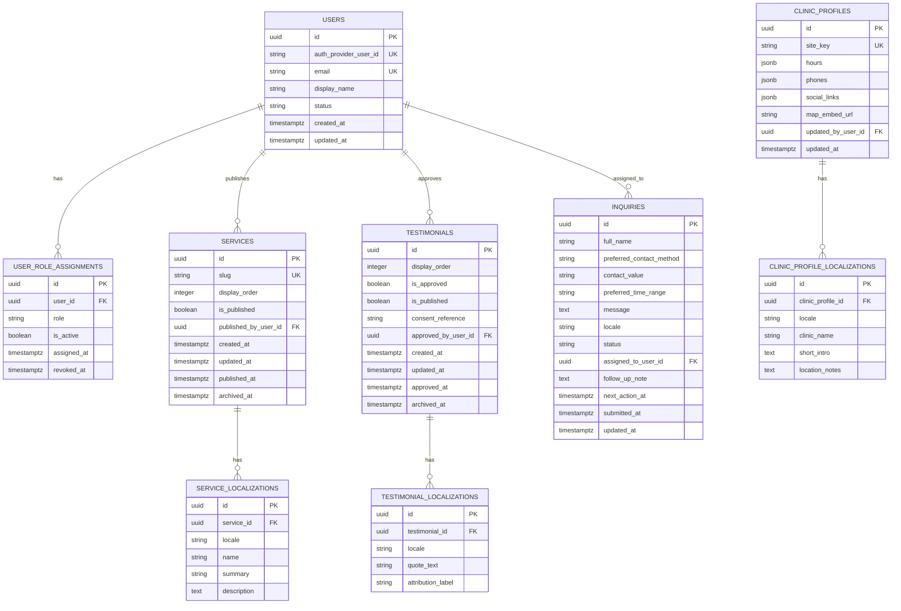

# Orthopedic Spine — Database Design

| Attribute        | Value            |
| ---------------- | ---------------- |
| **Project**      | Orthopedic Spine |
| **Version**      | 1.0              |
| **Status**       | Draft            |
| **Last Updated** | 2026-04-18       |
| **Owner**        | Tech Lead        |

## Sources

- [Project Overview](../overview.md)
- [Open Questions](../open-questions.md)
- [Project Requirements by Feature](../01-requirements/readme.md)
- [F-002 Inquiry and Appointment Request Flow](../01-requirements/f-002-inquiry-and-appointment-request-flow.md)
- [F-003 Clinic Profile, Location, and Social Presence](../01-requirements/f-003-clinic-profile-location-and-social-presence.md)
- [F-004 Admin Content and Testimonial Management](../01-requirements/f-004-admin-content-and-testimonial-management.md)
- [F-005 Inquiry Review and Staff Operations](../01-requirements/f-005-inquiry-review-and-staff-operations.md)
- [F-006 Admin Access and Role Boundaries](../01-requirements/f-006-admin-access-and-role-boundaries.md)
- [Phased Roadmap](../02-planning/phased-roadmap.md)
- [Architecture Solution Design](../03-architecture/architecture-solution-design.md)
- [Technology Stack](../03-architecture/technology-stack.md)
- [Security Architecture](../03-architecture/security/security-architecture.md)
- [API Contract](../03-architecture/api/api-contract.md)

## Design Scope and Assumptions

- Covers the MVP data model for bilingual public content, inquiry intake, testimonial approval, clinic operational details, and two-role admin access.
- Uses Supabase PostgreSQL as the primary transactional store, while Supabase Auth remains the system of record for credentials, sessions, and refresh-token lifecycle.
- Keeps inquiry handling intentionally minimal: no patient records, no clinical history, no direct booking ledger, and no CRM-style activity history in MVP.
- Treats WhatsApp as a continuation channel exposed through stored clinic contact configuration, not as a write-integrated external system of record.
- Favors additive schema evolution so future scheduling, richer audit trails, or additional locales can be introduced without breaking MVP workflows.

## Data Domains

- **Identity and Access**: application-visible user projection and role assignment for the approved `admin` and `staff` model.
- **Public Content and Localization**: services, clinic profile content, and testimonials with explicit bilingual content ownership.
- **Inquiry Operations**: minimal-data inquiry submission, assignment, and manual follow-up state for clinic staff.

## Core Entities

| Entity                        | Purpose                                                            | Bounded Context            | Owned By (Role/Team)          | Required By (FR/NFR)                                  | Lifecycle States                     |
| ----------------------------- | ------------------------------------------------------------------ | -------------------------- | ----------------------------- | ----------------------------------------------------- | ------------------------------------ |
| `users`                       | Application-facing identity projection linked to managed auth      | Identity and Access        | Backend / Access Control      | FR-006-01, FR-006-04, NFR-X06                         | `active`, `disabled`                 |
| `user_role_assignments`       | Stores active role membership and revocation metadata              | Identity and Access        | Backend / Access Control      | FR-006-01, FR-006-02, FR-006-03, NFR-005-02           | `active`, `revoked`                  |
| `services`                    | Canonical service records, slug, ordering, and publish state       | Public Content             | Clinic Admin + Backend        | FR-004-01, FR-004-03, FR-004-04                       | `draft`, `published`, `archived`     |
| `service_localizations`       | Locale-specific service copy for English and Spanish               | Public Content             | Clinic Admin + Backend        | FR-004-01, FR-004-03, NFR-X03                         | paired to parent                     |
| `testimonials`                | Moderated testimonial records with approval and publication state  | Testimonials               | Clinic Admin + Backend        | FR-004-01, FR-004-02, NFR-004-02, NFR-X05             | `draft`, `approved`, `published`, `archived` |
| `testimonial_localizations`   | Locale-specific testimonial quote and attribution copy             | Testimonials               | Clinic Admin + Backend        | FR-004-03, NFR-X03, NFR-X05                           | paired to parent                     |
| `clinic_profiles`             | Singleton clinic aggregate for operational details and channel data | Clinic Operations          | Clinic Admin + Staff          | FR-003-01, FR-003-02, FR-005-02, FR-006-03            | `active` by record                   |
| `clinic_profile_localizations` | Bilingual public clinic profile copy                              | Clinic Operations          | Clinic Admin + Staff          | FR-003-04, FR-004-03, FR-005-02, NFR-X03              | paired to parent                     |
| `inquiries`                   | Minimal inquiry submissions and follow-up workflow state           | Inquiry Operations         | Front Desk + Backend          | FR-002-01, FR-002-02, FR-002-03, FR-005-01, FR-005-03 | `new`, `in_review`, `responded`, `closed` |

## Relationships

- `users` has many `user_role_assignments`; only one active MVP role is allowed per user.
- `services`, `testimonials`, and `clinic_profiles` each own localized child rows keyed by locale.
- `users` can approve `testimonials`, publish `services`, and receive `inquiries` assignments for manual follow-up.
- `clinic_profiles` centralizes the public clinic details, hours, contact methods, and outbound social/WhatsApp links exposed through public and protected APIs.

## Schema Documentation

### 1. `users`

- **Purpose:** Stores the application-visible user profile for admin and staff actors without duplicating credential management from Supabase Auth.
- **Primary key:** `id` (UUID).
- **Constraints:** `auth_provider_user_id` unique, `email` unique, `status` check (`active`, `disabled`).
- **Indexes:** unique indexes on `auth_provider_user_id` and `email`; filtered index on active users.
- **Design note:** role decisions are enforced through `user_role_assignments`, not by trusting frontend role hints.

### 2. `user_role_assignments`

- **Purpose:** Tracks role assignment, activation, and revocation for the MVP `admin` and `staff` model.
- **Primary key:** `id` (UUID).
- **Foreign keys:** `user_id -> users.id`.
- **Constraints:** `role` check (`admin`, `staff`); `revoked_at` must be `NULL` while `is_active = true`.
- **Indexes:** partial unique index on `(user_id)` where `is_active = true`; index on `(role, is_active)`.

### 3. `services`

- **Purpose:** Holds canonical service metadata, display ordering, and publish state for the public services catalog.
- **Primary key:** `id` (UUID).
- **Foreign keys:** `published_by_user_id -> users.id`.
- **Constraints:** `slug` unique; `display_order >= 1`; `published_at` and `published_by_user_id` required when `is_published = true`.
- **Indexes:** unique index on `slug`; index on `(is_published, display_order)`; index on `(archived_at, updated_at DESC)`.
- **Design note:** localized copy is stored separately so publishing rules can require complete English and Spanish content before release.

### 4. `service_localizations`

- **Purpose:** Stores bilingual service copy used by both public reads and protected editing.
- **Primary key:** `id` (UUID).
- **Foreign keys:** `service_id -> services.id`.
- **Constraints:** unique `(service_id, locale)`; `locale` check (`en`, `es`); non-empty `name`, `summary`, and `description`.
- **Indexes:** unique index on `(service_id, locale)`.

### 5. `testimonials`

- **Purpose:** Stores moderated testimonial records with explicit approval metadata before publication.
- **Primary key:** `id` (UUID).
- **Foreign keys:** `approved_by_user_id -> users.id`.
- **Constraints:**
  - `display_order >= 1`.
  - `is_published = true` requires `is_approved = true`.
  - `approved_at`, `approved_by_user_id`, and `consent_reference` are required when `is_approved = true`.
- **Indexes:** index on `(is_published, display_order)`; index on `(is_approved, approved_at DESC)`.
- **Design note:** the approval endpoint writes to this aggregate directly to keep MVP moderation simple and auditable.

### 6. `testimonial_localizations`

- **Purpose:** Stores localized testimonial quote text and attribution for launch languages.
- **Primary key:** `id` (UUID).
- **Foreign keys:** `testimonial_id -> testimonials.id`.
- **Constraints:** unique `(testimonial_id, locale)`; `locale` check (`en`, `es`); quote text required.
- **Indexes:** unique index on `(testimonial_id, locale)`.

### 7. `clinic_profiles`

- **Purpose:** Singleton clinic aggregate for operational details that admin and staff users maintain.
- **Primary key:** `id` (UUID).
- **Foreign keys:** `updated_by_user_id -> users.id`.
- **Constraints:** `site_key` unique with MVP value `primary`; `hours`, `phones`, and `social_links` must follow validated JSON structures; `map_embed_url` nullable.
- **Indexes:** unique index on `site_key`.
- **Design note:** `hours`, `phones`, and `social_links` stay on the root aggregate because they are operationally updated together by admin or staff.

### 8. `clinic_profile_localizations`

- **Purpose:** Stores bilingual public clinic copy such as clinic name, summaries, and location notes.
- **Primary key:** `id` (UUID).
- **Foreign keys:** `clinic_profile_id -> clinic_profiles.id`.
- **Constraints:** unique `(clinic_profile_id, locale)`; `locale` check (`en`, `es`).
- **Indexes:** unique index on `(clinic_profile_id, locale)`.

### 9. `inquiries`

- **Purpose:** Persists minimal inquiry submissions and the protected operational fields needed for manual follow-up.
- **Primary key:** `id` (UUID).
- **Foreign keys:** `assigned_to_user_id -> users.id`.
- **Constraints:**
  - `preferred_contact_method` check (`phone`, `email`, `whatsapp`).
  - `locale` check (`en`, `es`) with default to the submitter locale.
  - `status` check (`new`, `in_review`, `responded`, `closed`).
  - `follow_up_note` limited to operational notes; no diagnosis or health-history fields in schema.
- **Indexes:** `(status, submitted_at DESC)` for queue reads; `(assigned_to_user_id, status, next_action_at)` for `assignedToMe`; `(preferred_contact_method, submitted_at DESC)` for operational reporting.
- **Design note:** the Turnstile token is not stored after verification; only the validated inquiry payload and workflow state remain.

## Constraints and Integrity Rules

- **Primary keys:** UUIDs on every root and child entity to align with managed-platform identity patterns and future integrations.
- **Foreign keys:** localization rows depend on parent aggregates; approval, publication, assignment, and update metadata point back to `users`.
- **Uniqueness:** one active role assignment per user, one localization row per parent/locale pair, unique service slug, singleton clinic profile via `site_key`.
- **Check constraints:** lifecycle states, locale values, contact methods, approval/publish invariants, and active-role revocation rules are enforced in the database.
- **Archive posture:** `services` and `testimonials` use `archived_at` to preserve auditability without exposing retired public content.
- **Scope guardrail by design:** no tables for patient records, diagnoses, insurance, or confirmed appointments are introduced in MVP.

## Access Patterns and Indexing Notes

- **Public service listing:** filter `services.is_published = true`, join `service_localizations` by locale, order by `display_order` → index `(is_published, display_order)`.
- **Public testimonial listing:** filter approved/published testimonials, join localized quote data, order by curated display order → indexes `(is_published, display_order)` and `(testimonial_id, locale)`.
- **Public clinic profile read:** lookup singleton `clinic_profiles.site_key = 'primary'` and join locale row → unique index on `site_key`.
- **Admin inquiry queue:** filter by `status`, paginate by newest submissions → index `(status, submitted_at DESC)`.
- **Staff “assigned to me” workflow:** filter by `assigned_to_user_id`, `status`, and upcoming follow-up work → index `(assigned_to_user_id, status, next_action_at)`.
- **Admin content editing:** list draft/published services and testimonials ordered by latest change → secondary indexes on `updated_at` and approval/publish state.

## Migration and Evolution Considerations

- **Backward compatibility policy:** additive-first schema changes; introduce new columns/tables before deprecating old structures.
- **Translation evolution:** add new locales by extending locale validation and inserting new localization rows instead of altering primary content tables.
- **Workflow evolution:** if MVP later needs richer moderation or inquiry history, add append-only activity tables rather than overloading `follow_up_note`.
- **Future scheduling boundary:** direct booking, calendars, or patient records should be modeled in a new bounded context with separate entities, not by mutating `inquiries` into a clinical record.
- **Rollback posture:** prefer forward fixes for schema mistakes; rely on managed PostgreSQL backups only for severe data integrity failures.

## Security and Data Governance

- **Sensitive fields:** inquiry `full_name`, `contact_value`, `message`, and testimonial `consent_reference`.
- **Access controls:** all protected writes flow through backend RBAC; the frontend never talks directly to protected tables.
- **Privacy posture:** the schema intentionally excludes health-history, diagnosis, insurance, and analytics-attribution fields from MVP inquiry storage.
- **Auditability:** `assigned_to_user_id`, `approved_by_user_id`, `published_by_user_id`, `updated_by_user_id`, and lifecycle timestamps provide basic operational traceability.
- **Retention note:** inquiry retention duration should stay minimal and policy-driven; exact archive/delete timing remains an operational follow-up decision.

## Traceability to Requirements

| Requirement | Database Coverage |
| ----------- | ----------------- |
| FR-002-01 | `inquiries` stores request submissions without introducing a booking or appointment-confirmation table. |
| FR-002-02 | `inquiries` limits persisted fields to name, contact channel, preferred time range, message, and locale. |
| FR-002-03 | `inquiries` supports validated submission outcomes with status and submitted timestamp. |
| FR-004-01 | `services`, `service_localizations`, `testimonials`, `testimonial_localizations`, and `clinic_profiles` support admin-managed public content. |
| FR-004-02 | `testimonials` approval fields and publish invariants enforce explicit approval before public release. |
| FR-004-03 | Localization child tables for services, testimonials, and clinic profile support English and Spanish maintenance. |
| FR-004-04 | Content-focused aggregates avoid expanding into unsupported clinical or operational-management domains. |
| FR-005-01 | `inquiries` plus assignment and follow-up fields provide the protected review queue for staff. |
| FR-005-02 | `clinic_profiles` stores scoped operational details that admin and staff can maintain together. |
| FR-005-03 | `inquiries.status`, `assigned_to_user_id`, and `next_action_at` support manual follow-up without CRM complexity. |
| FR-006-01 | `user_role_assignments.role` enforces the two-role MVP model. |
| FR-006-02 | Publication, approval, and content entities are available to admin-controlled workflows. |
| FR-006-03 | Staff-safe access aligns to inquiry review and clinic operational details without testimonial publication rights. |
| FR-006-04 | `users` keeps the application identity projection linked to managed sign-in. |
| NFR-003-01 | `clinic_profiles` centralizes operational detail ownership and `updated_by_user_id` supports controlled accuracy updates. |
| NFR-002-01 | No spam-token persistence, minimal public write surface, and queue-oriented inquiry indexes support abuse-resistant intake design. |
| NFR-004-02 | Testimonial approval metadata and publish constraints prevent accidental release of unapproved testimonials. |
| NFR-005-02 | Role assignments plus scoped inquiry and clinic aggregates reinforce restricted staff access. |
| NFR-X01 | Minimal-data inquiry storage keeps privacy exposure constrained for MVP. |
| NFR-X05 | Explicit testimonial consent and approval fields create publication governance evidence. |
| NFR-X06 | Managed-auth linkage, lifecycle constraints, and targeted indexes support the secure MVP baseline. |

## Risks and Open Questions

- **Risk:** storing operational details as JSON in `clinic_profiles` can drift if update validation is weak. **Mitigation:** validate hours, phones, and social link structures at the API boundary and with DB constraints where practical.
- **Risk:** inquiry follow-up history is intentionally thin in MVP, which may limit audit depth. **Mitigation:** add an append-only activity table only if operational review proves timestamps and last note are insufficient.
- **Risk:** bilingual completeness could be bypassed if publish rules are enforced only in application code. **Mitigation:** require publish-state checks against both locale rows before allowing `is_published = true`.
- **Open question:** should testimonial ordering remain manual through `display_order`, or should publication date drive the public list by default?
- **Open question:** what exact retention and deletion window should apply to closed inquiries once privacy/legal review is finalized?

## Change Log

| Date       | Version | Change Summary                                              | Author    |
| ---------- | ------- | ----------------------------------------------------------- | --------- |
| 2026-04-18 | 1.0     | Added initial database design for the orthopedic-spine MVP. | Tech Lead |
