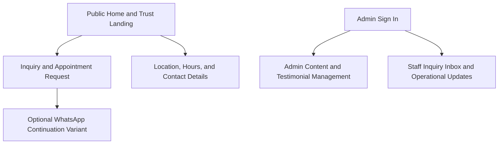

# Prototype Brief: Orthopedic Spine

## Purpose

Create a lightweight prototype brief that turns the orthopedic-spine planning docs into a single source of truth for Stitch prototype generation and stakeholder review.

The prototype pack should validate the MVP patient acquisition journey and the lightweight clinic admin/staff workflows without expanding into unsupported operational or clinical scope.

## Product Context

Orthopedic Spine is a bilingual clinic website and admin experience focused on helping prospective patients understand services, trust the practice, and submit a low-friction inquiry or appointment request.

The MVP is limited to:

- **Public patient experience** for services, trust signals, clinic information, and inquiry submission
- **Admin workflow** for content updates, testimonial approval, and publishing control
- **Staff workflow** for inquiry review and scoped operational-detail updates

## Goals

1. Show a trustworthy public experience that makes services, credibility, and next steps obvious.
2. Validate a short inquiry/request flow that collects only minimal information and works well on mobile.
3. Make bilingual public content, location details, and trust signals easy to review in prototype form.
4. Show clear internal role boundaries between Admin and Staff workflows.
5. Keep the prototype aligned to MVP boundaries: no direct booking, no patient records, and no complex operations tooling.

## Success Criteria

- Stakeholders can explain the public path from discovery to inquiry submission after one walkthrough.
- The inquiry flow feels short, privacy-conscious, and mobile-friendly.
- Admin and Staff permissions are visually distinct without extra explanation.
- Testimonial approval and staff-scoped updates are understandable at a glance.
- All Must-priority MVP requirements appear in at least one prototype screen or flow.

## Target Users

| Persona | Role in prototype | Primary needs |
| --- | --- | --- |
| Mariela Naranjo | Prospective patient | Understand services, trust the clinic, and request contact quickly from mobile |
| Aaron Fallas | Admin / clinic owner | Update bilingual content, publish approved testimonials, and manage the clinic's public presentation |
| Noily Naranjo | Staff / front desk coordinator | Review inquiries fast and maintain approved operational details without extra complexity |

## MVP Prototype Scope

### In Scope

- Public home and trust landing page
- Inquiry and appointment request page with validation and success feedback
- Clinic location, hours, map, and social/contact details page
- Admin sign-in page
- Admin content and testimonial management workspace
- Staff inquiry inbox and operational updates workspace
- Optional Phase 1 success-state variant for WhatsApp continuation

### Out of Scope

- Direct appointment booking calendars or slot picking
- Patient portal, records, billing, or telehealth workflows
- Full CRM, analytics dashboards, or automation-heavy lead management
- Complex role matrices beyond public, admin, and staff views
- Final branded visual design system beyond prototype-safe placeholder tokens

## Pages and Sections per Page

### 1. Public Home and Trust Landing

- Hero with bilingual-ready value proposition and primary CTA
- Service summary cards in plain language
- Trust signals: testimonials, clinician credibility, and reassurance copy
- Secondary content for bilingual switch, contact CTA, and next-step clarity
- State coverage: default, translated-language variant, testimonial-empty fallback

### 2. Inquiry and Appointment Request

- Short inquiry/request form with minimal fields only
- Privacy-conscious helper text and anti-spam confidence cue
- Preferred schedule/time-preference input without real booking
- Submission confirmation with manual follow-up expectation
- State coverage: default, validation error, loading, success

### 3. Location, Hours, and Contact Details

- Address, hours, phone, WhatsApp, and email/contact channels
- Embedded map or low-maintenance map placeholder
- Approved social links
- Bilingual-ready operational information blocks
- State coverage: default, map fallback, translated-language variant

### 4. Admin Sign In

- Email/password sign-in form
- Security-safe error feedback
- Short helper copy about protected clinic workflows
- State coverage: default, validation error, loading, signed-in redirect cue

### 5. Admin Content and Testimonial Management

- Content tabs or grouped panels for services, clinic profile, and testimonials
- Bilingual content editing cues
- Draft vs published visibility
- Explicit testimonial approval/publish action with confirmation modal
- State coverage: empty, draft, dirty/editing, saving, publish success, publish blocked

### 6. Staff Inquiry Inbox and Operational Updates

- Inquiry list with lightweight status or priority cues
- Inquiry detail panel showing only minimum follow-up information
- Scoped edit area for hours/contact details
- Clear notice that testimonial publishing and broad content controls are unavailable
- State coverage: empty inbox, default, filtered, save success, permission-restricted notice

### 7. Optional Phase 1: WhatsApp Continuation Variant

- Inquiry success panel with a clear WhatsApp follow-up CTA
- Supporting note that the clinic can continue scheduling manually
- Used only as a future-state validation artifact for `FR-002-04`

## Information Architecture

### Sitemap

### Navigation Model

Use a **small multi-page prototype** with simple page switching.

- **Public path**: landing -> inquiry -> confirmation, with location/contact available from the main CTA path
- **Internal path**: sign-in -> role-appropriate workspace
- **Guardrail**: do not invent a large dashboard shell or unsupported navigation complexity

## Key User Flows

### Flow 1: Mariela decides whether to contact the clinic

1. Open the public landing page on mobile.
2. Scan services, trust signals, and value proposition.
3. Review contact confidence cues and bilingual content.
4. Continue to the inquiry/request form.
5. Submit a short request and understand the manual next step.

### Flow 2: Mariela checks practical visit details

1. Open the location/contact page.
2. Confirm address, hours, and map location.
3. Review approved contact channels and social links.
4. Return to the inquiry/request CTA if ready.

### Flow 3: Aaron updates and publishes clinic content

1. Sign in through the protected admin entry.
2. Open the content management workspace.
3. Update bilingual service or profile content.
4. Review testimonial approval state.
5. Confirm a publish action intentionally.

### Flow 4: Noily reviews new inquiries and updates operations details

1. Sign in through the protected entry.
2. Open the staff-scoped inquiry workspace.
3. Review new inquiry details needed for follow-up.
4. Update hours or contact details if needed.
5. Confirm that unavailable admin-only actions are clearly restricted.

## Assumptions

- Public content must be prototype-ready in both Spanish and English, even if only key translated states are shown.
- Inquiry handling stays manual in MVP and should be communicated clearly in the success state.
- Admin and Staff share the same secure entry point but land on different scoped workflows.
- Optional WhatsApp continuation is a Phase 1 validation variant, not an MVP requirement.

## Requirements Coverage Matrix

Every Must requirement should appear in at least one row before prototype sign-off.

| Screen / Flow | Covers FR(s) | Covers NFR(s) | Story (US-\*) | Milestone |
| --- | --- | --- | --- | --- |
| Public Home and Trust Landing | FR-001-01, FR-001-02, FR-001-03, FR-001-04 | NFR-001-01, NFR-001-02, NFR-X02, NFR-X03 | US-PO-MVP-001, US-UX-MVP-001 | MVP |
| Inquiry and Appointment Request | FR-002-01, FR-002-02, FR-002-03 | NFR-002-01, NFR-002-02, NFR-X01, NFR-X02 | US-PO-MVP-002, US-FE-MVP-001 | MVP |
| Location, Hours, and Contact Details | FR-003-01, FR-003-02, FR-003-04 | NFR-003-02, NFR-X02, NFR-X03 | US-PO-MVP-003, US-FE-MVP-002 | MVP |
| Admin Sign In | FR-006-04 | NFR-006-02, NFR-X06 | US-PO-MVP-006, US-BE-MVP-003 | MVP |
| Admin Content and Testimonial Management | FR-004-01, FR-004-02, FR-004-03, FR-004-04, FR-006-01, FR-006-02 | NFR-004-01, NFR-004-02, NFR-006-01, NFR-X05 | US-PO-MVP-004, US-BE-MVP-001 | MVP |
| Staff Inquiry Inbox and Operational Updates | FR-005-01, FR-005-02, FR-005-03, FR-006-01, FR-006-03 | NFR-005-01, NFR-005-02, NFR-006-01 | US-PO-MVP-005, US-BE-MVP-002 | MVP |
| Optional WhatsApp Continuation Variant | FR-002-04 | NFR-002-02 | US-PO-MVP-002 | Phase 1 |

## Source References

- [Project Overview](../overview.md)
- [User Personas](../user-personas.md)
- [Open Questions](../open-questions.md)
- [Project Requirements by Feature](../01-requirements/readme.md)
- [F-001 Public Website and Trust Experience](../01-requirements/f-001-public-website-and-trust-experience.md)
- [F-002 Inquiry and Appointment Request Flow](../01-requirements/f-002-inquiry-and-appointment-request-flow.md)
- [F-003 Clinic Profile, Location, and Social Presence](../01-requirements/f-003-clinic-profile-location-and-social-presence.md)
- [F-004 Admin Content and Testimonial Management](../01-requirements/f-004-admin-content-and-testimonial-management.md)
- [F-005 Inquiry Review and Staff Operations](../01-requirements/f-005-inquiry-review-and-staff-operations.md)
- [F-006 Admin Access and Role Boundaries](../01-requirements/f-006-admin-access-and-role-boundaries.md)
- [Phased Roadmap](../02-planning/phased-roadmap.md)
- [Role Mapping](../02-planning/role-mapping.md)

## Change Log

| Date | Version | Change Summary | Author |
| --- | --- | --- | --- |
| 2026-04-18 | 1.0 | Added initial orthopedic-spine prototype brief and requirements coverage matrix. | UI/UX Designer |
