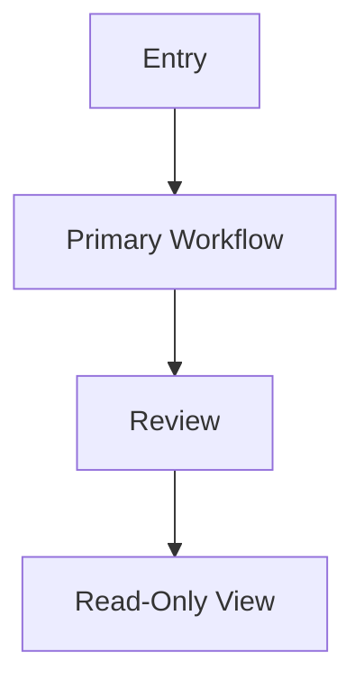

<!-- AI AGENT INSTRUCTIONS
Purpose: Define a prototype brief for [Project Name].
Replace all [placeholder] blocks with project-specific personas, flows, scope boundaries, and success criteria.
Keep this brief concise and aligned to documented requirements only.
-->

# Prototype Brief: [Project Name]

## Purpose

Create a lightweight prototype brief that turns planning documentation into a clear source of truth for Stitch prototypes and later design iteration.

## Product Context

[Summarize product and MVP boundary in 3-5 lines.]

## Goals

1. [Goal 1]
2. [Goal 2]
3. [Goal 3]

## Success Criteria

- [Success criterion 1]
- [Success criterion 2]
- [Success criterion 3]

## Target Users

| Persona     | Role in prototype | Primary needs |
| ----------- | ----------------- | ------------- |
| [Persona A] | [Role]            | [Needs]       |
| [Persona B] | [Role]            | [Needs]       |

## MVP Prototype Scope

### In Scope

- [Screen/flow 1]
- [Screen/flow 2]
- [Screen/flow 3]

### Out of Scope

- [Out-of-scope item 1]
- [Out-of-scope item 2]
- [Out-of-scope item 3]

## Pages and Sections

### 1. [Primary Workflow Screen]

- [Section 1]
- [Section 2]
- State coverage: empty, loading, error, success

### 2. [Review or Backlog Screen]

- [Section 1]
- [Section 2]

### 3. [Read-Only or Stakeholder Screen]

- [Section 1]
- [Section 2]

## Information Architecture

## Key User Flows

### Flow 1: [Primary role completes core workflow]

1. [Step 1]
2. [Step 2]
3. [Step 3]

### Flow 2: [Secondary role reviews outcome]

1. [Step 1]
2. [Step 2]

## Assumptions

- [Assumption 1]
- [Assumption 2]

## Requirements Coverage Matrix

Map each prototype screen or flow to the requirements it covers. Update this table whenever scope changes.

| Screen / Flow                  | Covers FR(s)           | Covers NFR(s) | Story (US-\*)   | Milestone |
| ------------------------------ | ---------------------- | ------------- | --------------- | --------- |
| [Primary Workflow Screen]      | [FR-001-01, FR-001-02] | [NFR-X01]     | [US-UX-MVP-001] | MVP       |
| [Review or Backlog Screen]     | [FR-002-01]            | [NFR-X03]     | [US-UX-MVP-002] | MVP       |
| [Read-Only / Stakeholder View] | [FR-003-01]            | [NFR-X03]     | [US-UX-P1-001]  | Phase 1   |

> **Rule:** Every Must requirement must appear in at least one row before prototype sign-off.

## Source References

- [Project Overview](../overview.md)
- [User Personas](../user-personas.md)
- [Open Questions](../open-questions.md)
- [Project Requirements by Feature](../01-requirements/project-requirements-by-feature.md)
- [Phased Roadmap](../02-planning/phased-roadmap.md)
- [Role Mapping](../02-planning/role-mapping.md)
- [Architecture Solution Design](../03-architecture/architecture-solution-design.md)
- [UI/UX Designer User Stories](../04-user-stories/ui-ux-designer-stories.md)
- [Product Epics](../04-user-stories/epics.md)

## Change Log

| Date         | Version | Change Summary | Author |
| ------------ | ------- | -------------- | ------ |
| [YYYY-MM-DD] | [vX.Y]  | [What changed] | [Name] |
