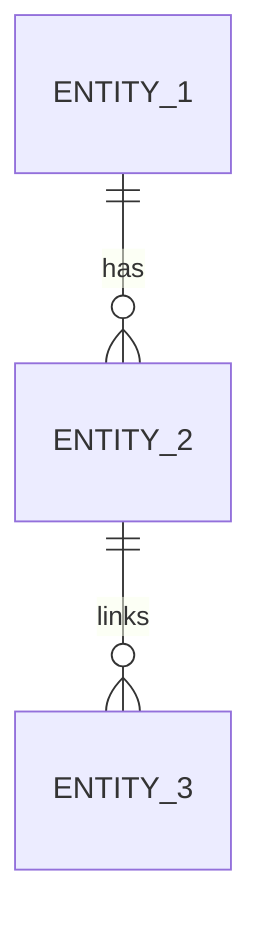

<!-- AI AGENT INSTRUCTIONS
Purpose: Document the database design for [Project Name].
Replace all [placeholder] blocks with project-specific entities, constraints, indexes, and lifecycle rules.
Keep this file implementation-ready but technology-agnostic where possible.
-->

# Database Design

| Attribute        | Value          |
| ---------------- | -------------- |
| **Project**      | [Project Name] |
| **Version**      | [0.1]          |
| **Status**       | [Draft]        |
| **Last Updated** | [YYYY-MM-DD]   |

## Sources

- [Project Overview](../overview.md)
- [Project Requirements by Feature](../01-requirements/project-requirements-by-feature.md)
- [Phased Roadmap](../02-planning/phased-roadmap.md)
- [Architecture Solution Design](../03-architecture/architecture-solution-design.md)
- [API Contract](../03-architecture/api/api-contract.md)
- [ADR: Database Decision](../03-architecture/adrs/)

## Data Domains

- **[Domain A]**: [Purpose and ownership]
- **[Domain B]**: [Purpose and ownership]
- **[Domain C]**: [Purpose and ownership]

## Core Entities

| Entity     | Purpose          | Owned By               | Lifecycle States                |
| ---------- | ---------------- | ---------------------- | ------------------------------- |
| [entity_1] | [What it stores] | [Bounded context/team] | [e.g., draft, active, archived] |
| [entity_2] | [What it stores] | [Bounded context/team] | [states]                        |
| [entity_3] | [What it stores] | [Bounded context/team] | [states]                        |

## Relationships

- [entity_1] has many [entity_2]
- [entity_2] belongs to [entity_1]
- [entity_3] references [entity_2] for [reason]

## Constraints and Integrity Rules

- Primary keys: [UUID / integer / composite]
- Foreign keys: [list key references]
- Uniqueness rules: [e.g., unique name per parent, unique sort order]
- Check constraints: [e.g., status enum, date/time invariants]
- Soft delete/archive policy: [status + archived_at or equivalent]

## Access Patterns and Indexing Notes

- Hot read path 1: [query shape] → index [columns]
- Hot read path 2: [query shape] → index [columns]
- Write-heavy path: [insert/update pattern] → note contention risks and mitigation
- Ordering strategy: [e.g., sort_order, created_at desc]

## Migration and Evolution Considerations

- Backward compatibility policy: [additive-first / expand-contract]
- Data migration strategy: [how historical data is transformed safely]
- Rollback posture: [forward-fix preferred / point-in-time restore criteria]
- Versioning notes: [schema versioning or migration tagging approach]

## Security and Data Governance

- Sensitive fields: [PII, secrets, internal notes]
- Access controls: [application policy + DB-level policy]
- Retention policy: [duration and archive/delete behavior]
- Auditability: [who changed what and when]

## Traceability to Requirements

| Requirement | Database Coverage                                 |
| ----------- | ------------------------------------------------- |
| [FR-XXX]    | [Entity/relationship/constraint that supports it] |
| [FR-XXX]    | [Entity/relationship/constraint that supports it] |
| [NFR-XXX]   | [Performance/security/compliance support]         |

## Risks and Open Questions

- [Risk 1]: [impact] — [mitigation]
- [Risk 2]: [impact] — [mitigation]
- [Open question 1]
- [Open question 2]

## Change Log

| Date         | Version | Change Summary | Author |
| ------------ | ------- | -------------- | ------ |
| [YYYY-MM-DD] | [vX.Y]  | [What changed] | [Name] |
